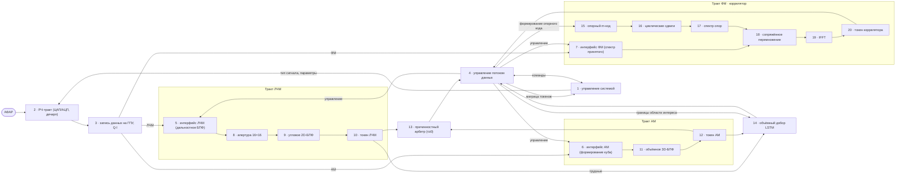

# Блок-схема устройства ECCM 3FFT — Mermaid (Фиг. 1)

> Редактируется текстом, рендерится вектором. Тип — `flowchart` (для блок-схем).
> Нумерация 1–20. Направление LR; вертикально — замени на `flowchart TB`.
> ВАЖНО: (1) текст узла со спецсимволами — в кавычках `B6["...: ..."]`;
> (2) после метки на стрелке `-->|...|` ставь РОВНО ОДИН пробел, иначе ошибка `got 'SPACE'`.

## Как редактировать (шпаргалка)
- **Текст узла с `:`, `,`, `·`, `×`, `≥` — только в кавычках:** `B6["6 · АМ: куб"]`.
- **После метки на стрелке — один пробел:** `B3 -->|"АМ"| B6` (два пробела = ошибка `got 'SPACE'`).
- Метку на стрелке тоже бери в кавычки, если кириллица: `-->|"команды"|`.
- Добавить блоку вход: `X --> B5`. Добавить выход: `B5 --> Y`.
- Соединить вход блока 5 с выходом блока 4: `B4 --> B5`.
- Двойная стрелка (в обе стороны): `B4 <--> B5` (с подписью `B4 <-->|"команды"| B5`).
- Линия без стрелки: `B4 --- B5`.
- Вертикальная раскладка: `flowchart TB` вместо `flowchart LR`.
