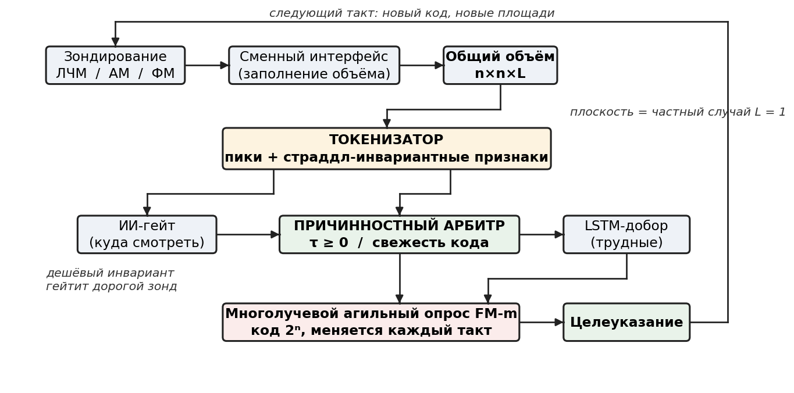
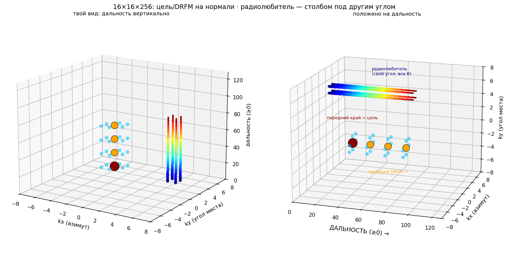

# Гибкое унифицированное распознавание цели на фоне самоприкрывающих помех

**Одно вычислительное ядро — объёмный токен → причинностный арбитр → агильный опрос FM-m — со сменными интерфейсами под тип сигнала (ЛЧМ / AM)**



Стержень решения: ядро и логика обработки **одни и те же**, меняется лишь **интерфейс (фронтенд)** под обрабатываемый сигнал. Универсальный интерфейс между фронтендом и ядром — **токен на объёме** (куб «угол×угол×дальность» 16×16×L, N переменна; плоскость — частный случай L=1). Приоритеты: надёжность распознавания → скорость → красота (единство) решения. Имя **«3FFT»** — про трёхмерный объём «угол×угол×дальность» (не про единый 3D-БПФ): ЛЧМ-интерфейс заполняет его двумя раздельными FFT, AM-интерфейс — скользящим 3D-FFT.

## Архитектура решения (стержень)

Решение построено вокруг **одного ядра** и **сменного интерфейса**:

```
сигнал ──► ИНТЕРФЕЙС (фронтенд под тип сигнала)
              ├─ ЛЧМ → два FFT (дальностно-разрешённо, точно)
              └─ AM  → скользящий 3D-FFT (грубо/быстро; 3-я ось = дальность)
         ──► ОБЩИЙ КУБ 16×16×L (угол × угол × дальность)
         ──► ЯДРО (одно, инвариантно к фронтенду):
                объёмный токенизатор → ИИ-гейт → причинностный арбитр (τ≥0 / код)
         ──► агильный многолучевой опрос FM-m ──► целеуказание
```

Токен на объёме — **универсальный интерфейс** между фронтендом и ядром. Новый тип сигнала = новый фронтенд, ядро не трогаем. В этом гибкость и сила: **одно решение — много сигналов**.


---

# Глава 1. Задача и модель угрозы

## 1.1. Задача

Моностатический UHF-радар (~0.5 ГГц) с активной фазированной антенной решёткой (АФАР) должен надёжно распознавать истинную цель на фоне самоприкрывающих помех и выдавать целеуказание. Приоритеты — в порядке: надёжность распознавания → скорость обработки → красота (единство) решения. Радар использует два основных зонда: **широкий ЛЧМ** для поиска («куда смотреть») и агильный фазоманипулированный **FM-m** для адресного многолучевого опроса площадей кандидатов; опционально — лёгкий **амплитудно-модулированный (AM) зонд** для быстрого грубого присутствия «есть/нет + где» перед точным трактом (глава 4-бис). Ключевая черта решения — **одно ядро обработки со сменным интерфейсом под тип сигнала** (глава 0).

## 1.2. Модель угрозы — самоприкрытие

Основная угроза — помеха, излучаемая с носителя самой цели (самоприкрытие):

- **DRFM/ISRJ** — гребёнка ложных целей, часто ярче истинной;
- **SMSP** — размытие спектра;
- **заградительная** (шумовая по полосе);
- **RFI** — сторонний непрерывный источник.

Ключевая трудность: по одному угловому срезу отклик ретранслятора структурно не отличается от отражения цели. Нужен различитель, устойчивый к адаптивному противнику, а не только к энергетике.

## 1.3. Прототип и его предел

Прототип RU2549375C1 (подавление активной помехи двумя каналами — основным и вспомогательным — с корреляцией для компенсации в главном луче) самоприкрытие не тянет: он рассчитан на геометрию отдельного постановщика, а структурного различителя «цель/ложь» в нём нет.

## 1.4. Наш ответ

Ядро решения — **один объёмный примитив, инвариантный к типу сигнала**. Общий куб «угол×угол×дальность» сворачивается в **матрицу токенов** (главы 4, 4-бис); лёгкий ИИ-**гейт** и физический причинностный **арбитр** — передний край `τ≥0` и свежесть кода (глава 5) — выделяют истинную цель; из матрицы токенов формируется **многолучевой агильный опрос FM-m** (главы 6, 8). Куб заполняет **сменный интерфейс** под сигнал: ЛЧМ — дальностно-разрешённо (глава 3), AM — грубым скользящим 3D-FFT для быстрого «есть/нет + примерно где» (глава 4-бис). Дешёвый инвариант гейтит дорогой агильный зонд; физика — арбитр, нейросеть — адъюнкт; **ядро — одно, интерфейс — сменный**.


---

# Глава 2. Тракт приёма и первичная обработка

Ниже — приёмный тракт **ЛЧМ-интерфейса** (для AM-присутствия фронтенд иной, глава 4-бис); дальше идёт общее ядро.

## 2.1. Аппаратная цепочка

АФАР → АЦП → **гетеродин-дечирп на ПЛИС** (stretch-processing) → сырые комплексные IQ. Дечирп на приёме смешивает принятый ЛЧМ с опорным и превращает задержку цели в постоянную частоту биений — тяжёлое широкополосное сжатие уходит в аналог/ПЛИС, на GPU приходит уже узкополосный поток.

## 2.2. Дечирп: задержка → частота

```
f_b = μ · 2R/c ,   μ = ΔF / T_c
```

Одна цель после дечирпа — один тон (одна частота биений); гребёнка ложных целей — ряд тонов с шагом, отвечающим их шагу по дальности.

## 2.3. Поток за такт

После дечирпа за такт получаем **N комплексных отсчётов**, где N переменна (до ~1.3М на канал). Число не фиксируется тактом; размер дальностного FFT ставится под текущее N (глава 3).

## 2.4. Батч-БПФ

Дальностный БПФ по всем 256 антеннам считается **батчем на GPU за один вызов**. Данные остаются **комплексными** — фаза нужна последующему угловому БПФ (главы 3–4).

## 2.5. Вывод

После дечирпа **частота = дальность**: спектр среза сразу даёт дальностный профиль (одна цель → пик; гребёнка → ряд пиков). Это и есть вход в каскад — тензор `16×16×N`, с которого начинается глава 3.


---

# Глава 3. Интерфейс ЛЧМ: два преобразования Фурье

Эта глава описывает **один из интерфейсов** (фронтендов) — дальностно-разрешённый ЛЧМ-тракт, который заполняет общий куб «угол×угол×дальность»; само ядро и объёмный примитив над кубом — в главе 4-бис. За каждый рабочий такт приёмный тракт даёт комплексный массив **16×16×N** — апертура × апертура × дальность, где N (глубина по оси быстрого времени) переменна и определяется тактом. Настоящая глава фиксирует геометрию этого массива и обработку, которая превращает его в картину угол × угол × дальность двумя раздельными преобразованиями Фурье — это «точный» интерфейс (в отличие от грубого AM, глава 4-бис).

## 3.1. Что на входе

Сигнал — линейно-частотно-модулированный (ЛЧМ), уже дечирпованный на приёме (stretch-processing). После дечирпа задержка цели превращается в постоянную частоту биений, и дальность закодирована именно в частоте:

```
f_b = μ · 2R/c ,   μ = ΔF / T_c
```

Оси массива:
- **X, Y — апертура 16×16** (256 элементов решётки);
- **Z — ось быстрого (дечирпованного) времени**, N комплексных отсчётов; N переменна за такт. Дальность в Z ещё не проявлена — она сидит в частоте биений и извлекается первым FFT.

Один импульс доплера не несёт (цель даёт один пик, в котором дальность и доплер смешаны); доплер добавляется отдельной, четвёртой осью по пачке импульсов (см. §3.5).

## 3.2. Два раздельных преобразования Фурье

Обработка — это **два разных FFT в разных местах конвейера**, а не одно трёхмерное преобразование.

**Первый — дальностный FFT, глобально по оси Z, один раз** (rocFFT). Он превращает частоты биений в дальность: после него ось Z становится дальностью с N бинами. Длина N произвольна — rocFFT выполняет её смешанным radix; при необходимости чистого radix-2 ось добивают нулями до ближайшей степени двойки. (Это дополнение относится к дальностной оси и не связано с агильной длиной кода FM-m из главы 6.)

Дальность локализуется одним глобальным преобразованием по всей записи: после дечирпа цель — тон на всю длину Z, поэтому посегментная оконная обработка по дальности не требуется.

Данные до этого момента держат **комплексными**: следующий, угловой FFT формирует луч когерентным сложением по апертуре, и ему нужна фаза между 256 элементами. Магнитуду `|·|²` берут только после углового FFT.

**Второй — угловой FFT 16×16, поячеечно, на каждом бине дальности**, на матричных (тензорных) блоках GPU (WMMA). Он и даёт угловую карту среза. Порядок осей результата — **угол × угол × дальность**.



> `[Рис — заметка]` текущий рисунок сделан под 3D-FFT и **неверен**; подлежит замене. Для патента рисунок не требуется — оставлен как напоминание.

## 3.3. Метрика (параметрическая)

Все шкалы и пороги считаются на ходу из `ΔF, f_s, d`; алгоритм при этом постоянен.

**Разрешение по дальности** задаёт девиация ЛЧМ:

```
Δr = c / (2·ΔF)
```

В знаменателе — именно девиация `ΔF` (полоса ЛЧМ). База `B = T_c·ΔF` (длительность × девиация) безразмерна и отвечает за помехозащищённость, а не за разрешение; запись `Δr = c/(2B)` неверна.

**Угловая шкала** при шаге решётки `d = λ/2`:

```
sinθ = k·λ / (N_ап·d) = k/8 ,   k = −8 … 7  (после fftshift)
```

разрешение по `sinθ` равно 1/8 (≈ 7° у визирования), покрытие — практически полусфера (`sinθ = −1…0.875`, верхний край чуть недобирает).

**Числовой пример** (малое `N` взято лишь для наглядности арифметики; в работе `N ~ 10⁵–10⁶`, до ~1.3М): `ΔF ≈ 6 МГц`, `f_s = 2 МГц`, `N = 10000`, UHF `0.5 ГГц` → `λ = 0.6 м`, `d = 0.3 м`:

```
T_c = N / f_s   = 5 мс      (длительность импульса)
Δr  = c/(2·ΔF)  = 25 м      (разрешение по дальности)
B   = T_c·ΔF    = 30000     (база)
```

Для дальней связи `ΔF = 500 МГц` → `Δr = 0.3 м`; меняется только число, не алгоритм.

## 3.4. Реализация: два кернела, вычисление на кристалле

Конвейер главы — два ядра GPU; ключ к скорости в том, что тяжёлая часть считается **в быстрой внутрикристальной памяти рабочей группы (LDS)**, без обменов с внешней памятью.

**Кернел A — дальностный FFT.** rocFFT по оси Z, батч 256 каналов. На входе load-callback совмещает окно и опорный дечирп: `x[z]·w[z]·ref_dechirp[z]`; выход — **комплексный** (магнитуду не берут, впереди угловой FFT); нормировку `1/N` при желании — на store-callback. Результат — комплексный буфер `16×16×N` в VRAM, где Z = дальность.

**Кернел B — фьюзед, на тензорных блоках.** Один workgroup обрабатывает блок бинов дальности, размещённый в LDS, и выполняет по срезу всю цепочку не выходя из быстрой памяти:

```
1. WMMA: угловой FFT 16×16 (комплекс)
2. |·|²  → карта энергии 16×16   (магнитуда здесь, переход в float, fftshift)
3. линейка инвариантных признаков (редукции в LDS)
4. MLP-гейт → метка + скор
5. на выход — токен (только выжившие срезы)
```

Размерность 16×16 выбрана так, что срез целиком помещается в память рабочей группы и вычисляется матрично на тензорных блоках. Совмещение формирования, токенизации и классификации в LDS устраняет обмены с внешней памятью — это и есть опора приоритета «скорость обработки» (признаки п.9 «способ» и п.13 «устройство» формулы). Между кернелами лежит только комплексный буфер в VRAM.

## 3.5. Доплер (на будущее)

В одном импульсе цель — один пик, дальность и доплер в нём смешаны и не отделяются. Доплер живёт по медленному времени, между импульсами: пачка из `P` импульсов с периодом `PRI` даёт четвёртую ось, и FFT по ней извлекает доплер:

```
16 × 16 × N × P      →   FFT по 4-й оси
Δf_d = PRF/P ,   Δv = λ·PRF/(2P) ,   однозначная v = λ·PRF/2
```

Движущаяся цель за пачку уходит по дальности (range walk) — компенсируется keystone-преобразованием. ЛЧМ-картина Range-Doppler подсказывает доплеровский банк FM-m коррелятора. Полный порядок осей: **угол → угол → дальность → доплер**; первые три — эта глава, четвёртая — пачкой.


---

# Глава 4. Грубое обнаружение на угловой карте: признаки, триаж, токен

## 4.0. Место главы в конвейере

После главы 3 дальностный БПФ (кернел A) перевёл дечирпованный сигнал в дальность: на входе настоящей главы — комплексный тензор **16×16×N**, где третья ось уже означает бины дальности, а N переменна за такт. Для каждого бина дальности `r` срез `S[:, :, r]` — комплексная **апертурная матрица 16×16** (сигнал на элементах решётки для этой дальности).

Задача главы — по каждому срезу быстро решить, есть ли в нём собранный по углу источник и какого он типа, и упаковать результат в компактный **токен**. Всё выполняет один вычислительный блок — **кернел B**.

> Настоящая глава описывает плоский случай (одна угловая карта на срез дальности). Он обобщается на объём: токен можно формировать на кубе `16×16×L` одним объёмным ядром, а плоскость — частный случай при `L = 1`. См. главу 4-бис «Унифицированный объёмный примитив».

## 4.1. Обозначения

| Символ | Смысл | Размер / диапазон |
|---|---|---|
| `N` | глубина дальности (бинов) | переменна за такт |
| `r` | индекс бина дальности | 0 … N−1 |
| `S[k_x,k_y,r]` | комплексный сигнал на элементах решётки | 16×16, ℂ |
| `A[k_x,k_y]` | комплексная **угловая карта** после углового БПФ | 16×16, ℂ |
| `P = |A|²` | **энергетическая** угловая карта | 16×16, ℝ≥0 |
| `M = 256` | число угловых ячеек (16×16) | — |
| `p_i` | значения `P`, развёрнутые в вектор | i = 0 … 255 |
| `(k_x,k_y)` | номер углового бина; `sinθ = k/8` при d=λ/2 | −8 … 7 (после fftshift) |
| `S1 = Σp_i`, `S2 = Σp_i²` | суммы для признаков | — |

Угловая ячейка `(k_x,k_y)` соответствует направлению прихода, её значение — энергия с этого направления на данной дальности.

## 4.2. Что делает кернел B (обзор)

Базовая единица — одна апертурная матрица `S[:,:,r]`; на выходе — один токен:

```
вход:  S[:, :, r]                       — апертурная матрица 16×16 (комплекс)
  1. A = угловой БПФ 2D (S · окно)      — формирование луча, остаётся комплексом
  2. P = |A|²  (fftshift)               — энергетическая карта (переход в float)
  3. f = features(P)                    — вектор инженерных признаков
  4. пики = поиск до 5 пиков по углу    — координаты и яркости источников
  5. (метка, скор) = MLP(f)             — классификация типа среза
выход: токен(r) = { пики[], признаки, метка, скор }
```

Порядок принципиален: **магнитуда берётся только после углового БПФ**. Угловой БПФ — когерентное суммирование по апертуре, ему нужна фаза между 256 элементами; взять модуль раньше — потерять направление.

## 4.3. Шаг 1 — угловой БПФ (формирование луча)

Двумерный БПФ по апертуре, с оконной функцией `w` (Хэмминга) по обеим осям для подавления боковых лепестков:

```
A[k_x,k_y] = FFT2( S[:,:,r] · w(x)·w(y) )
```

Точечный источник даёт узкий главный лепесток в одной ячейке; шум — равномерную рябь. Реализуется матричным умножением на тензорных блоках (WMMA).

## 4.4. Шаг 2 — энергетическая карта

```
P[k_x,k_y] = |A[k_x,k_y]|²   (с fftshift: нулевая частота в центре, k = −8…7)
```

С этого шага работаем с вещественной картой `P`; все признаки считаются по ней.

## 4.5. Шаг 3 — линейка признаков

Классифицировать срез по всем 256 значениям дорого; вместо этого сжимаем карту в короткий **вектор инженерных признаков**, каждый — дешёвая редукция.

**Признаки собранности (устойчивые якоря).**

Participation Ratio — эффективное число «горящих» ячеек:

```
PR = (Σp_i)² / Σp_i² = S1² / S2
```

Точечный источник → `PR ≈ 1–3`; заградка → десятки; шум → `≈ M/2 = 128`. Главный якорь «источник против шума».

Индекс Хойера — нормированная разреженность в [0,1]:

```
Hoyer = (√M − S1/√S2) / (√M − 1)
```

`→ 1` собрано, `→ 0` размазано.

**Признаки формы главного лепестка (страддл-устойчивые).** При попадании источника между бинами (страддл) энергия делится между соседними ячейками; поэтому меряем не ячейку, а лепесток целиком. Пусть `(i*,j*) = argmax P`, блок 3×3 вокруг него:

```
MainFrac = Σ_{3×3} P / S1
```

Доля энергии в главном лепестке. Цель (даже при страддле) → 0.94–0.98; заградка → ~0.40; шум → ~0.07.

Интегральное отношение лепестков (устойчивая замена «2-й/1-й пик»): обнуляем охранную зону 5×5 вокруг главного пика, ищем второй лепесток:

```
LobeRatio = Σ_{3×3 вне охранной зоны} P / Σ_{3×3 главный}
```

Одиночная цель → ~0.002; заградка → ~0.25; шум → ~1.0.

**Вспомогательные признаки:**

```
MaxMean = max(P)/mean(P)   — контраст пика (яркость)
PeakPos = argmax P         — направление главного источника
Energy  = S1               — абсолютный уровень
```

Итоговый вектор: `f = [PR, Hoyer, MainFrac, LobeRatio, MaxMean, Energy]` (+ PeakPos отдельно). Все компоненты — 1–2 прохода по 256 значениям, т.е. редукции в быстрой памяти. Набор не финальный: по результатам обучения корректируется.


## 4.6. Шаг 4 — поиск пиков по углу

На одной дальности возможно несколько источников под **разными углами**, поэтому в токен пишем массив пиков фиксированной длины (до 5):

```
пики[5] = { (k_x, k_y, яркость, кромка) }
n_пиков  = сколько из 5 валидны (0…5)
```

`кромка` — нарастание/спад пика по соседним бинам дальности; почти бесплатна (соседние бины под рукой) и служит физическим признаком (резкая кромка реального отражателя против размытой копии). Если пиков больше 5 — это само по себе признак «размазано», лишние не пишутся.

Массив ловит множественность **по углу**. Множественность **по дальности** (гребёнка) собирает проход 2 (§4.9). Две оси структуры независимы: угол — массивом, дальность — сборкой.


## 4.7. Структурный токен

```
токен = {
    r,                         // индекс бина дальности
    n_пиков,                   // 0..5
    пики[5] = { k_x, k_y, amp, кромка },
    PR, Hoyer, MainFrac, LobeRatio,   // признаки среза
    метка,                     // шум / источник / заградка
    скор                       // уверенность
}
```

Пустые срезы («шум») не пишутся → выход разрежённый. Это и есть свёртка большого объёма в компактную матрицу токенов.

## 4.8. Шаг 5 — триаж (гейт, не арбитр)

Вектор признаков подаётся на компактную сеть:

```
MLP: 6 → 16 → 3
классы среза: шум / собранный источник / размазанный (заградка)
выход: метка + скор
```

Три класса — это то, что физически различимо по **одной** угловой карте. Гребёнка ретранслятора от одиночной цели по одному срезу неотличима (различие — по дальности) и выделяется проходом 2.

**Триаж — гейт, не арбитр.** Метку «цель» окончательно ставит физика следующего уровня (передний край + согласование с текущим кодом, глава 5), а не эта сеть: ретранслятор даёт «собранный источник», для угловой сети неотличимый от цели. Выход сети — скор для приоритета обработки. Порог записи токена **мягкий**: слабый ближний пик (истинная цель под яркой ложной) не должен отсеяться — передний край терять нельзя.

## 4.9. Проход 2 — сборка структуры по дальности

Второй, дешёвый проход работает уже с потоком токенов. Берём токены с меткой «источник» под одним направлением `(k_x,k_y)` и раскладываем по дальности `r`:

| Картина токенов вдоль дальности | Вывод |
|---|---|
| одиночный токен | одиночная цель |
| несколько с равным шагом `Δr` | регулярная гребёнка ретранслятора |
| ближний токен группы (`min r`) | передний край — кандидат в истинную цель |
| токены во всех `r` подряд | заградка / сплошной источник |

Регулярность гребёнки подтверждается автокорреляцией цепочки токенов (период `Δr`). Ближний член группы помечается как **кандидат** в истинную цель; окончательную метку цель/ложь выносит физический арбитр главы 5 (правило переднего края τ≥0 и/или согласование с текущим кодом). Обработка идёт по единицам токенов, не по кубу данных → очень дёшево.

Итог по классам разнесён по уровням: на срезе (проход 1) — шум / собранный / размазанный; на профиле (проход 2) — «собранный» распадается на одиночную цель и гребёнку.

## 4.10. Реализация на GPU

Логика §4.2–4.9 не зависит от раскладки срезов по вычислительным блокам. Ради занятости один workgroup берёт **плитку из нескольких соседних бинов дальности**, грузит их в быструю память рабочей группы (LDS) и выполняет для каждой матрицы плитки угловой БПФ, магнитуду, признаки и триаж, не выходя в общую память; наружу пишутся только токены. Совмещение всех шагов в LDS — источник скорости (признак п.9 формулы); на смысл алгоритма плитка не влияет.

**Размер угловой плитки — параметр, а не константа.** Базовые 16×16 — это родная матричная инструкция (WMMA на RDNA4). Тот же конвейер масштабируется без изменения алгоритма: на CDNA/MI100 нативны матрицы 16×16 и 32×32 (MFMA), а по бюджету LDS одна плитка держится на кристалле вплоть до 64×64 (32 КБ из 64 КБ при комплексном float2); 128×128 уже уходит в VRAM. Например, реальная подапертура 32×32 даёт вдвое тоньше угол (Δsinθ = 1/16) при том же ядре, а большие решётки набираются плиточно со вторым уровнем beamspace-сложения. Размерность выбирается под задачу и карту, а не фиксируется.

## 4.11. Проверка на числах (модельная сцена)

Признаки посчитаны на модельных угловых картах 16×16 (аподизация Хэмминга, комплексный гауссов шум). Значения иллюстративны (зависят от SNR и параметров сцены); важна **структура разделения**.

**Три класса (источник на сетке):**

| класс | PR | Hoyer | MaxMean | MainFrac | LobeRatio |
|---|---|---|---|---|---|
| шум | 129 | 0.31 | 5.4 | 0.07 | 1.03 |
| цель | 3.6 | 0.94 | 123 | 0.98 | 0.002 |
| заградка | 15–23 | 0.81 | 22–42 | 0.40 | 0.25 |

**Устойчивость к страддлу (источник смещается на полбина):**

| признак | цель на сетке | цель на полбина | вывод |
|---|---|---|---|
| PR | 3.6 | 4.8 | устойчив |
| Hoyer | 0.94 | 0.92 | устойчив |
| MainFrac | 0.98 | 0.94 | устойчив |
| LobeRatio | 0.002 | 0.002 | устойчив |
| «2-й/1-й пик» (сырой) | 0.21 | 0.99 | ломается → не используется |

Разделение держится на устойчивых якорях (PR, Hoyer, MainFrac, LobeRatio); сырой пиковый признак чувствителен к страддлу и оставлен только как исторический.


## 4.12. Открытые вопросы

> Все пункты ниже закрываются экспериментально на этапе тестов.

1. Итоговый состав вектора признаков — уточняется по результатам обучения (кандидат — энтропия карты).
2. Пороги классов и порог записи токена — калибруются на синтетическом датасете по заданной вероятности ложной тревоги.
3. Нерегулярная структура по дальности (рваная гребёнка, дрожащая задержка) — выносится на глубокий уровень (глава 7): LSTM над потоком токенов области интереса вдоль дальности, глубина области (64/128/256) от типичного периода гребёнки.


---

# Глава 4-бис. Ядро: унифицированный объёмный примитив

Это **ядро всего решения**, к которому главы 3–4 — лишь один частный интерфейс. Токен формируется **на объёме** (куб «угол×угол×дальность»), а способ заполнить объём — сменный **интерфейс (фронтенд) под тип сигнала**. Над кубом работает **один токенизатор**, безразличный к тому, чем куб заполнен. Плоская токенизация главы 4 — частный случай при `L = 1`. В этом стержень: одно ядро — много интерфейсов.


## 4-бис.1. Единый куб «угол × угол × дальность»

Общий интерфейс — объём `16×16×L` (апертура × апертура × дальность). Оба режима заполняют **один и тот же куб**, отличаясь лишь способом заполнения:

- **ЛЧМ-точность:** глобальный дальностный FFT + поячеечный угловой 16×16 (главы 3–4) — куб заполнен дальностно-разрешённо, плотно.
- **AM-присутствие:** локальный **трёхмерный FFT** по скользящему окну `16×16×D` (глубина окна `D`, напр. 16) с переменным шагом (8/16/32/64) — куб заполнен грубо и разреженно.

Дальше — **один объёмный токенизатор**, безразличный к тому, чем куб заполнен. Это и есть абстракция: одно ядро, разный фронт.

## 4-бис.2. AM-фронтенд: быстрый «есть/нет + примерно где»

Вход этого интерфейса — отдельный **лёгкий амплитудно-модулированный зонд** (быстрый грубый обзор; при необходимости — огибающая широкополосного приёма). AM отвечает не на «точно где», а на «есть ли что-то в квадрате». В идеале AM-куб — почти сплошной шум с **редкими выбросами** там, где надо исследовать. Дёшево, потому что:

- **переменный шаг** 8/16/32/64 — ручка «грубо↔точно»: крупный шаг подвыбирает дальность (читаем меньше), мелкий (8) — только в помеченных зонах;
- **произвольный под-куб**: обрабатываем участок любого размера (вплоть до `8×8×L`) и **в любой точке** объёма, не с начала — «только конец», только заказанная часть длины;
- никакой тонкой дальности и когерентной точности — это работа FM-m.

**Почему именно 3D, а не 2D по блоку.** Плоский угловой FFT показывает лишь «энергия есть» (переход 0→1) и не отличает точку от сплошного. Третья ось несёт **форму по дальности**: локальный отклик даёт **компактный колокол**, а длинный/непрерывный источник — размазанный профиль с провалом. То есть 3D-FFT сразу отделяет «сконцентрировано» (кандидат) от «размазано» (шум/помеха) — концентрация как признак, прямо в кубе.

## 4-бис.2а. Адаптивная нарезка: грубо → всплеск → тонкий добор сырья

Дешевизна AM-обзора держится на том, что **всё сведено к токенам**: разреженная карта токенов уходит в **головную машину (блок 1)**, и она решает, что смотреть, до какого размера спускаться и сколько точек брать; блок управления потоком данных (4) исполняет это на ГПУ, перенарезая **одни и те же сырые данные** — они остаются в памяти ГПУ — под-кубами произвольного размера, шага и положения. Решает по дешёвой карте токенов, а не по сырому объёму. Режимы:

- **Грубо с эскалацией по ярким.** Объём проходят крупным шагом/глубоким форматом (напр. `16×16×256` — дёшево, грубая дальность по `k_z`). Головная машина берёт **ограниченное число самых ярких выбросов** (например, 3–4) и по ним командует **тонкий добор**: спуститься по формату (напр. `256 → 16`) с заданным числом точек и перечитать **те же** сырые под-кубы мелким шагом — второй проход 3D-БПФ уточняет положение только в этих точках. Менее яркие выбросы не теряются: они остаются в карте токенов и до-исследуются на следующих тактах (трекинг).
- **Сплошь мелким шагом (8/16).** Весь объём сразу в полном разрешении — добирать нечего, **эскалация выключается**.
- **Пропуск.** Пустой в прошлом такте участок при экономии бюджета не читают.

Выигрыш — **фиксированная наихудшая задержка** такта: грубый проход + не более `N` тонких доборов (`N` задаёт блок 1). Приоритет добора — по яркости (энергии), но это лишь порядок зумирования: истину «цель/ложь» по-прежнему выносит арбитр и код-корреляция FM-m, так что ранняя яркая ложь не смещает обнаружение, а только раньше отрабатывается.

## 4-бис.3. Объёмный токенизатор

Над кубом работает одно ядро:

```
под-куб 16×16×L → 3D-FFT → OS-CFAR по объёму → 3D-признаки → токен
```

Признаки — прямое обобщение плоских на объём: главный лепесток **3×3×3**, охранная зона **5×5×5**, PR/Hoyer по вокселям (16×16×L), интегральное отношение лепестков в 3D. Порог выброса — **OS-CFAR в 3D** (объёмные обучающие/охранные ячейки), тот же принцип, что в плоском тракте. **Двумерная токенизация глав 3–4 — частный случай при L = 1.**

Выход — тот же структурный токен (теперь пик в 3D: `k_x, k_y, k_z` + грубая дальность-позиция окна + признаки + метка), и дальше — **тот же** конвейер: гейт → арбитр переднего края / код → L3 → опрос FM-m.

## 4-бис.4. Объект и радиолюбитель (RFI) в кубе

Пример разделения одним алгоритмом:

- **объект** — когерентный отклик: **компактный выброс** в одном угловом квадрате и одном блоке дальности (колокол);
- **радиолюбитель (RFI)** — непрерывный внешний источник со своего угла: не эхо, приходит непрерывно → выброс на его угле **во всех блоках дальности** (полоса), а по третьей оси — **застывший тон** во всех окнах.

Тот же токенизатор и та же сборка по дальности видят: объект локализован (один блок), RFI — размазан по всей дальности → распознаётся как непрерывный источник; окончательно RFI отсекает FM-m код-арбитр (не ответит на свежий код). Спец-случая нет.

**«Летит» — не из куба.** Окно быстрого времени слишком коротко для доплера; движение определяется **трекингом выброса между тактами** (либо отдельной осью пачки), а не внутри одного AM-куба.

## 4-бис.5. Реализация и бюджет (MI100)

Под-куб загружается в **память рабочей группы (LDS)**, угловые плоскости 3D-БПФ считаются на матричных блоках, порог и токенизация — там же, без выхода в VRAM; сбор апертуры поперёк антенн (данные лежат антенна-за-антенной) — страйд-чтениями при загрузке в LDS, отдельного прохода нет.

Порядок величин на MI100 (полоса 1.23 ТБ/с), объём 16×16×N:

| режим | 0.5М | 1М |
|---|---|---|
| грубый скан, шаг 64 (¼ объёма) | ~0.2–0.3 мс | ~0.4–0.5 мс |
| сплошной, шаг 16 | ~1 мс | ~2 мс |
| под-куб `8×8×пару-тысяч` (зум/«только конец») | микросекунды | микросекунды |

Полная длина 0.5–1М — осознанная, заложенная задержка; «быстро» достигается крупным шагом и/или частичным под-кубом.

## 4-бис.6. Итог

Токен — универсальный интерфейс; фронтенд лишь заполняет куб (AM грубо / ЛЧМ точно), а объёмный токенизатор один. Отсюда одно абстрактное ядро, инвариантный к фронтенду пайплайн и, как следствие, простота и патентная широта (зависимые пункты об объёмном токене и инвариантности к фронтенду).


---

# Глава 5. Физический арбитр: правило переднего края

## 5.0. Место главы в конвейере


Гейт главы 4 сжал объём в матрицу токенов и грубо разметил срезы (шум / собранный источник / размазанный), но метку «цель / ложная» он не ставит: ретранслятор даёт «собранный источник», по одной угловой карте неотличимый от настоящей цели. Окончательное решение выносит **физический арбитр** настоящей главы — не нейросеть, а причинностный принцип, который противник не может подделать.

## 5.1. Причинность: τ ≥ 0

DRFM/ретранслятор — это **пере**датчик: он обязан сначала принять зондирующий сигнал, затем переизлучить его. Приём, обработка в памяти и переизлучение занимают неотрицательное время, поэтому любой отклик, созданный ретранслятором, приходит **позже** прямого отражения истинной цели. Время переводится в дальность, значит ложная цель, слепленная ретранслятором, стоит на **той же дальности или дальше** истинной — и никогда ближе:

```
τ ≥ 0   →   R_ложн ≥ R_цель
```

Ось возможных положений ложных целей **односторонняя**. Это фундамент главы: истинная цель — передний край причинностной группы.

Важная оговорка: ложная цель может быть **ярче** истинной (DRFM усиливает сигнал, чтобы увести захват). Поэтому решение принимается **по дальности, а не по яркости**: ближний член группы, а не самый яркий.

## 5.2. Вариант 1 — передний край по дальности (геометрия)

Работает на картине широкого ЛЧМ-обзора, по профилю токенов вдоль дальности (проход 2 главы 4). В причинностной группе — истинное отражение и следующая за ним гребёнка копий с регулярным шагом. Правило:

> ведущий (ближний по дальности) член группы — истинная цель; хвостовые пики с регулярным шагом — кандидаты в ложные.

Регулярность гребёнки подтверждается автокорреляцией цепочки токенов, но метку определяет именно **передний край**. Признак чисто геометрический, кодов не требует и работает уже на этапе обзора.

## 5.3. Вариант 2 — свежесть кода (сигнал)

Работает на этапе многолучевого опроса FM-m. Код опроса **свежий и непредсказуемый** и меняется от такта к такту, поэтому противник не может подделать ответ на код, которого ещё не слышал. Переизлучение ретранслятора либо несёт **не тот код** — в корреляторе не сжимается в пик и подавляется на ~10·log₁₀(L) дБ (проигрыш согласования), либо приходит **позже** — оказывается дальше и снова попадает под правило переднего края.

Это свойство самого зонда FM-m: непредсказуемость кода делает согласованный отклик **неподделываемым признаком** истинной цели.

## 5.4. Почему держим оба варианта

Оба признака вытекают из одной причинности (τ ≥ 0), но действуют на **разных осях и разных этапах**, и потому закрывают слабые места друг друга — противник обязан обойти **сразу оба**:

- если на данном такте истинное эхо слабое (замирание, ракурс с малой ЭПР) и ближний край ненадёжен — ретранслятор всё равно ловится **свежестью кода** (несёт не тот код);
- если помеха ухитрилась ответить текущим кодом — она физически **не может** оказаться ближе истинной цели, её берёт **передний край** по дальности.

Геометрия ловит то, что упускает код, и наоборот. Это и даёт надёжность при ограниченной цене (приоритет надёжность → скорость).

## 5.5. Область действия

Правило переднего края строго верно для **самозащитной (самоприкрывающей) помехи** — излучаемой с носителя самой цели. Уводящий или загораживающий джаммер на **ином**, физически более близком носителе может оказаться ближе истинной цели; но это уже не самоприкрытие, и он отделяется **свежестью кода** (не отвечает согласованно на свежий зонд) и **угловым разнесением** (иное направление). Поэтому в независимом пункте формулы область действия арбитра ограничена самозащитной помехой — так признак остаётся неуязвимым.

## 5.6. Связь с конвейером и формулой

Арбитр замыкает распознавание: гейт (глава 4) отбирает кандидатов и приоритезирует, арбитр (эта глава) ставит окончательную метку по причинности, а результат уходит в целеуказание агильного пучка FM-m (глава 8). В формуле это признак (в) независимого пункта: «метку цель/ложь устанавливают по правилу ближнего по дальности члена причинностной группы (τ ≥ 0) **и/или** согласования с текущим кодом» — оба варианта настоящей главы. Причинность нельзя подделать: противник не ответит кодом, которого ещё не слышал, и не поставит ложную цель ближе истинной.

## 5.7. Робастность к движению цели

Правило переднего края — **потактовое и мгновенное**: оно про задержку внутри одного измерения, а не про движение между тактами. Отсюда три случая.

**Удаление (или сближение) цели.** Гребёнку не разворачивает. Внутри каждого такта копии тянутся в бо́льшую дальность (τ ≥ 0), ближний край — истинная цель. Вся группа (истинная + гребёнка) едет по дальности от такта к такту; её ведут трекингом.

**Гребёнка «к нам» (уводящая по дальности на упреждение, range-gate pull-in).** Внутри импульса невозможна: ближе истинной — значит переизлучить раньше приёма (τ < 0). Между импульсами враг может проиграть **запомненный прошлый** импульс на меньшую дальность, но тот несёт **устаревший код** и в корреляторе не сжимается — снимается свежестью кода (§5.3). Случай, где геометрия одна не справилась бы, закрывает связка с кодом.

**Диагональ (движение по дальности и по углу).** Потактовое правило держится: ближний край группы — истинная цель, а группа смещается по углу и дальности вместе (для самоприкрытия ретранслятор на носителе цели — тот же угол). Трудность не в принципе, а в когерентной пачке: **range walk** (компенсируется keystone, §3.5) и **угловая миграция** пика по карте (короткий интервал накопления). Гребёнка под иным углом — уже не самоприкрытие, отсекается §5.5.


---

# Глава 6. FM-m коррелятор: реализация многолучевого опроса

## 6.0. Место главы в конвейере


После того как широкий ЛЧМ-обзор и матрица токенов (главы 3–5) дали, куда светить, радар опрашивает **интересуемые площади** зондом FM-m — сигналом, фазово-манипулированным M-последовательностью. Опрос **многолучевой**: столько лучей (5, 6, 7 … n), сколько нужно, чтобы покрыть площади кандидатов, и **все лучи считаются параллельно на GPU** (`S` лучей за проход, поддержано батчингом §6.7). Настоящая глава описывает коррелятор, который отвечает на вопрос: **есть ли в принятом сигнале наш код и с какой задержкой (дальностью)** — для `S` лучей против `K` гипотез задержки одновременно, целиком на GPU в частотной области.

## 6.1. Почему M-последовательность

M-последовательность (генерируется регистром сдвига с линейной обратной связью, LFSR, по примитивному полиному, не фиксированному — он меняется по такту) — код из `±1` с двумя ценными свойствами:

- **острая автокорреляция**: корреляция кода с самим собой — почти дельта-функция (высокий центральный пик, боковые ~`1/√L` при апериодической корреляции), поэтому совпадение по задержке видно как чёткий одиночный пик;
- **псевдошумовой спектр**: код выглядит как шум — помехозащищённость и скрытность.

Длина кода **агильная**, `L = 2⁸ … 2²⁰`, и **меняется каждый такт**; эталонного полинома нет — код формируется по команде под текущий такт. Генерация дешёвая (регистр Галуа: сдвиг и XOR с полиномом на бит, бит → `±1.0`); код уходит на GPU и переиспользуется в пределах такта.

## 6.2. Корреляция через БПФ

Прямая корреляция длины `N` стоит `O(N²)`; по теореме о свёртке её заменяют тремя быстрыми преобразованиями:

```
corr(ref, inp) = IFFT( conj(FFT(ref)) · FFT(inp) )
```

Стоимость — `O(N log N)`. Пошагово: `FFT(ref)` (эталон, заранее, один раз) → `FFT(inp)` (вход) → поэлементное `conj(FFT(ref))·FFT(inp)` (сопряжение превращает свёртку в корреляцию) → `IFFT` (корреляционная функция) → `|·|/N` (магнитуда, нормировка). Пик в точке `j` означает: принятый сигнал содержит эталонный код с задержкой `j` отсчётов; `j` пересчитывается в дальность. Размер преобразования — под длину кода такта (дополнение нулями до `2ⁿ`).

## 6.3. Банк из K гипотез задержки

Эталон готовится не в одном экземпляре, а как **банк из `K` версий** — `K` циклических сдвигов **текущего** кода. Каждый сдвиг — отдельная гипотеза задержки (дальностный строб); коррелятор проверяет все `K` за один проход, и положение пика по `(k, j)` локализует цель по дальности. Никакой истории прошлых кодов здесь нет — все `K` опор принадлежат коду текущего такта. Различение истинной цели и ретранслятора выполняет не банк, а физический арбитр главы 5 (передний край + свежесть кода).

## 6.4. Архитектура GPU: два потока, переиспользование эталона

Обработка построена на двух независимых потоках ради параллелизма:

```
поток 0 (эталон):  H2D(ref) → циклические сдвиги → FFT(K сдвигов)
поток 1 (вход):    H2D(inp) → FFT(S сигналов)          ← одновременно
                   ── синхронизация потоков ──
поток 0 (финал):   conj·умножение → IFFT(S×K) → магнитуды → D2H
```

Эталон готовится один раз и живёт на GPU: его `K` спектров переиспределяются без повторной загрузки; пока поток 1 грузит и преобразует входные лучи, поток 0 уже сделал свою часть — латентность прячется за перекрытием. Планы БПФ создаются один раз при установке параметров (создание плана дорогое) и привязываются к своим потокам, чтобы не рушить параллелизм.

## 6.5. Четыре вычислительных ядра

Счёт — четыре компактных HIP-ядра, скомпилированных под целевую архитектуру на устройстве (с дисковым кешем бинаря):

1. **Циклические сдвиги** — из вещественного эталона строит `K×N` комплексный банк: `out[k][i] = ref[(i+k) mod N]`; сдвиг по модулю `N` — побитовое `И` (N — степень двойки), без деления.
2. **Сопряжённое умножение** — `conj(ref_fft[k])·inp_fft[s]` за один проход по всем парам `(s,k)`; сопряжение инлайн (смена знака мнимой части).
3. **Извлечение магнитуд** — `|corr[j]|/N` для первых `n_kg` точек (дальние задержки не нужны — экономия памяти и времени); модуль побитовым сбросом знака, деление на `N` заменено умножением на `1/N`.
4. **Генератор тест-входов** — служебное: `inp = circshift(ref, s·шаг)` прямо на GPU для самопроверки без загрузки с хоста.

Микрооптимизации: выровненный `float2` (одна 64-битная транзакция), эрмитова симметрия вещественного БПФ (`N/2+1` точек вместо `N` — ~50% памяти на спектрах входа), нормировка умножением.

## 6.6. Кернел токенизации на выходе IFFT

Сразу после IFFT встроено ядро, которое **не передаёт полный корреляционный отклик дальше**, а извлекает из него **3–5 наибольших значений** и формирует набор токенов (позиция пика = задержка/дальность, амплитуда, кромка). Это резко сокращает объём данных на дальнейшую обработку — та же логика «токен вместо сырья», что и в главе 4, но на выходе коррелятора. Число значений (3 или 5) подбирается на этапе тестов.

## 6.7. Батчинг по памяти

Число лучей `S` бывает большим, весь массив может не поместиться в память GPU; менеджер батчей решает это сам:

- оценивает, сколько лучей влезает в ~70% свободной памяти, заранее вычтя постоянно занятый банк эталона;
- влезает всё — считает за один проход; не влезает — режет на батчи оптимального размера и обрабатывает по очереди, накапливая результат;
- эталон не трогается (подготовлен один раз); между батчами пересоздаются только буферы входа, и то лишь при смене размера батча;
- данные подаются прямым указателем в нужное смещение массива, без промежуточных копий.

Один и тот же вызов корректно отрабатывает и пять лучей, и тысячи — масштаб подстраивается под железо.

## 6.8. Оптимизация финала (опция)

Поскольку `K` опор — циклические сдвиги **одного** (текущего) кода, все `K` корреляций суть сдвиги одной базовой. Поэтому финал при желании сводится к **одной IFFT на луч** и `K` оконным чтениям со сдвигом вместо `S×K` обратных БПФ — ощутимое сокращение времени. Это опциональная оптимизация; прямой честный `S×K` тоже корректен, и на смысл результата выбор не влияет.

## 6.9. Что на выходе

Набор токенов пиков по лучам и задержкам: для каждого луча `s` и задержки `j` — магнитуда корреляции (после токенизации §6.6 — только выжившие пики). По нему: **есть ли цель** — по превышению пика над фоном; **дальность** — по положению пика `j`. Метку **истинная/ложная** ставит не коррелятор, а физический арбитр главы 5 — по переднему краю и свежести кода. Эти величины идут в целеуказание активного FM-m зондирования (глава 8).

## 6.10. Заметки для патента

- **Уровень техники.** Сама GPU-ускоренная кросс-корреляция известна (две работы по GPU-корреляции для пассивного бистатического радара — Remote Sensing, MDPI 15(22):5421; J. Parallel Distrib. Comput., 2025); её берём как ближайший уровень.
- **Что здесь несёт новизну** (не сама корреляция): **агильная длина кода** `2⁸…2²⁰` с дополнением до `2ⁿ`, on-chip обработка и **токенизация на выходе IFFT** — в связке с признаками (а)+(г) формулы. Коррелятор — реализующий движок многолучевого опроса FM-m.
- **Параметры LFSR.** Полином не фиксирован, длина агильная; для референс-реализации фиксируется генератор конкретного такта, канонического полинома нет.


---

# Глава 7. L3 — глубокий добор на токенах (LSTM)

## 7.0. Умный переход: где и как это включается

Гейт (глава 4) и арбитр переднего края (глава 5) разбирают **регулярные** сцены: одиночная цель, ровная гребёнка. Но остаётся малая доля **трудных кандидатов** — рваная (нерегулярная) гребёнка, дрожащая задержка, наложенные отклики, — где передний край и автокорреляция цепочки токенов не дают чистого ответа.

Слепо запускать по такому кандидату полный многолучевой опрос FM-m — дорого и неточно: непонятно, куда именно светить. L3 вставляется **ровно между токенами и опросом**: он берёт **уже посчитанные токены** трудного участка и уточняет, **куда** светить, — угол и тонкую дальность кандидата. Это узкий добор на единицах кандидатов, а не в потоке. Схема такта с L3:

```
ЛЧМ широко → приём → 16×16×N (два FFT)
                          │
                          ▼
       L1: формирование токенов (угловой FFT → |·|²+fftshift(−8..0..7) → признаки → токен)
                          │
                   матрица токенов
                          │
          ┌───────────────┴────────────────┐
          ▼                                 ▼
   регулярная сцена                   трудный кандидат
   арбитр переднего края (гл.5)       L3: LSTM над токенами (гл.7)
          │                                 │
          └────────► уточнённые (угол, дальность) ◄────────┘
                          │
                          ▼
        опрос FM-m → подтверждение код-корреляцией → целеуказание
```

## 7.1. Триггер

L3 запускается по флагу из гейта/арбитра: класс «размазанный», либо группа с **нерегулярным** шагом, где правило переднего края / автокорреляция не разошлись однозначно. На регулярных сценах L3 не включается.

## 7.2. Вход — токены, а не сырьё

Вход L3 — **подпоследовательность токенов** вдоль дальности вокруг кандидата (окно D токенов), уже посчитанных в L1. Никакого сырого куба и пересчёта: угловой БПФ, магнитуда и признаки сделаны один раз в гейте, L3 живёт на их результате. Каждый токен несёт ≤5 угловых пиков `(k_x,k_y,amp,кромка)` и признаки среза; в признаки добавлены **позиция `r` и шаг `Δr`** — так неравномерность (джиттер) представима явно.

## 7.3. Сеть

Токены вдоль дальности — последовательность, и структура живёт в том, как они меняются по дальности. Поэтому — **рекуррентная сеть (LSTM/GRU)**, резидентная на GPU (веса — единицы КБ):

- проход **ближний→дальний** (однонаправленный) кодирует причинность: первый сильный токен — кандидат-цель, последующие — копии; направление совпадает с правилом переднего края (`τ≥0`);
- вход — признаки токенов + позиция/шаг, что делает рваную гребёнку и джиттер представимыми;
- выход — **только уточнённые `(угол, тонкая дальность)`** кандидата (регрессия). Метку «цель» здесь не ставим — это делает физика (§7.4);
- attention/малый Transformer — резерв для самых злых сцен с дальним нерегулярным сцеплением.

## 7.4. Конечная точка — код-корреляция FM-m

Уточнённые `(угол, дальность)` идут в опрос FM-m: острый **код-согласованный** пик подтверждает цель. Это и есть конечная точка — решение выносит детерминированная физика, а не сеть. Если L3 ошибся в наводке, код-корреляция просто **не подтвердит** — ложной цели не возникнет, максимум зря потрачен один опрос.

## 7.5. Точность и роль ИИ

Здесь важно снять типичное опасение к «чёрному ящику». Итоговую точность даёт **не сеть, а физика**:

- **Дальность.** База — `Δr = c/(2·ΔF)`; тонкая дальность — параболической интерполяцией корреляционного пика, ~`Δr/10 … Δr/20` при хорошем SNR. Пример: `ΔF=6 МГц → Δr=25 м → тонко ~1–2.5 м`; `ΔF=500 МГц → Δr=0.3 м → тонко ~1.5–3 см`.
- **Угол.** База `Δsinθ = 1/8` (16×16) или `1/16` (32×32); субпиксель — интерполяцией/моноимпульсом внутри луча.
- **Роль LSTM** — довести наводку до ~1 бина, чтобы опрос FM-m накрыл кандидата; **тонкую точность считает код-корреляция**, детерминированно и воспроизводимо.

Отсюда три причины, почему ИИ здесь безопасен (для команды, что опасается сетей):

1. **ИИ — наводчик, не судья.** Он сужает и упорядочивает; окончательное «цель / угол / дальность» ставит физика.
2. **Ошибка сети безопасна.** Промах наводки не даёт ложной цели — код-корреляция не подтвердит; цена ошибки — лишний опрос, а не неверное решение.
3. **Сертифицируемость.** Итог — от интерполяции корреляционного пика (воспроизводимо), вход сети — интерпретируемые токены с понятными признаками, а не сырой куб; сеть крошечная.

## 7.6. Обучение (Часть III, позже)

Генератор создаёт **полную сцену 16×16×N** (для реалистичного сырья), но сеть **учится и работает на токенах** того же L1-токенизатора — обучение и инференс на одном представлении, без train/serve mismatch. Датасет — рваные гребёнки, джиттер задержки, наложения; метки берутся из «правды» генератора и вешаются на токены. Число пиков в токене (≤5) — параметр: если бины упираются в потолок, поднимаем или обогащаем токен.

## 7.7. Связь с формулой

Это зависимый п.7: «на трудных кандидатах применяют резидентную последовательностную сеть (LSTM/GRU) над потоком токенов, уточняющую угол и тонкую дальность, с подтверждением код-корреляцией FM-m»; входом сети служат готовые разреженные токены области интереса, а не сырой массив данных (по блок-схеме устройства вход блока объёмного добора соединён с выходами блоков токенизации). Принцип каскада сохранён: нейросеть — адъюнкт, арбитр — физика.


---

# Глава 8. Целеуказание пучка FM-m: замыкание когнитивной петли

## 8.0. Место главы в конвейере

Гейт (глава 4) свернул объём в матрицу токенов, арбитр (глава 5) пометил истинную цель, коррелятор (глава 6) реализует многолучевой опрос. Настоящая глава замыкает петлю: из матрицы токенов формируется **целеуказание** — куда и каким пучком светить агильным FM-m. Ключевая мысль: решение принимается по компактной матрице токенов, а не по сырому объёму, — отсюда скорость.

## 8.1. Что даёт вход

Из токенов выживших срезов уже известно (грубо, до опроса):

- **номер бина дальности** `r` истинной цели (передний край группы, глава 5);
- **углы** `(k_x, k_y)` — из массива пиков токена, `sinθ = k/8` при `d = λ/2`.

Это несколько чисел на цель, а не карта и не куб. **Тонкую дальность даёт уже сам опрос FM-m** (интерполяция корреляционного пика, глава 7), а не вход целеуказания — целеуказание строится над грубыми оценками.

## 8.2. Формирование пучка

Вокруг оценки `(дальность, углы)` остаётся конус неопределённости (дискретность угловой сетки, страддл, шум). В него направляется **пучок из нескольких лучей** (глава 6) агильного FM-m: лучи покрывают конус, а свежий непредсказуемый код обеспечивает неподделываемость опроса (глава 5). Отклик, согласованный с текущим кодом на ближней дальности, подтверждает цель; отсутствие согласованного отклика — снимает кандидата.

## 8.3. Когнитивная петля (такт)

```
ЛЧМ широко  →  16×16×N (два FFT)  →  токены + арбитр  →  FM-m в выбранный квадрат  →  пауза
```

Логика петли: **обнаружил пассивно (широкий ЛЧМ) → дал точки (матрица токенов) → зондировал активно (пучок FM-m в квадрат) → уточнил**. После опроса — пауза; радар может пройтись по соседним квадратам; на следующем такте всё формируется заново (новый код, новая длина, новое N). Дешёвый инвариант (ЛЧМ-картинка → токены) гейтит дорогой агильный зонд — так тратится ресурс только туда, где есть кандидат.

## 8.4. Почему из матрицы токенов, а не из объёма

Целеуказание работает по **единицам токенов**, а не по кубу `16×16×N`, и одинаково независимо от фронтенда (ЛЧМ/AM, глава 4-бис): это единицы чисел на цель против миллионов отсчётов на входе. Отсюда ограниченная и предсказуемая латентность цикла «обнаружил → зондировал», что и требуется для когнитивного режима реального времени.

## 8.5. Связь с формулой

Это признак (г) независимого пункта: «по матрице токенов формируют целеуказание и излучают в выбранные площади многолучевой агильный FM-m». Вместе с (а) формированием объёма двумя FFT, (б) токеном и (в) арбитром переднего края целеуказание замыкает совокупность из четырёх элементов, на которой держится новизна.


---

# Глава 9. Устойчивость к противнику и латентность

## 9.1. Причинность как неподделываемый признак

Ядро устойчивости — причинность. Противник не ответит кодом, которого ещё не слышал, и не поставит ложную цель ближе истинной (`τ ≥ 0`). Передний край (глава 5) и свежесть агильного кода дают признак, который **нельзя подделать** подстройкой мощности или спектра — в отличие от чисто энергетических или статистических критериев, которые адаптивный DRFM обходит.

## 9.2. Анти-затопление и латентность

DRFM способен залить сцену множеством ложных целей. Латентность ограничивается сверху конструктивно: **потолок кандидатов `K_max`** (обозначение отдельно от `K` гипотез задержки гл.6) плюс приоритет обработки по **инвариантному скору токена** (глава 4). Обрабатываются первые `K_max` кандидатов по приоритету, остальное отбрасывается — цикл «обнаружил → зондировал» остаётся ограниченным по времени независимо от плотности помех.

## 9.3. Устойчивое обнаружение (CFAR)

Против гребёнки и RFI — **CFAR порядковой статистики (OS-CFAR)**, локальный, по угловой координате. Он устойчив к множественным помеховым отметкам в окне, тогда как усредняющий CA-CFAR гребёнка «поднимает» по фону и глушит истинную цель.

## 9.4. Заградительный шум — тоже наблюдаем

Заградительную (шумовую по полосе) помеху мы не просто терпим — мы её **видим и используем**:

- **Обнаружение.** После дечирпа шум не сжимается в дальностный тон, а поднимает фон по дальности; из своего углового сектора он даёт в гейте (глава 4) класс «размазанный» с характерными признаками (PR — десятки, MainFrac ~0.4, LobeRatio ~0.25), отделимыми и от цели (PR ~3.6), и от белого шума (PR ~128). Направление заградки известно из угловой карты.
- **Не подтверждается как цель.** В опросе FM-m шум не даёт код-согласованного пика — давится процессным усилением ~10·log₁₀(L) дБ; заградка не проходит арбитр как цель.
- **Пеленг в пользу.** Зная угловой сектор заградки, при целеуказании его деприоритизируют/обходят, а сам пеленг постановщика — полезный выход (angle of arrival). OS-CFAR (§9.3) держит порог при поднятом фоне.

## 9.5. Итог

Устойчивость строится на **физике** (причинность), а не только на статистике: противник может подтолкнуть энергетические признаки, но не причинностный передний край и не непредсказуемый код. Латентность ограничена конструктивно (`K_max` + приоритет по скору), что и требуется для когнитивного режима реального времени.


---

# Часть III. Патентная часть

# Формула изобретения (рабочая редакция)

> Якорь документа. Описание (главы 3–9) обязано поддерживать каждый признак формулы.
> Финальную редакцию визирует патентный поверенный; ниже — инженерный каркас под экспертизу.

---

## Независимый пункт 1 (способ)

**Ограничительная часть.**
Способ распознавания истинной цели на фоне самоприкрывающей ретрансляционной помехи и целеуказания в моностатическом радаре с активной фазированной антенной решёткой, включающий излучение зондирующего сигнала, приём отражённого сигнала элементами решётки, преобразование Фурье принятого сигнала и обнаружение целей,

**Отличительная часть —** отличающийся тем, что за каждый рабочий такт:

**(а)** излучают широкий линейно-частотно-модулированный (ЛЧМ) зондирующий сигнал; принятый сигнал подвергают гетеродинному сжатию (дечирпу), получая N комплексных отсчётов, где N — переменная за такт величина; и формируют массив данных апертура×апертура×дальность размерности n×n×N (в частности 16×16×N) посредством **двух раздельных преобразований Фурье** — глобального дальностного преобразования по оси быстрого времени и поячеечного углового преобразования 16×16 на каждом бине дальности;

**(б)** для каждого среза дальности заменяют полную угловую карту **структурным токеном**, содержащим массив ограниченного числа наиболее ярких угловых пиков с их координатами и амплитудами и вектор **инвариантных к расщеплению (страддлу) признаков** распределения энергии;

**(в)** классификатором относят срез к классу состояния, причём классификатор выполняет функцию **гейта**, а принадлежность отклика истинной либо ложной цели устанавливают **причинностным арбитром** — по признаку ближнего по дальности члена причинностной группы (правило переднего края, τ ≥ 0) и/или согласования отклика с текущим кодом зондирования;

**(г)** по совокупности токенов (матрице токенов) формируют целеуказание и излучают в выбранные площади многолучевой фазоманипулированный зондирующий сигнал (FM-m) с **агильным кодом переменной длины 2ⁿ**, дополняемой нулями до размера преобразования Фурье, причём код меняется от такта к такту.

**Ядро новизны — совокупность (а)+(б)+(в)+(г):** агильная длина кода → страддл-инвариантный токен → ИИ-гейт с физическим арбитром → целеуказание агильного пучка из матрицы токенов.

---

## Зависимые пункты (способ)

**п.2.** Способ по п.1, отличающийся тем, что вектор признаков включает пиковое отношение PR = (Σpᵢ)²/Σpᵢ², меру разреженности Хойера, долю энергии главного лепестка в окне 3×3, интегральное отношение главного лепестка к боковым, отношение максимума к среднему (max/mean) и полную энергию среза; pᵢ = |Aᵢ|².

**п.3.** Способ по п.1, отличающийся тем, что структурный токен содержит до пяти наиболее ярких пиков, каждый из которых задан угловыми координатами (kx, ky), амплитудой и признаком кромки; массив пиков упорядочен по углу, а сборка токенов ведётся по дальности.

**п.4.** Способ по п.1, отличающийся тем, что причинностный арбитр применяют в области **самозащитной (самоприкрывающей) помехи**, а уводящую помеху на ином носителе разделяют по свежести кода зондирования и угловому разнесению.

**п.5.** Способ по п.1, отличающийся тем, что корреляцию с кодом зондирования выполняют через быстрое преобразование Фурье по K сопряжённым опорам текущего кода (K — число гипотез задержки, гл.6): corr = IFFT(conj(FFT(ref))·FFT(inp)), с батчингом по свободной памяти графического процессора.

**п.6.** Способ по п.5, отличающийся тем, что на выходе обратного преобразования Фурье коррелятора формируют вторичный набор токенов из 3–5 наибольших значений отклика, сокращая объём передаваемых на дальнейшую обработку данных.

**п.7.** Способ по п.1, отличающийся тем, что на трудных кандидатах с нерегулярной структурой (рваная гребёнка, дрожащая задержка, наложенные отклики) дополнительно применяют **резидентную последовательностную нейронную сеть** (рекуррентную, LSTM/GRU) над потоком токенов области интереса вдоль дальности, которая уточняет угол и тонкую дальность кандидата, после чего решение подтверждают код-корреляцией FM-m; входом сети служат готовые разреженные токены области интереса (текущий срез и один-два последующих по дальности), а не сырой куб.

**п.8.** Способ по п.1, отличающийся тем, что устойчивое обнаружение на угловой карте выполняют посредством CFAR порядковой статистики (OS-CFAR) по угловой координате.

**п.9.** Способ по п.1, отличающийся тем, что формирование углового среза, свёртку среза в токен и классификацию-гейт выполняют **целиком в быстрой внутрикристальной памяти графического процессора (памяти рабочей группы, LDS)** без выгрузки промежуточных данных во внешнюю память, а поячеечное угловое преобразование 16×16 вычисляют на **матричных (тензорных) вычислительных блоках**; размерность 16×16 обеспечивает размещение среза в памяти рабочей группы и матричное вычисление.
> Технический эффект (в описание, не в пункт): совмещение формирования, токенизации и классификации в памяти рабочей группы устраняет обмены с внешней памятью, а тензорное вычисление 16×16 даёт выигрыш по скорости на порядки — это опора приоритета «скорость обработки».

---

## Независимый пункт 10 (устройство)

Устройство распознавания истинной цели и целеуказания, содержащее активную фазированную антенную решётку, аналого-цифровой тракт с гетеродинным сжатием (дечирпом) и вычислитель на графическом процессоре, **отличающееся тем, что** вычислитель выполнен с возможностью:
- формирования массива n×n×N (в частности 16×16×N, где n = 2ᵏ выбирают так, чтобы срез n×n размещался в памяти рабочей группы и отображался на матричный/тензорный вычислительный блок) двумя раздельными преобразованиями Фурье (дальностным и поячеечным угловым);
- свёртки каждого среза дальности в структурный токен из инвариантных к расщеплению признаков распределения энергии;
- классификации-гейта срезов и причинностного арбитража «истинная/ложная цель» по правилу ближнего края (τ ≥ 0) и/или согласования с текущим кодом;
и содержащее **формирователь агильного фазоманипулированного зондирующего сигнала** переменной длины 2ⁿ, управляемый по матрице токенов для целеуказания.

---

## Зависимые пункты (устройство)

**п.11.** Устройство по п.10, отличающееся тем, что формирователь строит код переменной длины от 2⁸ до 2²⁰, меняющийся от такта к такту.

**п.12.** Устройство по п.10, отличающееся тем, что вычислитель реализует коррелятор с двухпоточным конвейером (эталон и вход) и батчингом по свободной памяти графического процессора.

**п.13.** Устройство по п.10, отличающееся тем, что вычислитель выполняет угловое преобразование 16×16 и классификацию-гейт в памяти рабочей группы на матричных (тензорных) блоках графического процессора.

**п.14.** Устройство по п.10, отличающееся тем, что содержит канал грубого амплитудно-модулированного присутствия (объёмный примитив со скользящим трёхмерным преобразованием переменной глубины), гейтящий дальностно-разрешённый линейно-частотно-модулированный тракт и последующий многолучевой агильный фазоманипулированный зонд.

**п.14а.** Устройство по п.10, отличающееся тем, что вычислитель содержит резидентную последовательностную нейронную сеть (LSTM/GRU), выполненную с возможностью уточнения угла и тонкой дальности трудного кандидата по потоку токенов области интереса (зеркало п.7 способа).

---

## Дополнительные зависимые пункты (унифицированный объёмный примитив)

**п.15.** Способ по п.1, отличающийся тем, что токен формируют из объёмного участка «апертура×апертура×дальность» размера n×n×L (в частности 16×16×L) произвольного размера и положения посредством трёхмерного преобразования Фурье и трёхмерного порогового обнаружения (OS-CFAR по объёму) с объёмными признаками (главный лепесток 3×3×3, охранная зона 5×5×5), причём фронтенд грубого амплитудно-модулированного присутствия (скользящее объёмное преобразование переменного шага) и дальностно-разрешённый ЛЧМ-тракт формируют **один и тот же токен**; двумерная токенизация — частный случай при L=1.

**п.16.** Устройство по п.10, отличающееся тем, что блок токенизации выполнен с возможностью формирования токена из объёмного участка n×n×L (в частности 16×16×L) произвольного размера и положения трёхмерным преобразованием Фурье и трёхмерным пороговым обнаружением в памяти рабочей группы, единообразно для данных амплитудно-модулированного присутствия и ЛЧМ-тракта.

---

## Карта «признак формулы → уровень техники» (для поверенного)

- (а) два FFT дальность/угол по бинам — близко: **EP0097490A2**, **CN101441271A** (GPU-SAR). Новизна не в самих двух FFT.
- (б)+(в) ИИ-классификатор на радарном кубе — близко: **US10962637B2**, **US12181562**. Отличие — токен из страддл-инвариантных признаков + гейт/арбитр, а не end-to-end сеть.
- (г) целеуказание/планирование пучка ИИ — близко: **US11747438**. Отличие — управление именно агильным FM-m из матрицы токенов.
- Прототип: **RU2549375C1** (два канала + корреляция, без структурного различителя цель/ложь).
- **Вывод для защиты:** новизна держится на СОВОКУПНОСТИ (а)+(б)+(в)+(г); дробление пунктов недопустимо — каждый элемент по отдельности бьётся уровнем техники.

## Решения и статус
- **Патентная чистота** (классы G01S 7/36, 7/292, 7/41, 7/38, 7/2813; H04K 3/22, 3/25) — Алекс ведёт дополнительный патентный поиск параллельно; мы реализуем план, не дожидаясь.
- **Достаточность раскрытия (enablement)** — раскрываем **полно**: перечень страддл-инвариантных признаков, токен, арбитр, on-chip/тензорная обработка описываются в главах 3–6 без сокрытия (если не патент — то статья, а ей полнота нужна).
- **Единство изобретения** — рассматриваем **раздельно три трека**: способ, устройство, статья (отдельные документы/заявки).
