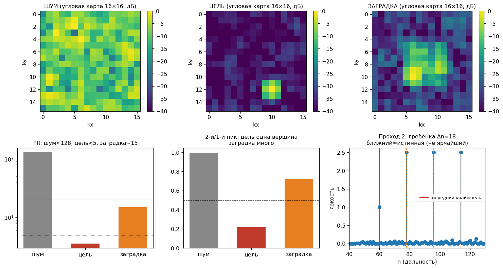
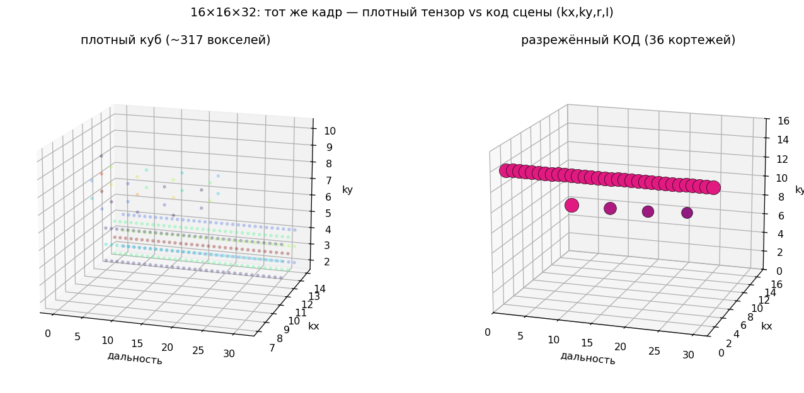
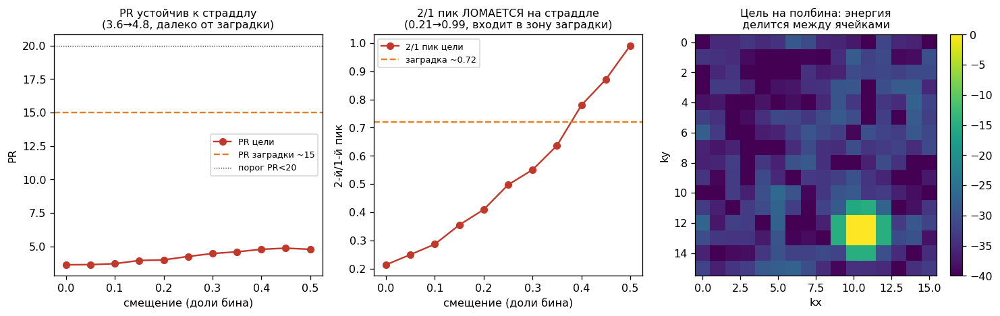
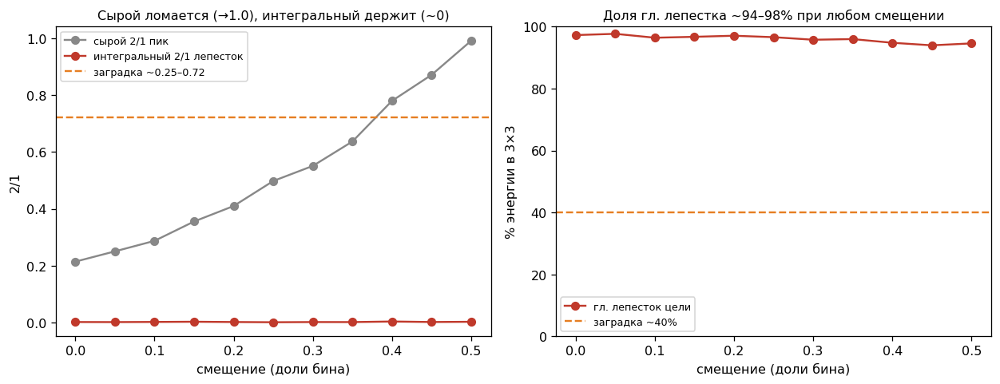

# Глава 4. Грубое обнаружение на угловой карте: признаки, триаж, токен

## 4.0. Место главы в конвейере

После главы 3 дальностный БПФ (кернел A) перевёл дечирпованный сигнал в дальность: на входе настоящей главы — комплексный тензор **16×16×N**, где третья ось уже означает бины дальности, а N переменна за такт. Для каждого бина дальности `r` срез `S[:, :, r]` — комплексная **апертурная матрица 16×16** (сигнал на элементах решётки для этой дальности).

Задача главы — по каждому срезу быстро решить, есть ли в нём собранный по углу источник и какого он типа, и упаковать результат в компактный **токен**. Всё выполняет один вычислительный блок — **кернел B**.

## 4.1. Обозначения

| Символ | Смысл | Размер / диапазон |
|---|---|---|
| `N` | глубина дальности (бинов) | переменна за такт |
| `r` | индекс бина дальности | 0 … N−1 |
| `S[k_x,k_y,r]` | комплексный сигнал на элементах решётки | 16×16, ℂ |
| `A[k_x,k_y]` | комплексная **угловая карта** после углового БПФ | 16×16, ℂ |
| `P = |A|²` | **энергетическая** угловая карта | 16×16, ℝ≥0 |
| `M = 256` | число угловых ячеек (16×16) | — |
| `p_i` | значения `P`, развёрнутые в вектор | i = 0 … 255 |
| `(k_x,k_y)` | номер углового бина; `sinθ = k/8` при d=λ/2 | −8 … 7 (после fftshift) |
| `S1 = Σp_i`, `S2 = Σp_i²` | суммы для признаков | — |

Угловая ячейка `(k_x,k_y)` соответствует направлению прихода, её значение — энергия с этого направления на данной дальности.

## 4.2. Что делает кернел B (обзор)

Базовая единица — одна апертурная матрица `S[:,:,r]`; на выходе — один токен:

```
вход:  S[:, :, r]                       — апертурная матрица 16×16 (комплекс)
  1. A = угловой БПФ 2D (S · окно)      — формирование луча, остаётся комплексом
  2. P = |A|²  (fftshift)               — энергетическая карта (переход в float)
  3. f = features(P)                    — вектор инженерных признаков
  4. пики = поиск до 5 пиков по углу    — координаты и яркости источников
  5. (метка, скор) = MLP(f)             — классификация типа среза
выход: токен(r) = { пики[], признаки, метка, скор }
```

Порядок принципиален: **магнитуда берётся только после углового БПФ**. Угловой БПФ — когерентное суммирование по апертуре, ему нужна фаза между 256 элементами; взять модуль раньше — потерять направление.

## 4.3. Шаг 1 — угловой БПФ (формирование луча)

Двумерный БПФ по апертуре, с оконной функцией `w` (Хэмминга) по обеим осям для подавления боковых лепестков:

```
A[k_x,k_y] = FFT2( S[:,:,r] · w(x)·w(y) )
```

Точечный источник даёт узкий главный лепесток в одной ячейке; шум — равномерную рябь. Реализуется матричным умножением на тензорных блоках (WMMA).

## 4.4. Шаг 2 — энергетическая карта

```
P[k_x,k_y] = |A[k_x,k_y]|²   (с fftshift: нулевая частота в центре, k = −8…7)
```

С этого шага работаем с вещественной картой `P`; все признаки считаются по ней.

## 4.5. Шаг 3 — линейка признаков

Классифицировать срез по всем 256 значениям дорого; вместо этого сжимаем карту в короткий **вектор инженерных признаков**, каждый — дешёвая редукция.

**Признаки собранности (устойчивые якоря).**

Participation Ratio — эффективное число «горящих» ячеек:

```
PR = (Σp_i)² / Σp_i² = S1² / S2
```

Точечный источник → `PR ≈ 1–3`; заградка → десятки; шум → `≈ M/2 = 128`. Главный якорь «источник против шума».

Индекс Хойера — нормированная разреженность в [0,1]:

```
Hoyer = (√M − S1/√S2) / (√M − 1)
```

`→ 1` собрано, `→ 0` размазано.

**Признаки формы главного лепестка (страддл-устойчивые).** При попадании источника между бинами (страддл) энергия делится между соседними ячейками; поэтому меряем не ячейку, а лепесток целиком. Пусть `(i*,j*) = argmax P`, блок 3×3 вокруг него:

```
MainFrac = Σ_{3×3} P / S1
```

Доля энергии в главном лепестке. Цель (даже при страддле) → 0.94–0.98; заградка → ~0.40; шум → ~0.07.

Интегральное отношение лепестков (устойчивая замена «2-й/1-й пик»): обнуляем охранную зону 5×5 вокруг главного пика, ищем второй лепесток:

```
LobeRatio = Σ_{3×3 вне охранной зоны} P / Σ_{3×3 главный}
```

Одиночная цель → ~0.002; заградка → ~0.25; шум → ~1.0.

**Вспомогательные признаки:**

```
MaxMean = max(P)/mean(P)   — контраст пика (яркость)
PeakPos = argmax P         — направление главного источника
Energy  = S1               — абсолютный уровень
```

Итоговый вектор: `f = [PR, Hoyer, MainFrac, LobeRatio, MaxMean, Energy]` (+ PeakPos отдельно). Все компоненты — 1–2 прохода по 256 значениям, т.е. редукции в быстрой памяти. Набор не финальный: по результатам обучения корректируется.



## 4.6. Шаг 4 — поиск пиков по углу

На одной дальности возможно несколько источников под **разными углами**, поэтому в токен пишем массив пиков фиксированной длины (до 5):

```
пики[5] = { (k_x, k_y, яркость, кромка) }
n_пиков  = сколько из 5 валидны (0…5)
```

`кромка` — нарастание/спад пика по соседним бинам дальности; почти бесплатна (соседние бины под рукой) и служит физическим признаком (резкая кромка реального отражателя против размытой копии). Если пиков больше 5 — это само по себе признак «размазано», лишние не пишутся.

Массив ловит множественность **по углу**. Множественность **по дальности** (гребёнка) собирает проход 2 (§4.9). Две оси структуры независимы: угол — массивом, дальность — сборкой.



## 4.7. Структурный токен

```
токен = {
    r,                         // индекс бина дальности
    n_пиков,                   // 0..5
    пики[5] = { k_x, k_y, amp, кромка },
    PR, Hoyer, MainFrac, LobeRatio,   // признаки среза
    метка,                     // шум / источник / заградка
    скор                       // уверенность
}
```

Пустые срезы («шум») не пишутся → выход разрежённый. Это и есть свёртка большого объёма в компактную матрицу токенов.

## 4.8. Шаг 5 — триаж (гейт, не арбитр)

Вектор признаков подаётся на компактную сеть:

```
MLP: 6 → 16 → 3
классы среза: шум / собранный источник / размазанный (заградка)
выход: метка + скор
```

Три класса — это то, что физически различимо по **одной** угловой карте. Гребёнка ретранслятора от одиночной цели по одному срезу неотличима (различие — по дальности) и выделяется проходом 2.

**Триаж — гейт, не арбитр.** Метку «цель» окончательно ставит физика следующего уровня (передний край + согласование с текущим кодом, глава 5), а не эта сеть: ретранслятор даёт «собранный источник», для угловой сети неотличимый от цели. Выход сети — скор для приоритета обработки. Порог записи токена **мягкий**: слабый ближний пик (истинная цель под яркой ложной) не должен отсеяться — передний край терять нельзя.

## 4.9. Проход 2 — сборка структуры по дальности

Второй, дешёвый проход работает уже с потоком токенов. Берём токены с меткой «источник» под одним направлением `(k_x,k_y)` и раскладываем по дальности `r`:

| Картина токенов вдоль дальности | Вывод |
|---|---|
| одиночный токен | одиночная цель |
| несколько с равным шагом `Δr` | регулярная гребёнка ретранслятора |
| ближний токен группы (`min r`) | передний край — кандидат в истинную цель |
| токены во всех `r` подряд | заградка / сплошной источник |

Регулярность гребёнки подтверждается автокорреляцией цепочки токенов (период `Δr`). Ближний член группы помечается как **кандидат** в истинную цель; окончательную метку цель/ложь выносит физический арбитр главы 5 (правило переднего края τ≥0 и/или согласование с текущим кодом). Обработка идёт по единицам токенов, не по кубу данных → очень дёшево.

Итог по классам разнесён по уровням: на срезе (проход 1) — шум / собранный / размазанный; на профиле (проход 2) — «собранный» распадается на одиночную цель и гребёнку.

## 4.10. Реализация на GPU

Логика §4.2–4.9 не зависит от раскладки срезов по вычислительным блокам. Ради занятости один workgroup берёт **плитку из нескольких соседних бинов дальности**, грузит их в быструю память рабочей группы (LDS) и выполняет для каждой матрицы плитки угловой БПФ, магнитуду, признаки и триаж, не выходя в общую память; наружу пишутся только токены. Совмещение всех шагов в LDS — источник скорости (признак п.9 формулы); на смысл алгоритма плитка не влияет.

**Размер угловой плитки — параметр, а не константа.** Базовые 16×16 — это родная матричная инструкция (WMMA на RDNA4). Тот же конвейер масштабируется без изменения алгоритма: на CDNA/MI100 нативна матрица 32×32 (MFMA), а по бюджету LDS одна плитка держится на кристалле вплоть до 64×64 (32 КБ из 64 КБ при комплексном float2); 128×128 уже уходит в VRAM. Например, реальная подапертура 32×32 даёт вдвое тоньше угол (Δsinθ = 1/16) при том же ядре, а большие решётки набираются плиточно со вторым уровнем beamspace-сложения. Размерность выбирается под задачу и карту, а не фиксируется.

## 4.11. Проверка на числах (модельная сцена)

Признаки посчитаны на модельных угловых картах 16×16 (аподизация Хэмминга, комплексный гауссов шум). Значения иллюстративны (зависят от SNR и параметров сцены); важна **структура разделения**.

**Три класса (источник на сетке):**

| класс | PR | Hoyer | MaxMean | MainFrac | LobeRatio |
|---|---|---|---|---|---|
| шум | 129 | 0.31 | 5.4 | 0.07 | 1.03 |
| цель | 3.6 | 0.94 | 123 | 0.98 | 0.002 |
| заградка | 15–23 | 0.81 | 22–42 | 0.40 | 0.25 |

**Устойчивость к страддлу (источник смещается на полбина):**

| признак | цель на сетке | цель на полбина | вывод |
|---|---|---|---|
| PR | 3.6 | 4.8 | устойчив |
| Hoyer | 0.94 | 0.92 | устойчив |
| MainFrac | 0.98 | 0.94 | устойчив |
| LobeRatio | 0.002 | 0.002 | устойчив |
| «2-й/1-й пик» (сырой) | 0.21 | 0.99 | ломается → не используется |

Разделение держится на устойчивых якорях (PR, Hoyer, MainFrac, LobeRatio); сырой пиковый признак чувствителен к страддлу и оставлен только как исторический.





## 4.12. Открытые вопросы

> Все пункты ниже закрываются экспериментально на этапе тестов.

1. Итоговый состав вектора признаков — уточняется по результатам обучения (кандидат — энтропия карты).
2. Пороги классов и порог записи токена — калибруются на синтетическом датасете по заданной вероятности ложной тревоги.
3. Нерегулярная структура по дальности (рваная гребёнка, дрожащая задержка) — выносится на глубокий уровень (глава 7): патч по дальности + объёмная сеть, глубина патча (64/128/256) от типичного периода гребёнки.
