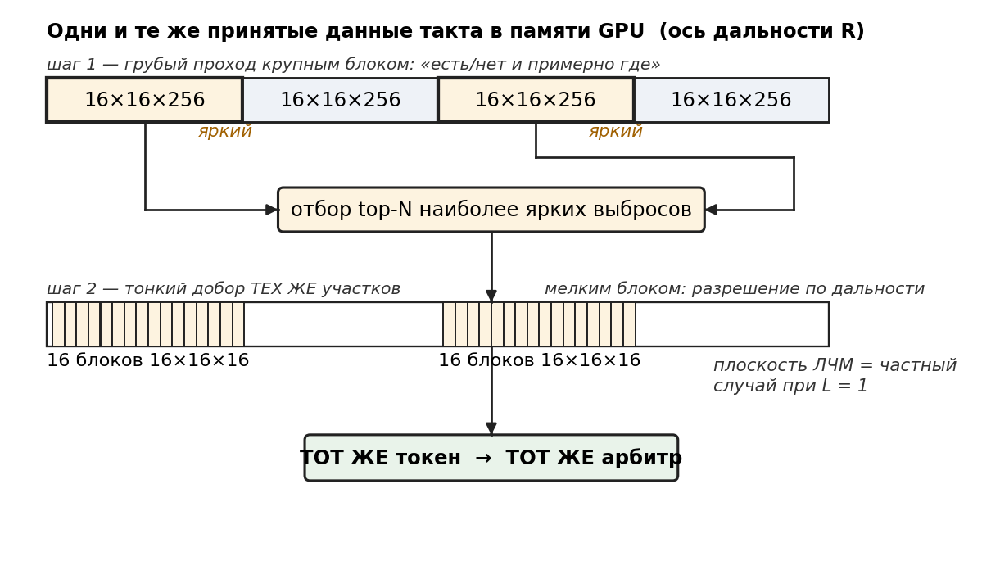

> ⚠️ **КОНЦЕПЦИЯ ИЗМЕНЕНА (2026-07-17):** апертура НЕ фиксированная 16×16, а **i×j** (каждая ось = 2ⁿ, недобор элементов → zero-pad до 2ⁿ); угловая шкала `sinθ = k/(N_pad/2)` считается по каждой оси НЕЗАВИСИМО. Куб и окна `16×16×L/D` → `i×j×L/D`; бюджет пересчитать под i·j каналов. Полный список правок — [`00_КОНЦЕПЦИЯ_ixj_2n.md`](00_КОНЦЕПЦИЯ_ixj_2n.md). Текст ниже ещё НЕ переработан под новую концепцию.

# Глава 4-бис. Ядро: унифицированный объёмный примитив

Это **ядро всего решения**, к которому главы 3–4 — лишь один частный интерфейс. Токен формируется **на объёме** (куб «угол×угол×дальность»), а способ заполнить объём — сменный **интерфейс (фронтенд) под тип сигнала**. Над кубом работает **один токенизатор**, безразличный к тому, чем куб заполнен. Плоская токенизация главы 4 — частный случай при `L = 1`. В этом стержень: одно ядро — много интерфейсов.



## 4-бис.1. Единый куб «угол × угол × дальность»

Общий интерфейс — объём `16×16×L` (апертура × апертура × дальность). Оба режима заполняют **один и тот же куб**, отличаясь лишь способом заполнения:

- **ЛЧМ-точность:** глобальный дальностный FFT + поячеечный угловой 16×16 (главы 3–4) — куб заполнен дальностно-разрешённо, плотно.
- **AM-присутствие:** локальный **трёхмерный FFT** по скользящему окну `16×16×D` (глубина окна `D`, напр. 16) с переменным шагом (8/16/32/64) — куб заполнен грубо и разреженно.

Дальше — **один объёмный токенизатор**, безразличный к тому, чем куб заполнен. Это и есть абстракция: одно ядро, разный фронт.

## 4-бис.2. AM-фронтенд: быстрый «есть/нет + примерно где»

Вход этого интерфейса — отдельный **лёгкий амплитудно-модулированный зонд** (быстрый грубый обзор; при необходимости — огибающая широкополосного приёма). AM отвечает не на «точно где», а на «есть ли что-то в квадрате». В идеале AM-куб — почти сплошной шум с **редкими выбросами** там, где надо исследовать. Дёшево, потому что:

- **переменный шаг** 8/16/32/64 — ручка «грубо↔точно»: крупный шаг подвыбирает дальность (читаем меньше), мелкий (8) — только в помеченных зонах;
- **произвольный под-куб**: обрабатываем участок любого размера (вплоть до `8×8×L`) и **в любой точке** объёма, не с начала — «только конец», только заказанная часть длины;
- никакой тонкой дальности и когерентной точности — это работа FM-m.

**Почему именно 3D, а не 2D по блоку.** Плоский угловой FFT показывает лишь «энергия есть» (переход 0→1) и не отличает точку от сплошного. Третья ось несёт **форму по дальности**: локальный отклик даёт **компактный колокол**, а длинный/непрерывный источник — размазанный профиль с провалом. То есть 3D-FFT сразу отделяет «сконцентрировано» (кандидат) от «размазано» (шум/помеха) — концентрация как признак, прямо в кубе.

## 4-бис.2а. Адаптивная нарезка: грубо → всплеск → тонкий добор сырья

Дешевизна AM-обзора держится на том, что **всё сведено к токенам**: разреженная карта токенов уходит в **головную машину (блок 1)**, и она решает, что смотреть, до какого размера спускаться и сколько точек брать; блок управления потоком данных (4) исполняет это на ГПУ, перенарезая **одни и те же сырые данные** — они остаются в памяти ГПУ — под-кубами произвольного размера, шага и положения. Решает по дешёвой карте токенов, а не по сырому объёму. Режимы:

- **Грубо с эскалацией по ярким.** Объём проходят крупным шагом/глубоким форматом (напр. `16×16×256` — дёшево, грубая дальность по `k_z`). Головная машина берёт **ограниченное число самых ярких выбросов** (например, 3–4) и по ним командует **тонкий добор**: спуститься по формату (напр. `256 → 16`) с заданным числом точек и перечитать **те же** сырые под-кубы мелким шагом — второй проход 3D-БПФ уточняет положение только в этих точках. Менее яркие выбросы не теряются: они остаются в карте токенов и до-исследуются на следующих тактах (трекинг).
- **Сплошь мелким шагом (8/16).** Весь объём сразу в полном разрешении — добирать нечего, **эскалация выключается**.
- **Пропуск.** Пустой в прошлом такте участок при экономии бюджета не читают.

Выигрыш — **фиксированная наихудшая задержка** такта: грубый проход + не более `N` тонких доборов (`N` задаёт блок 1). Приоритет добора — по яркости (энергии), но это лишь порядок зумирования: истину «цель/ложь» по-прежнему выносит арбитр и код-корреляция FM-m, так что ранняя яркая ложь не смещает обнаружение, а только раньше отрабатывается.

## 4-бис.3. Объёмный токенизатор

Над кубом работает одно ядро:

```
под-куб 16×16×L → 3D-FFT → OS-CFAR по объёму → 3D-признаки → токен
```

Признаки — прямое обобщение плоских на объём: главный лепесток **3×3×3**, охранная зона **5×5×5**, PR/Hoyer по вокселям (16×16×L), интегральное отношение лепестков в 3D. Порог выброса — **OS-CFAR в 3D** (объёмные обучающие/охранные ячейки), тот же принцип, что в плоском тракте. **Двумерная токенизация глав 3–4 — частный случай при L = 1.**

Выход — тот же структурный токен (теперь пик в 3D: `k_x, k_y, k_z` + грубая дальность-позиция окна + признаки + метка), и дальше — **тот же** конвейер: гейт → арбитр переднего края / код → L3 → опрос FM-m.

## 4-бис.4. Объект и радиолюбитель (RFI) в кубе

Пример разделения одним алгоритмом:

- **объект** — когерентный отклик: **компактный выброс** в одном угловом квадрате и одном блоке дальности (колокол);
- **радиолюбитель (RFI)** — непрерывный внешний источник со своего угла: не эхо, приходит непрерывно → выброс на его угле **во всех блоках дальности** (полоса), а по третьей оси — **застывший тон** во всех окнах.

Тот же токенизатор и та же сборка по дальности видят: объект локализован (один блок), RFI — размазан по всей дальности → распознаётся как непрерывный источник; окончательно RFI отсекает FM-m код-арбитр (не ответит на свежий код). Спец-случая нет.

**«Летит» — не из куба.** Окно быстрого времени слишком коротко для доплера; движение определяется **трекингом выброса между тактами** (либо отдельной осью пачки), а не внутри одного AM-куба.

## 4-бис.5. Реализация и бюджет (MI100)

Под-куб загружается в **память рабочей группы (LDS)**, угловые плоскости 3D-БПФ считаются на матричных блоках, порог и токенизация — там же, без выхода в VRAM; сбор апертуры поперёк антенн (данные лежат антенна-за-антенной) — страйд-чтениями при загрузке в LDS, отдельного прохода нет.

Порядок величин на MI100 (полоса 1.23 ТБ/с), объём 16×16×N:

| режим | 0.5М | 1М |
|---|---|---|
| грубый скан, шаг 64 (¼ объёма) | ~0.2–0.3 мс | ~0.4–0.5 мс |
| сплошной, шаг 16 | ~1 мс | ~2 мс |
| под-куб `8×8×пару-тысяч` (зум/«только конец») | микросекунды | микросекунды |

Полная длина 0.5–1М — осознанная, заложенная задержка; «быстро» достигается крупным шагом и/или частичным под-кубом.

## 4-бис.6. Итог

Токен — универсальный интерфейс; фронтенд лишь заполняет куб (AM грубо / ЛЧМ точно), а объёмный токенизатор один. Отсюда одно абстрактное ядро, инвариантный к фронтенду пайплайн и, как следствие, простота и патентная широта (зависимые пункты об объёмном токене и инвариантности к фронтенду).
