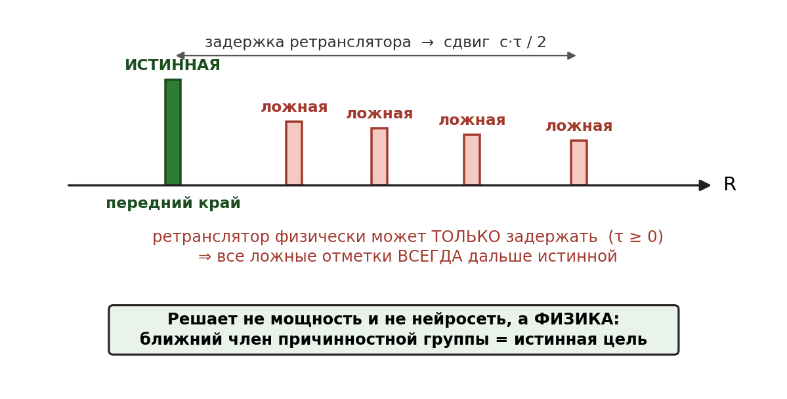

# Глава 5. Физический арбитр: правило переднего края

## 5.0. Место главы в конвейере

Гейт главы 4 сжал объём в матрицу токенов и грубо разметил срезы (шум / собранный источник / размазанный), но метку «цель / ложная» он не ставит: ретранслятор даёт «собранный источник», по одной угловой карте неотличимый от настоящей цели. Окончательное решение выносит **физический арбитр** настоящей главы — не нейросеть, а причинностный принцип, который противник не может подделать.



## 5.1. Причинность: τ ≥ 0

DRFM/ретранслятор — это **пере**датчик: он обязан сначала принять зондирующий сигнал, затем переизлучить его. Приём, обработка в памяти и переизлучение занимают неотрицательное время, поэтому любой отклик, созданный ретранслятором, приходит **позже** прямого отражения истинной цели. Время переводится в дальность, значит ложная цель, слепленная ретранслятором, стоит на **той же дальности или дальше** истинной — и никогда ближе:

```
τ ≥ 0   →   R_ложн ≥ R_цель
```

Ось возможных положений ложных целей **односторонняя**. Это фундамент главы: истинная цель — передний край причинностной группы.

Важная оговорка: ложная цель может быть **ярче** истинной (DRFM усиливает сигнал, чтобы увести захват). Поэтому решение принимается **по дальности, а не по яркости**: ближний член группы, а не самый яркий.

## 5.2. Вариант 1 — передний край по дальности (геометрия)

Работает на картине широкого ЛЧМ-обзора, по профилю токенов вдоль дальности (проход 2 главы 4). В причинностной группе — истинное отражение и следующая за ним гребёнка копий с регулярным шагом. Правило:

> ведущий (ближний по дальности) член группы — истинная цель; хвостовые пики с регулярным шагом — кандидаты в ложные.

Регулярность гребёнки подтверждается автокорреляцией цепочки токенов, но метку определяет именно **передний край**. Признак чисто геометрический, кодов не требует и работает уже на этапе обзора.

## 5.3. Вариант 2 — свежесть кода (сигнал)

Работает на этапе многолучевого опроса FM-m. Код опроса **свежий и непредсказуемый** и меняется от такта к такту, поэтому противник не может подделать ответ на код, которого ещё не слышал. Переизлучение ретранслятора либо несёт **не тот код** — в корреляторе не сжимается в пик и подавляется на ~10·log₁₀(L) дБ (проигрыш согласования), либо приходит **позже** — оказывается дальше и снова попадает под правило переднего края.

Это свойство самого зонда FM-m: непредсказуемость кода делает согласованный отклик **неподделываемым признаком** истинной цели.

## 5.4. Почему держим оба варианта

Оба признака вытекают из одной причинности (τ ≥ 0), но действуют на **разных осях и разных этапах**, и потому закрывают слабые места друг друга — противник обязан обойти **сразу оба**:

- если на данном такте истинное эхо слабое (замирание, ракурс с малой ЭПР) и ближний край ненадёжен — ретранслятор всё равно ловится **свежестью кода** (несёт не тот код);
- если помеха ухитрилась ответить текущим кодом — она физически **не может** оказаться ближе истинной цели, её берёт **передний край** по дальности.

Геометрия ловит то, что упускает код, и наоборот. Это и даёт надёжность при ограниченной цене (приоритет надёжность → скорость).

## 5.5. Область действия

Правило переднего края строго верно для **самозащитной (самоприкрывающей) помехи** — излучаемой с носителя самой цели. Уводящий или загораживающий джаммер на **ином**, физически более близком носителе может оказаться ближе истинной цели; но это уже не самоприкрытие, и он отделяется **свежестью кода** (не отвечает согласованно на свежий зонд) и **угловым разнесением** (иное направление). Поэтому в независимом пункте формулы область действия арбитра ограничена самозащитной помехой — так признак остаётся неуязвимым.

## 5.6. Связь с конвейером и формулой

Арбитр замыкает распознавание: гейт (глава 4) отбирает кандидатов и приоритезирует, арбитр (эта глава) ставит окончательную метку по причинности, а результат уходит в целеуказание агильного пучка FM-m (глава 8). В формуле это признак (в) независимого пункта: «метку цель/ложь устанавливают по правилу ближнего по дальности члена причинностной группы (τ ≥ 0) **и/или** согласования с текущим кодом» — оба варианта настоящей главы. Причинность нельзя подделать: противник не ответит кодом, которого ещё не слышал, и не поставит ложную цель ближе истинной.

## 5.7. Робастность к движению цели

Правило переднего края — **потактовое и мгновенное**: оно про задержку внутри одного измерения, а не про движение между тактами. Отсюда три случая.

**Удаление (или сближение) цели.** Гребёнку не разворачивает. Внутри каждого такта копии тянутся в бо́льшую дальность (τ ≥ 0), ближний край — истинная цель. Вся группа (истинная + гребёнка) едет по дальности от такта к такту; её ведут трекингом.

**Гребёнка «к нам» (уводящая по дальности на упреждение, range-gate pull-in).** Внутри импульса невозможна: ближе истинной — значит переизлучить раньше приёма (τ < 0). Между импульсами враг может проиграть **запомненный прошлый** импульс на меньшую дальность, но тот несёт **устаревший код** и в корреляторе не сжимается — снимается свежестью кода (§5.3). Случай, где геометрия одна не справилась бы, закрывает связка с кодом.

**Диагональ (движение по дальности и по углу).** Потактовое правило держится: ближний край группы — истинная цель, а группа смещается по углу и дальности вместе (для самоприкрытия ретранслятор на носителе цели — тот же угол). Трудность не в принципе, а в когерентной пачке: **range walk** (компенсируется keystone, §3.5) и **угловая миграция** пика по карте (короткий интервал накопления). Гребёнка под иным углом — уже не самоприкрытие, отсекается §5.5.
