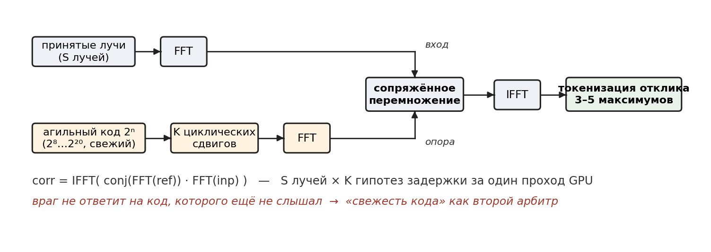

# Глава 6. FM-m коррелятор: реализация многолучевого опроса

## 6.0. Место главы в конвейере

После того как широкий ЛЧМ-обзор и матрица токенов (главы 3–5) дали, куда светить, радар опрашивает **интересуемые площади** зондом FM-m — сигналом, фазово-манипулированным M-последовательностью. Опрос **многолучевой**: столько лучей (5, 6, 7 … n), сколько нужно, чтобы покрыть площади кандидатов, и **все лучи считаются параллельно на GPU** (`S` лучей за проход, поддержано батчингом §6.7). Настоящая глава описывает коррелятор, который отвечает на вопрос: **есть ли в принятом сигнале наш код и с какой задержкой (дальностью)** — для `S` лучей против `K` гипотез задержки одновременно, целиком на GPU в частотной области.



## 6.1. Почему M-последовательность

M-последовательность (генерируется регистром сдвига с линейной обратной связью, LFSR, по примитивному полиному, не фиксированному — он меняется по такту) — код из `±1` с двумя ценными свойствами:

- **острая автокорреляция**: корреляция кода с самим собой — почти дельта-функция (высокий центральный пик, боковые ~`1/√L` при апериодической корреляции), поэтому совпадение по задержке видно как чёткий одиночный пик;
- **псевдошумовой спектр**: код выглядит как шум — помехозащищённость и скрытность.

Длина кода **агильная**, `L = 2⁸ … 2²⁰`, и **меняется каждый такт**; эталонного полинома нет — код формируется по команде под текущий такт. Генерация дешёвая (регистр Галуа: сдвиг и XOR с полиномом на бит, бит → `±1.0`); код уходит на GPU и переиспользуется в пределах такта.

## 6.2. Корреляция через БПФ

Прямая корреляция длины `N` стоит `O(N²)`; по теореме о свёртке её заменяют тремя быстрыми преобразованиями:

```
corr(ref, inp) = IFFT( conj(FFT(ref)) · FFT(inp) )
```

Стоимость — `O(N log N)`. Пошагово: `FFT(ref)` (эталон, заранее, один раз) → `FFT(inp)` (вход) → поэлементное `conj(FFT(ref))·FFT(inp)` (сопряжение превращает свёртку в корреляцию) → `IFFT` (корреляционная функция) → `|·|/N` (магнитуда, нормировка). Пик в точке `j` означает: принятый сигнал содержит эталонный код с задержкой `j` отсчётов; `j` пересчитывается в дальность. Размер преобразования — под длину кода такта (дополнение нулями до `2ⁿ`).

## 6.3. Банк из K гипотез задержки

Эталон готовится не в одном экземпляре, а как **банк из `K` версий** — `K` циклических сдвигов **текущего** кода. Каждый сдвиг — отдельная гипотеза задержки (дальностный строб); коррелятор проверяет все `K` за один проход, и положение пика по `(k, j)` локализует цель по дальности. Никакой истории прошлых кодов здесь нет — все `K` опор принадлежат коду текущего такта. Различение истинной цели и ретранслятора выполняет не банк, а физический арбитр главы 5 (передний край + свежесть кода).

## 6.4. Архитектура GPU: два потока, переиспользование эталона

Обработка построена на двух независимых потоках ради параллелизма:

```
поток 0 (эталон):  H2D(ref) → циклические сдвиги → FFT(K сдвигов)
поток 1 (вход):    H2D(inp) → FFT(S сигналов)          ← одновременно
                   ── синхронизация потоков ──
поток 0 (финал):   conj·умножение → IFFT(S×K) → магнитуды → D2H
```

Эталон готовится один раз и живёт на GPU: его `K` спектров переиспределяются без повторной загрузки; пока поток 1 грузит и преобразует входные лучи, поток 0 уже сделал свою часть — латентность прячется за перекрытием. Планы БПФ создаются один раз при установке параметров (создание плана дорогое) и привязываются к своим потокам, чтобы не рушить параллелизм.

## 6.5. Четыре вычислительных ядра

Счёт — четыре компактных HIP-ядра, скомпилированных под целевую архитектуру на устройстве (с дисковым кешем бинаря):

1. **Циклические сдвиги** — из вещественного эталона строит `K×N` комплексный банк: `out[k][i] = ref[(i+k) mod N]`; сдвиг по модулю `N` — побитовое `И` (N — степень двойки), без деления.
2. **Сопряжённое умножение** — `conj(ref_fft[k])·inp_fft[s]` за один проход по всем парам `(s,k)`; сопряжение инлайн (смена знака мнимой части).
3. **Извлечение магнитуд** — `|corr[j]|/N` для первых `n_kg` точек (дальние задержки не нужны — экономия памяти и времени); модуль побитовым сбросом знака, деление на `N` заменено умножением на `1/N`.
4. **Генератор тест-входов** — служебное: `inp = circshift(ref, s·шаг)` прямо на GPU для самопроверки без загрузки с хоста.

Микрооптимизации: выровненный `float2` (одна 64-битная транзакция), эрмитова симметрия вещественного БПФ (`N/2+1` точек вместо `N` — ~50% памяти на спектрах входа), нормировка умножением.

## 6.6. Кернел токенизации на выходе IFFT

Сразу после IFFT встроено ядро, которое **не передаёт полный корреляционный отклик дальше**, а извлекает из него **3–5 наибольших значений** и формирует набор токенов (позиция пика = задержка/дальность, амплитуда, кромка). Это резко сокращает объём данных на дальнейшую обработку — та же логика «токен вместо сырья», что и в главе 4, но на выходе коррелятора. Число значений (3 или 5) подбирается на этапе тестов.

## 6.7. Батчинг по памяти

Число лучей `S` бывает большим, весь массив может не поместиться в память GPU; менеджер батчей решает это сам:

- оценивает, сколько лучей влезает в ~70% свободной памяти, заранее вычтя постоянно занятый банк эталона;
- влезает всё — считает за один проход; не влезает — режет на батчи оптимального размера и обрабатывает по очереди, накапливая результат;
- эталон не трогается (подготовлен один раз); между батчами пересоздаются только буферы входа, и то лишь при смене размера батча;
- данные подаются прямым указателем в нужное смещение массива, без промежуточных копий.

Один и тот же вызов корректно отрабатывает и пять лучей, и тысячи — масштаб подстраивается под железо.

## 6.8. Оптимизация финала (опция)

Поскольку `K` опор — циклические сдвиги **одного** (текущего) кода, все `K` корреляций суть сдвиги одной базовой. Поэтому финал при желании сводится к **одной IFFT на луч** и `K` оконным чтениям со сдвигом вместо `S×K` обратных БПФ — ощутимое сокращение времени. Это опциональная оптимизация; прямой честный `S×K` тоже корректен, и на смысл результата выбор не влияет.

## 6.9. Что на выходе

Набор токенов пиков по лучам и задержкам: для каждого луча `s` и задержки `j` — магнитуда корреляции (после токенизации §6.6 — только выжившие пики). По нему: **есть ли цель** — по превышению пика над фоном; **дальность** — по положению пика `j`. Метку **истинная/ложная** ставит не коррелятор, а физический арбитр главы 5 — по переднему краю и свежести кода. Эти величины идут в целеуказание активного FM-m зондирования (глава 8).

## 6.10. Заметки для патента

- **Уровень техники.** Сама GPU-ускоренная кросс-корреляция известна (две работы по GPU-корреляции для пассивного бистатического радара — Remote Sensing, MDPI 15(22):5421; J. Parallel Distrib. Comput., 2025); её берём как ближайший уровень.
- **Что здесь несёт новизну** (не сама корреляция): **агильная длина кода** `2⁸…2²⁰` с дополнением до `2ⁿ`, on-chip обработка и **токенизация на выходе IFFT** — в связке с признаками (а)+(г) формулы. Коррелятор — реализующий движок многолучевого опроса FM-m.
- **Параметры LFSR.** Полином не фиксирован, длина агильная; для референс-реализации фиксируется генератор конкретного такта, канонического полинома нет.
