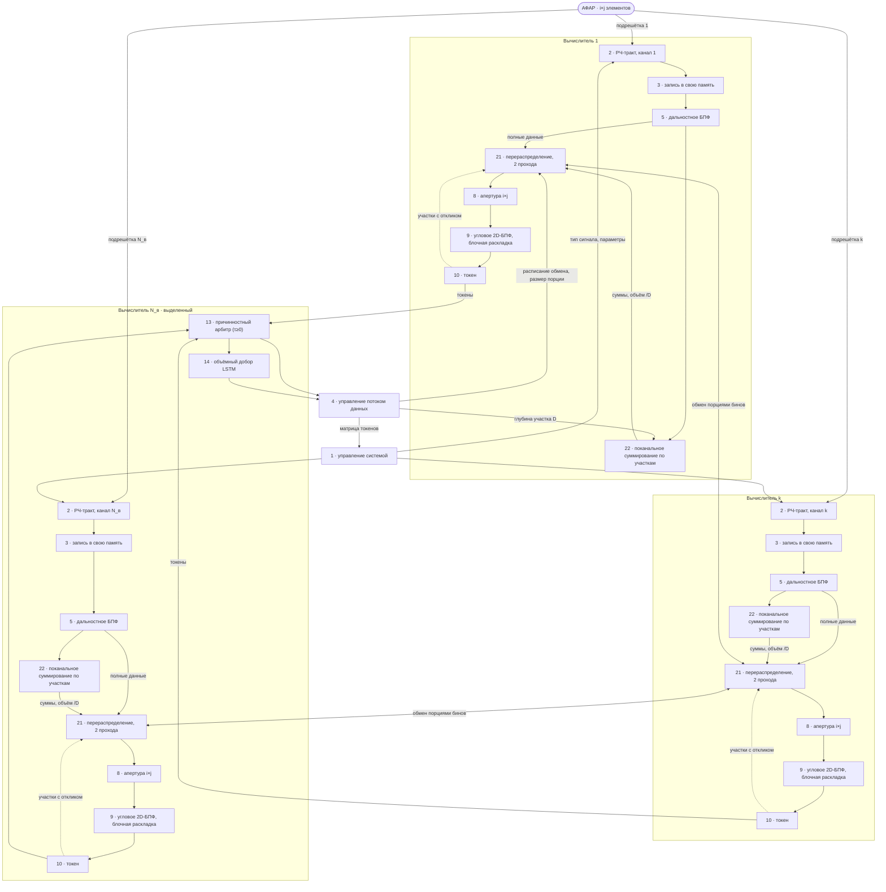
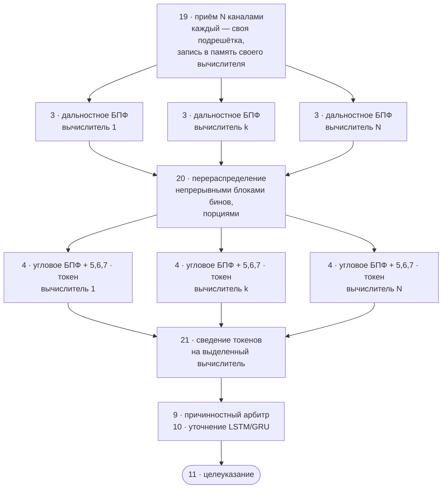
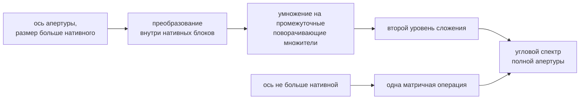
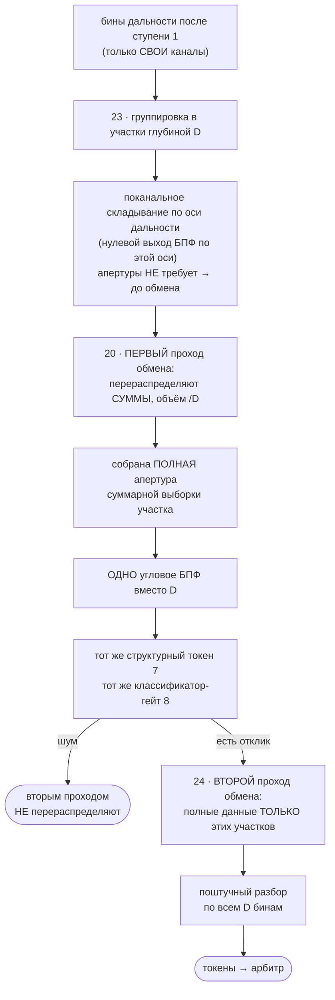
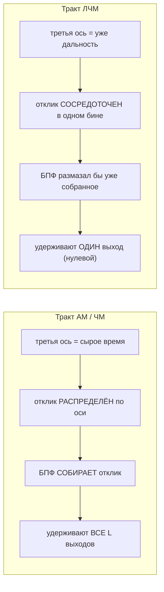

# Блок-схемы исполнения с N вычислителями — Mermaid (исходники)

> **Дата:** 2026-08-09 · Дополнение к [`blocksch_mermaid.md`](../blocksch_mermaid.md) (Фиг. 1 устройства).
> Теория и обоснование — [`../NGPUand/00_TEORIYA_NGPU_konveyer.md`](../NGPUand/00_TEORIYA_NGPU_konveyer.md).
>
> ⚠️ **Схемы черновые — под перерисовку.** Mermaid даёт верную топологию и подписи, но не
> оформление по ГОСТ. Alex перерисовывает; здесь зафиксированы **состав блоков, связи и
> подписи**, чтобы при перерисовке ничего не потерялось.
>
> Правила редактирования — те же, что в `blocksch_mermaid.md`: текст узла со спецсимволами
> в кавычках; после метки на стрелке `-->|"..."|` ровно один пробел.

**Соответствие файлам заявок:**

| Фигура | Файл-приёмник | Куда вставляется |
|---|---|---|
| Устройство, фиг. 2 | `Устройство_фиг2.png` | `zayavka_USTROJSTVO.md` |
| Способ, фиг. 5 | `Способ_фиг5.png` | `zayavka_SPOSOB.md` |
| Способ, фиг. 6 | `Способ_фиг6.png` | `zayavka_SPOSOB.md` |
| Способ, фиг. 7 | `Способ_фиг7.png` | `zayavka_SPOSOB.md` |

---

## Устройство, фиг. 2 — N приёмных каналов и N вычислителей

Показаны три вычислителя из N (первый, произвольный k-й и выделенный). Блоки 3, 5, 22, 21,
8, 9, 10 — в каждом вычислителе; блоки 13, 14 — только на выделенном.

> 🔴 **Исправлено 09.08 по итогам ревью.** В первой версии этой схемы блок 22 стоял в цепочке
> **до** блока 21 и при этом «выполнял угловое преобразование». Так нельзя: угловому
> преобразованию нужна **вся апертура**, а до обмена у вычислителя только своя подрешётка.
> Верно так: блок 22 делает **только поканальное суммирование** (оно апертуры не требует),
> а блок 21 работает **в два прохода** — сначала обменивается суммами, потом полными данными
> отобранных участков. Угловое БПФ (блок 9) во всех случаях идёт **после** блока 21.

**Что обязательно сохранить при перерисовке:**
1. Каждый приёмный канал идёт **на свой** вычислитель — перекрёстных линий «канал → чужой вычислитель» нет.
2. Блок 21 связан с блоками 21 **остальных** вычислителей двусторонним обменом.
3. Блок 9 находится **после** блока 21 — угловое БПФ всегда по уже собранной апертуре.
4. Блоки 13 и 14 — **в единственном экземпляре**, на выделенном вычислителе.
5. У блока 21 **два входа данных**: от блока 5 (полные данные) и от блока 22 (суммы) — и **обратная связь** от блока 10 с перечнем отобранных участков.
6. Блок 22 — **только суммирование**, никакого углового преобразования в нём нет.

---

## Способ, фиг. 5 — распределённое осуществление (позиции 19, 20, 21)

**Подписи, которые нужны на чертеже:**
- у стрелки `P19 → ступень 1`: «обмена нет — преобразование поканальное»;
- у блока `P20`: «шов между двумя раздельными БПФ»;
- у стрелок `ступень 2 → P21`: «передаются токены, не угловые карты».

---

## Способ, фиг. 6 — конвейер порций (позиция 20)

Временная диаграмма: передача порции скрыта за обработкой предыдущей.

```mermaid
gantt
    title Конвейерное совмещение передачи и обработки
    dateFormat X
    axisFormat %s

    section Передача
    порция 1  :a1, 0, 1
    порция 2  :a2, 1, 1
    порция 3  :a3, 2, 1
    порция 4  :a4, 3, 1

    section Обработка
    порция 1  :b1, 1, 1
    порция 2  :b2, 2, 1
    порция 3  :b3, 3, 1
    порция 4  :b4, 4, 1
```

**Что показать на чертеже (диаграмма выше — только идея):**
- две дорожки: «передача» и «обработка», сдвинутые на одну порцию;
- условие `t_передачи(порция) ≤ t_обработки(порция)` — подписью под диаграммой;
- пометка «в памяти вычислителя одновременно живут только две порции».

---

## Способ, фиг. 7 — блочная раскладка и участки (позиции 22, 23, 24)

### 7а. Блочная раскладка углового БПФ (позиция 22)

**Подписи:** «`k = k₁ + m·k₂`, где m — нативный размер блока»; «число уровней = отношение
размера оси к нативному размеру»; «остаточный малый множитель — обычная бабочка».

### 7б. Участки предварительного решения (позиции 23, 24)

**Подписи:** «обмен идёт в ДВА прохода: суммы (объём /D), затем полные данные только отобранных»; «данные для второго прохода уже в памяти — повторного приёма нет»;
«поячеечная обработка = частный случай участковой при D = 1»;
«глубина D = наименьшее из: запас по дальности, разрежённость обстановки».

---

## Сопоставление трактов по третьей оси участка

Не отдельная фигура, а врезка — поясняет, почему оператор один, а удержание разное.
Можно дать таблицей прямо на фиг. 7 или отдельной врезкой.

**Подпись:** «Оператор один — преобразование Фурье по третьей оси участка. Различается
число удерживаемых выходов, и различие следует из физики оси».
