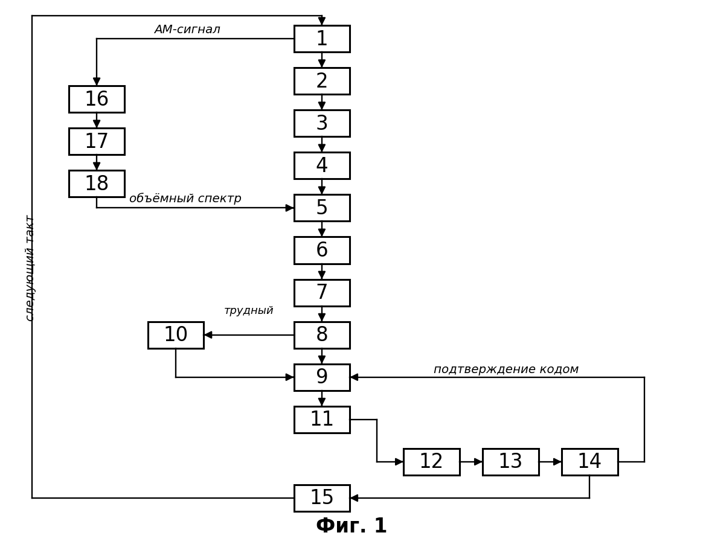
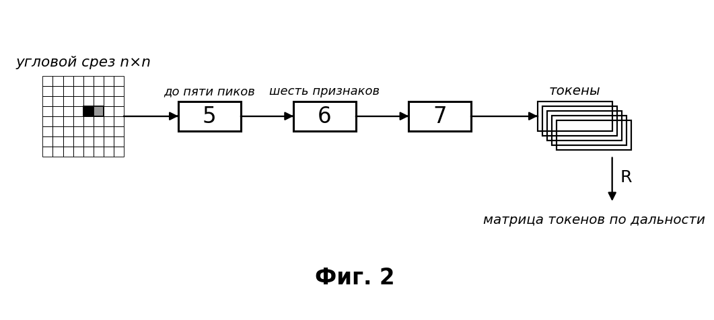
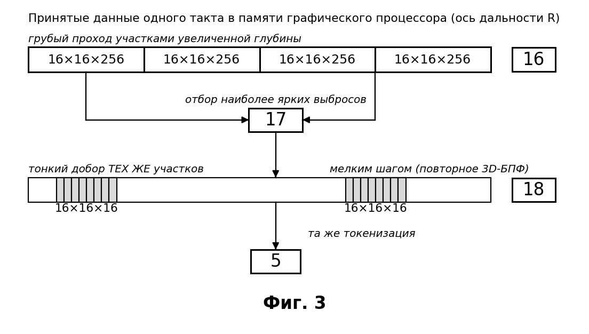
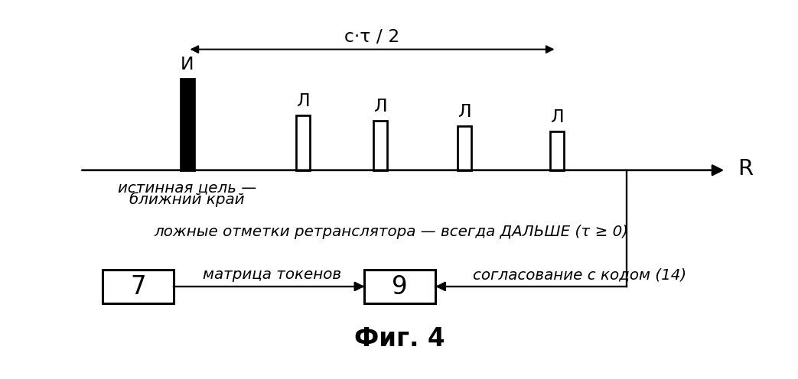
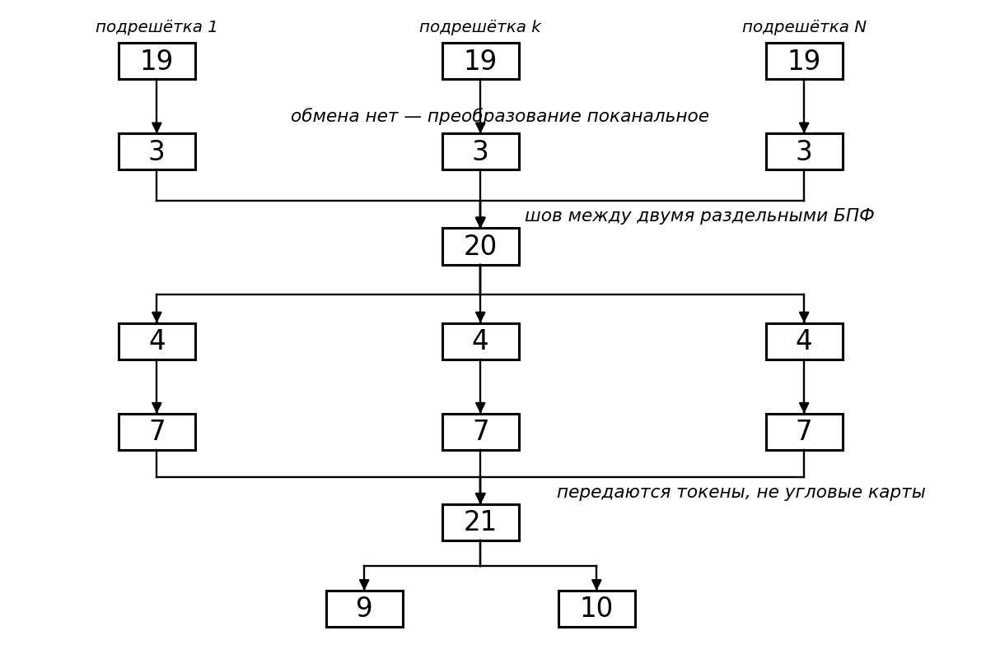
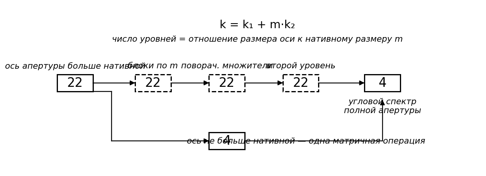
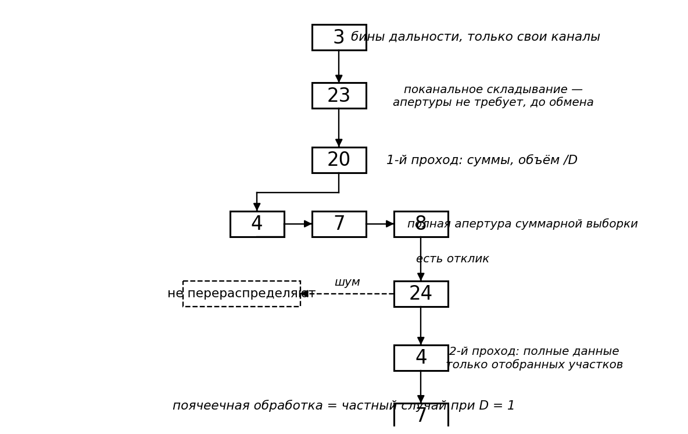

# Название изобретения

Способ распознавания истинной цели на фоне самоприкрывающей ретрансляционной помехи и целеуказания.

# Область техники

Изобретение относится к области радиолокации, конкретно к способу распознавания истинной цели на фоне самоприкрывающей ретрансляционной (DRFM) помехи и выдачи целеуказания в моностатической радиолокационной станции (РЛС) с активной фазированной антенной решёткой (АФАР), и может найти применение в широком классе РЛС с АФАР, решающих задачу обнаружения и сопровождения целей в условиях активного радиоэлектронного противодействия.

# Уровень техники

Классическая помеховая обстановка предполагает, что постановщик помех и цель пространственно разнесены: помеха приходит с одного направления, полезное отражение — с другого. На этом допущении построено большинство известных способов защиты — компенсация помехи по вспомогательному каналу, формирование провалов диаграммы направленности в направлении постановщика, пространственно-временная адаптивная обработка.

Известен способ подавления активной помехи /1/, принятый за **прототип**, основанный на приёме излучения источника помех по основному и вспомогательному приёмным каналам и вычислении взаимной корреляции между ними с последующей компенсацией помехи в главном луче диаграммы направленности. Способ обеспечивает подавление помехи от отдельно расположенного постановщика, однако обладает существенными ограничениями:

1. **Способ опирается на пространственное разнесение цели и помехи.** При самоприкрытии, когда ретранслятор размещён на самом носителе цели, помеха и полезный отклик приходят с одного направления и по одному лучу; вспомогательный канал не даёт компенсирующей выборки, и механизм компенсации перестаёт работать.

2. **Способ не содержит структурного различителя «истинная цель / ложная цель».** Современный ретранслятор с цифровой радиочастотной памятью (DRFM) запоминает зондирующий сигнал и переизлучает его копии с задержками, порождая гребёнку ложных отметок. Каждая такая отметка когерентна с зондирующим сигналом и по всем энергетическим и корреляционным признакам неотличима от отражения реальной цели. Компенсация помехи по мощности здесь бесполезна: подавлять нужно не энергию, а **ложность**.

3. **Компенсация ведётся по мощности, а не по причинности.** Признак, по которому ложную отметку можно отделить от истинной физически, — направление причинно-следственной связи: ретранслятор способен только **задержать** сигнал, но не опередить его. Прототип этот признак не использует.

Известны способы нейросетевой классификации радиолокационных данных на трёхмерном массиве «дальность–угол–скорость» /2, 3/. Они обучают свёрточную сеть непосредственно на сыром радиолокационном кубе и выдают решение «конец в конец». Ограничения: (а) объём входных данных остаётся полным, вычислительные затраты и латентность высоки; (б) решение выносит нейронная сеть, то есть оно не поверяется физическим законом и деградирует на сценах, которых не было в обучающей выборке; (в) структурного признака ложной цели, инвариантного к обучению, такие способы не образуют.

Известен способ формирования азимут-угломестной картины преобразованием Фурье по бинам дальности /4/ и известны способы обработки радиолокационных данных на графическом процессоре /5/. Оба относятся к вычислительной части задачи и признака различения истинной и ложной цели не содержат.

Известен способ планирования радиолокационного ресурса и наведения луча средствами машинного обучения /6/. Он решает задачу распределения ресурса, но не задачу распознавания цели на фоне самоприкрытия и не связывает наведение зонда со структурными признаками сцены.

Известен способ распределённой обработки радиолокационного сигнала /7/, в котором приёмные каналы вычисляют дальностное преобразование Фурье локально, а отдельный процессор вычисляет по их результатам угловое преобразование, причём передача результатов совмещается с вычислением. Способ решает задачу распределения вычислительной нагрузки, но угловое преобразование в нём **централизовано** на выделенном процессоре, обмен выполняется в полном объёме независимо от содержания сцены, и структурного признака различения истинной и ложной цели способ не содержит.

Известен способ двухэтапной обработки радиолокационного сигнала /8/, в котором кадр пониженного разрешения обрабатывается полностью, по нему определяются участки интереса, и лишь для них выполняется обработка кадра высокого разрешения. Способ сокращает вычисления, но требует формирования двух отдельных кадров разного разрешения и признака причинностного различения не содержит.

Таким образом, в известном уровне техники не выявлено способа, который решал бы задачу распознавания истинной цели **при самоприкрытии** — то есть тогда, когда помеха и цель неразделимы ни по направлению, ни по спектру, ни по энергии, — при этом укладываясь в ограниченную латентность обработки при апертуре произвольного размера.

# Задача изобретения

Задачей изобретения является разработка способа распознавания истинной цели на фоне самоприкрывающей ретрансляционной помехи и целеуказания в моностатической РЛС с АФАР, свободного от указанных ограничений.

# Технический результат

Техническим результатом является повышение достоверности распознавания истинной цели при самоприкрытии и снижение вычислительных затрат на обработку, обеспечивающее выполнение обработки в пределах рабочего такта при апертуре произвольного размера.

# Сущность изобретения

Решение поставленной задачи и достижение заявленного технического результата обеспечивается тем, что за каждый рабочий такт излучают широкий линейно-частотно-модулированный (ЛЧМ) зондирующий сигнал и принимают отражённый сигнал элементами АФАР. Принятый сигнал подвергают гетеродинному сжатию (дечирпированию), получая N комплексных отсчётов, где N — переменная за такт величина. Далее формируют массив «апертура×апертура×дальность» размерности i×j×N, где i и j — числа элементов решётки по двум осям апертуры, посредством двух раздельных преобразований Фурье — глобального дальностного по оси быстрого времени и поячеечного углового i×j на каждом бине дальности. Затем для каждого среза дальности полную угловую карту заменяют структурным токеном, содержащим ограниченное число наиболее ярких угловых пиков и вектор инвариантных к расщеплению (страддлу) признаков распределения энергии. Полученные токены классифицируют нейросетевым классификатором, который выполняет функцию гейта-приоритизатора, а окончательную метку «истинная цель / ложная цель» устанавливают причинностным арбитром — по признаку ближнего по дальности члена причинностной группы (правило переднего края, τ ≥ 0) и/или согласования отклика с текущим кодом зондирования. По совокупности токенов (матрице токенов) формируют целеуказание и излучают в выбранные площади многолучевой агильный фазоманипулированный зондирующий сигнал с кодом переменной длины 2ⁿ, дополняемой нулями до размера преобразования Фурье, причём код меняется от такта к такту.

Обе оси апертуры обрабатывают независимо: перед угловым преобразованием по каждой оси выполняют весовое взвешивание по действительно имеющимся элементам решётки, после чего каждую ось дополняют нулями до ближайшей степени двойки, а угловую шкалу вычисляют по каждой оси отдельно. Тем самым апертура не обязана быть квадратной, а разрешение по двум угловым осям может различаться.

Когда размер оси апертуры превышает нативный размер матричной (тензорной) операции вычислителя, угловое преобразование по этой оси выполняют блочной раскладкой: ось разделяют на нативные блоки, выполняют преобразование внутри блоков, умножают промежуточный результат на поворачивающие множители и выполняют второй уровень сложения. Аппаратная матричная операция при этом не изменяется — изменяется только глубина логической раскладки на неё, что позволяет удержать вычисление на матричных блоках при апертуре произвольного размера.

Когда число элементов решётки таково, что приём и обработка за один рабочий такт не выполнимы одним приёмным каналом и одним вычислителем, приём ведут N_в приёмными каналами, каждый из которых сопряжён со своим вычислителем и принимает свою подрешётку элементов АФАР. Дальностное преобразование Фурье выполняют N_в параллельными преобразованиями — на каждом вычислителе по своей группе каналов и по всей оси быстрого времени, — после чего данные перераспределяют между вычислителями порциями бинов дальности, совмещая передачу очередной порции с обработкой предыдущей. Угловое преобразование при этом не разделяют: срез «апертура×апертура» на каждом бине дальности формируют целиком на одном вычислителе. Полученные разреженные матрицы токенов сводят на один выделенный вычислитель, где выполняют причинностный арбитраж и уточнение последовательностной нейронной сетью.

Объём перераспределяемых данных сокращают, группируя бины дальности в участки глубиной D и вынося по участку предварительное решение тем же структурным токеном. Складывание отсчётов участка по оси дальности поканально, поэтому его выполняют до обмена, на том вычислителе, где канал принят; перераспределение ведут в два прохода — первым проходом суммарные выборки участков, объём которых меньше полного в D раз, вторым проходом полные данные только тех участков, которые отнесены к содержащим отклик.

Такая последовательность действий переносит решение с энергетического признака на **причинностный**: ретранслятор физически способен только задержать сигнал, поэтому все порождённые им ложные отметки лежат **дальше** истинной цели, а свежий, меняющийся от такта к такту код зондирования противник не может отразить, не услышав его. Дешёвый инвариантный признак (токен) при этом гейтирует дорогой агильный зонд, а решение по компактной матрице токенов принимается вместо решения по полному объёму данных. Следствием этого является повышение достоверности распознавания истинной цели именно в той обстановке, где известные способы неработоспособны (самоприкрытие), и снижение вычислительных затрат — объём данных, передаваемых на этап принятия решения, сокращается на два-три порядка, поскольку полная угловая карта среза из i·j комплексных отсчётов заменяется токеном из нескольких пиков и шести скалярных признаков.

# Краткое описание чертежей

Сущность изобретения поясняется рисунками, представленными на фиг. 1 – фиг. 7. Позиции 1–24 на всех чертежах сквозные и обозначают операции способа.

На фиг. 1 представлена схема осуществления способа — последовательность операций одного рабочего такта; на фиг. 2 — свёртка углового среза в структурный токен (детализация операций 5, 6, 7); на фиг. 3 — объёмный примитив с переменной размерностью (детализация операций 16, 17, 18); на фиг. 4 — работа причинностного арбитра (детализация операции 9): взаимное расположение истинного отклика и порождённых ретранслятором ложных отметок на оси дальности при неотрицательной задержке; на фиг. 5 — распределённое осуществление способа на нескольких вычислителях (детализация операций 19, 20, 21); на фиг. 6 — блочная раскладка углового преобразования на нативные блоки матричной операции (детализация операции 22); на фиг. 7 — группировка бинов дальности в участки и перераспределение в два прохода (детализация операций 23, 24).















# Раскрытие сущности изобретения

Согласно фиг. 1 – фиг. 7 способ осуществляют за каждый рабочий такт в следующей последовательности действий. Позиции 1–24 сквозные для всех чертежей.

Приняты обозначения: Q — число антенн решётки (принятый массив Q·l), l — число комплексных отсчётов на антенну, N — число отсчётов после гетеродинного сжатия, i и j — числа элементов решётки по двум осям апертуры (Q = i·j), i_пад и j_пад — размеры осей после дополнения нулями до степени двойки, M = i_пад·j_пад — число угловых ячеек, L — глубина объёмного участка, D — глубина участка группировки бинов дальности, m — нативный размер матричной операции вычислителя, N_в — число приёмных каналов и сопряжённых с ними вычислителей, k_x и k_y — номера угловых бинов по осям, K — число гипотез задержки, S — число лучей опроса.

Излучают 1 широкий линейно-частотно-модулированный (ЛЧМ) зондирующий сигнал и принимают отражённый сигнал элементами АФАР. Принятый сигнал подвергают гетеродинному сжатию 2 (дечирпу), при котором задержка цели переходит в постоянную частоту биений (`f_b = μ·2R/c`, `μ = ΔF/T_c`), и получают N комплексных отсчётов, где N — переменная за такт величина.

Далее формируют массив «апертура×апертура×дальность» размерности i×j×N посредством **двух раздельных** преобразований Фурье: выполняют глобальное дальностное преобразование Фурье 3 по оси быстрого времени, а затем поячеечное угловое преобразование 4 на каждом бине дальности. Магнитуду с центрированием (fftshift) вычисляют только после углового преобразования.

Поскольку задержка цели неотрицательна, частота биений имеет фиксированный знак, и дальностная шкала является односторонней: бины с номерами `k` и `N_fft − k` отвечают одной и той же дальности, поэтому число различимых бинов дальности вдвое меньше размера преобразования. Разрешение по дальности определяется девиацией частоты: `Δr = c/(2·ΔF)`.

Угловые оси обрабатывают **независимо друг от друга**. Перед преобразованием по каждой оси выполняют весовое взвешивание по **действительно имеющимся** элементам решётки (i элементов по одной оси, j по другой), после чего каждую ось дополняют нулями до ближайшей степени двойки — до i_пад и j_пад соответственно. Порядок «взвешивание, затем дополнение нулями» существен: при обратном порядке весовая функция учла бы отсутствующие (нулевые) элементы и исказила бы диаграмму. Угловую шкалу при шаге решётки `d = λ/2` вычисляют по каждой оси отдельно:

```
sinθ_x = k_x / (i_пад/2) ,   sinθ_y = k_y / (j_пад/2)
```

Разрешение по осям при `i ≠ j` различается и определяется **действительным** числом элементов, тогда как число угловых ячеек `M = i_пад·j_пад` определяется размерами после дополнения нулями; дополнение нулями выполняет интерполяцию углового спектра и разрешения не повышает.

Существенно, что описанное **не** является трёхмерным преобразованием Фурье: тон дальности задан на всю запись, поэтому дальностное преобразование 3 выполняют глобально и однократно, а угловое 4 — поячеечно и независимо на каждом бине дальности.

Для каждого среза дальности полную угловую карту из M ячеек заменяют структурным токеном (фиг. 2). Выделяют 5 до пяти наиболее ярких угловых пиков, каждый из которых задают угловыми координатами (k_x, k_y), амплитудой и признаком кромки. Устойчивое обнаружение пиков выполняют посредством CFAR порядковой статистики (OS-CFAR) по угловой координате. Вычисляют 6 вектор инвариантных к расщеплению (страддлу — делению энергии пика между соседними угловыми бинами) признаков распределения энергии: пиковое отношение `PR = (Σpᵢ)²/Σpᵢ²`, где `pᵢ = |Aᵢ|²`; меру разреженности Хойера; долю энергии главного лепестка в окне 3×3; интегральное отношение главного лепестка к боковым при охранной зоне 5×5; отношение максимума к среднему и полную энергию среза — всего шесть признаков. Признаки, значение которых зависит от числа угловых ячеек — пиковое отношение, отношение максимума к среднему и полная энергия, — нормируют на M, благодаря чему пороги классификации не зависят от размера апертуры; остальные три признака инвариантны к M по построению, поскольку являются отношениями однородных величин. Формируют 7 структурный токен из массива пиков и вектора признаков; сборку токенов ведут по дальности, образуя разреженную матрицу токенов.

Именно инвариантность признаков к страддлу делает токен пригодным для принятия решения: смещение цели на доли углового бина не меняет значений признаков, тогда как сырое пиковое отношение при этом «ломается».

Классифицируют 8 срез нейросетевым классификатором (сеть 6→16→3 по числу признаков) и относят его к одному из трёх классов состояния — шум, собранный (локализованный) источник, размазанная (заградительная) помеха. Классификатор выполняет функцию **гейта** и приоритизатора, но не арбитра: он лишь указывает, куда смотреть дальше. На втором проходе — по профилю токенов вдоль дальности — класс «собранный» распадается на одиночную локализованную цель и гребёнку ложных целей, что вместе с шумом и заградительной помехой образует четыре класса состояния сцены.

Окончательную метку «истинная цель / ложная цель» устанавливают причинностным арбитром 9 (фиг. 4). Истинной целью признают ближний по дальности член причинностной группы: ретранслятор причинно только **задерживает** сигнал (`τ ≥ 0`), поэтому порождённые им ложные отметки всегда лежат дальше истинной на величину `c·τ/2` (правило переднего края). Дополнительно и/или альтернативно истинным признают отклик, **согласованный с текущим кодом зондирования**: код меняется от такта к такту, и противник не может ответить на код, которого ещё не слышал. Область применения правила переднего края — самозащитная (самоприкрывающая) помеха; уводящую помеху, размещённую на ином носителе, разделяют по свежести кода зондирования и угловому разнесению.

На трудных кандидатах с нерегулярной структурой (рваная гребёнка, дрожащая задержка, наложенные отклики) дополнительно применяют 10 резидентную последовательностную нейронную сеть (рекуррентную, LSTM/GRU) над потоком токенов области интереса вдоль дальности, которая уточняет угол и тонкую дальность кандидата; уточнённые значения возвращают в арбитр 9. Входом сети служат **готовые разреженные токены** области интереса, а не сырой объём данных, — именно поэтому добор остаётся дешёвым.

По совокупности токенов (матрице токенов) формируют 11 целеуказание: номер бина дальности, тонкую дальность интерполяцией корреляционного пика и углы. Излучают в выбранные площади многолучевой агильный фазоманипулированный зондирующий сигнал FM-m с кодом переменной длины 2ⁿ (2⁸…2²⁰), дополняемой нулями до размера преобразования Фурье, причём код меняется от такта к такту, а эталонного (канонического) полинома не существует. Формируют 12 сопряжённый опорный код и векторы его циклических сдвигов — K гипотез задержки, представляющих собой дальностные стробы текущего кода. Корреляцию выполняют 13 через быстрое преобразование Фурье: `corr = IFFT(conj(FFT(ref))·FFT(inp))`, — для S лучей против K гипотез задержки одновременно, с батчингом по свободной памяти графического процессора. На выходе обратного преобразования формируют 14 вторичный набор токенов из 3–5 наибольших значений отклика; положение корреляционного пика соответствует дальности. Результат опроса 14 возвращают в арбитр 9 как подтверждение согласования с текущим кодом.

Выдают 15 параметры цели (углы, дальность, метка) и формируют следующий такт — новый код, его длину и площади опроса, — после чего цикл повторяется с позиции 1.

Формирование **секции** углового среза, свёртку в токен и классификацию (операции 4–8) выполняют в быстрой внутрикристальной памяти рабочей группы графического процессора, а поячеечное угловое преобразование 4 — на матричных (тензорных) вычислительных блоках. Секцией является плитка углового среза, размер которой согласован с нативным размером матричной операции; при апертуре, не превышающей нативного размера, секцией является срез целиком. Во внешнюю память при этом выгружают **только токен**, а не полную угловую карту, — токенизация выполняется слитно с последним уровнем блочной раскладки. Именно это обеспечивает вторую составляющую технического результата — снижение вычислительных затрат.

**Объёмный примитив с переменной размерностью (фиг. 3).**

Способ инвариантен к типу фронтенда, и это свойство образует самостоятельное техническое решение. При ином, например амплитудно-модулированном, зондирующем сигнале тот же токен формируют из объёмного участка «апертура×апертура×дальность» размера i×j×L произвольного размера, шага и положения: применяют трёхмерное преобразование Фурье и трёхмерное пороговое обнаружение (OS-CFAR по объёму) с признаками, обобщёнными на объём (главный лепесток 3×3×3, охранная зона 5×5×5). Двумерная токенизация ЛЧМ-тракта является частным случаем объёмной при глубине участка L = 1 — именно это и связывает оба решения в единый изобретательский замысел: **фронтенды разные, токен 7 и арбитр 9 одни и те же**.

Существенно, что размерность участка **изменяют в течение одного рабочего такта**. Принятые данные остаются в памяти графического процессора и повторно не пересылаются, поэтому одни и те же данные нарезают дважды. Сначала выполняют грубый проход 16 участками увеличенной глубины (в частности 16×16×256) с трёхмерным преобразованием Фурье по каждому участку — он дёшев, покрывает всю дальность и отвечает на вопрос «есть/нет и примерно где». Затем отбирают 17 ограниченное число наиболее ярких выбросов (например, три-четыре). После чего по адресам отобранных выбросов выполняют тонкий добор 18 — повторное трёхмерное преобразование Фурье **тех же самых участков** участками уменьшенной глубины (в частности 16×16×16), что и даёт разрешение по дальности. Выход операции 18 поступает на ту же токенизацию 5, 6, 7. При сплошном проходе участками уменьшенной глубины добор 18 не выполняют; участок, оказавшийся пустым в предыдущем такте, пропускают, а участок, в котором отклик отсутствовал продолжительное время, обрабатывают участком увеличенной глубины, чтобы не пропустить одиночный всплеск.

Выигрыш здесь не в точности, а в **произведении «площадь × время»**: грубый проход 16 стоит в число раз, равное отношению глубин, меньше по числу участков, а тонкий добор 18 выполняется лишь на нескольких адресах вместо всей дальности.

**Распределённое осуществление на нескольких вычислителях (фиг. 5).**

Число элементов АФАР может быть таким, что за один рабочий такт ни один приёмный канал не успевает принять весь объём данных, ни один вычислитель — его обработать. В этом случае приём ведут 19 N_в приёмными каналами: каждый канал сопряжён со своим вычислителем и принимает **свою подрешётку** элементов решётки, записывая данные непосредственно в память своего вычислителя, минуя общий буфер управляющей машины. Каждому вычислителю достаётся своя группа каналов, но **вся** ось быстрого времени, поэтому дальностное преобразование Фурье 3 выполняется как N_в независимых преобразований параллельно на всех вычислителях, и обмена данными между ними на этом этапе **не требуется**.

Угловое преобразование 4, напротив, требует всех элементов решётки на данном бине дальности, а они распределены по разным вычислителям. Поэтому по завершении дальностного преобразования выполняют перераспределение 20: бины дальности делят на N_в непрерывных блоков по номеру — первый вычислитель принимает бины от нулевого до `N_бин/N_в − 1`, второй — следующий блок той же длины, и так далее, — после чего каждый вычислитель собирает свой блок **порциями** по несколько десятков бинов, получая недостающие каналы от остальных вычислителей. Границы блоков известны заранее и от обстановки не зависят, поэтому расписание обмена статическое и пересчёта в течение такта не требует.

Существенно, что угловое преобразование при этом **не разделяется** между вычислителями: срез «апертура×апертура» на каждом бине дальности собирается целиком на одном вычислителе. Обмен размещён на естественном шве между двумя раздельными преобразованиями Фурье — там, где он единственно возможен без разделения самого преобразования.

Обработку ведут конвейером: пока над порцией выполняются угловое преобразование 4 и токенизация 5–7, следующая порция **одновременно** собирается и передаётся, так что время передачи скрывается за временем вычисления. Размер порции выбирают из условия, что **время передачи порции не превышает времени её обработки** (в частности, порядка пятидесяти бинов дальности). Сбор данных для преобразования дороже самого преобразования, поэтому именно это совмещение даёт основной выигрыш по времени такта.

Полученные на всех вычислителях разреженные матрицы токенов сводят 21 на один выделенный вычислитель, где выполняют причинностный арбитраж 9 и уточнение последовательностной нейронной сетью 10. Объём передаваемых на этом шаге данных мал, поскольку передаются токены, а не угловые карты, — это прямое следствие замены полной угловой карты структурным токеном.

Число вычислителей является параметром способа: при одном вычислителе перераспределение 20 вырождается в локальную пересборку данных, тогда как конвейерное совмещение передачи с обработкой сохраняется без изменений. Тем самым один и тот же порядок действий охватывает и однопроцессорное, и многопроцессорное исполнение.

**Блочная раскладка углового преобразования (фиг. 6).**

Размер оси апертуры может превышать нативный размер m матричной (тензорной) операции вычислителя. В этом случае угловое преобразование 4 по такой оси выполняют блочной раскладкой 22: ось разделяют на нативные блоки, выполняют преобразование внутри блоков, умножают промежуточный результат на поворачивающие множители и выполняют второй уровень сложения. Раскладка алгоритмически точна — систематической погрешности склейка не вносит, разрешение полной апертуры сохраняется, а неоднозначность снимается соотношением `k = k₁ + m·k₂`.

Число уровней раскладки определяется отношением размера оси к нативному размеру: ось, равная произведению двух нативных размеров, закрывается двумя уровнями, ось большего размера — тремя и более; остаточный малый множитель выполняют обычной бабочкой и матричного блока для него не требуется. Если размер оси **не превышает** нативного размера, преобразование по этой оси выполняют одной матричной операцией, и раскладка не требуется. Так, ось из 256 элементов при нативном размере 16 закрывается двумя уровнями по 16, ось из 512 элементов при нативном размере 32 — уровнями 16 и 32, а та же ось при нативном размере 16 — тремя уровнями.

Именно блочная раскладка позволяет удержать признак вычисления на матричных блоках при апертуре произвольного размера: аппаратная матричная операция не изменяется, изменяется только глубина логической раскладки на неё.

**Сокращение объёма перераспределения (фиг. 7).**

Перераспределение 20 является единственной дополнительной операцией распределённого исполнения, поэтому его объём сокращают, выполняя перераспределение **в два прохода** — сначала сокращённый, затем полный и только по отобранному.

Существенно, что операция сложения по оси дальности **поканальна**: она выполняется над отсчётами одного канала и знания остальных каналов не требует. Поэтому её выполняют **до** обмена, на том вычислителе, где канал принят. Бины дальности группируют 23 в участки глубиной D, и каждый вычислитель складывает по оси дальности отсчёты **своих** каналов внутри каждого участка. В результате вместо D бинов на участок остаётся одна суммарная выборка, то есть объём данных, подлежащих обмену, сокращается в D раз.

Первым проходом перераспределяют 20 именно эти суммарные выборки. Собрав их, каждый вычислитель получает **полную апертуру** суммарной выборки участка и выполняет над ней **одно** угловое преобразование 4 вместо D, сворачивает результат в тот же структурный токен 7, и тот же классификатор-гейт 8 относит участок к шуму либо к содержащему отклик.

Вторым проходом перераспределяют 24 полные данные **только** тех участков, что отнесены к содержащим отклик, и разбирают их поячеечно по всем D бинам дальности. Участок, отнесённый к шуму, вторым проходом не перераспределяют вовсе. Данные для второго прохода находятся в памяти вычислителей с момента приёма и повторного приёма не требуют. Суммарный объём обмена составляет тем самым долю `1/D` от полного плюс долю, отвечающую участкам с откликом, вместо полного обмена по всем бинам.

Складывание отсчётов участка по оси дальности является **нулевым выходом** преобразования Фурье по этой оси. Поэтому операция 23 и грубый проход 16 объёмного примитива представляют собой **одно и то же преобразование по третьей оси участка**, различающееся лишь числом удерживаемых выходов. Различие вытекает из физики оси: в амплитудно-модулированном тракте третья ось есть время, отклик по ней распределён, и преобразование его собирает — поэтому удерживают все выходы; в дальностно-разрешённом тракте третья ось уже есть дальность, отклик сосредоточен в одном бине, и удерживают один выход. Поячеечная обработка бинов является частным случаем участковой при глубине участка, равной единице.

Глубину участка D выбирают как наименьшее из двух ограничений: по энергетическому запасу, который убывает с дальностью, и по разрежённости обстановки, для которой равенство затрат предварительного и поячеечного проходов достигается при глубине, равной корню из отношения числа бинов дальности к числу занятых бинов. При заградительной помехе, когда отклик присутствует на всей оси дальности, предварительное решение перестаёт отсеивать участки, и группировку либо ведут участками увеличенной глубины, либо не применяют.

Возможность осуществления способа подтверждается наличием работающего корреляционного модуля FM-m на графическом процессоре (программная среда ROCm/HIP, библиотеки hipFFT/rocFFT).

# Формула изобретения

**1.** Способ распознавания истинной цели на фоне самоприкрывающей ретрансляционной помехи и целеуказания в моностатической радиолокационной станции с активной фазированной антенной решёткой (АФАР), **характеризующийся тем, что** за каждый рабочий такт излучают широкий линейно-частотно-модулированный зондирующий сигнал и принимают отражённый сигнал элементами АФАР, принятый сигнал подвергают гетеродинному сжатию с получением N комплексных отсчётов, где N — переменная за такт величина, далее формируют массив «апертура×апертура×дальность» размерности i×j×N, где i и j — числа элементов решётки по двум осям апертуры, посредством двух раздельных преобразований Фурье — глобального дальностного преобразования по оси быстрого времени и поячеечного углового преобразования i×j на каждом бине дальности, причём по каждой оси апертуры перед угловым преобразованием выполняют весовое взвешивание по действительно имеющимся элементам решётки, затем дополняют ось нулями до ближайшей степени двойки и вычисляют угловую шкалу по каждой оси независимо, затем для каждого среза дальности полную угловую карту заменяют структурным токеном, содержащим ограниченное число наиболее ярких угловых пиков и вектор инвариантных к расщеплению признаков распределения энергии, после чего срез относят к классу состояния нейросетевым классификатором, выполняющим функцию гейта, а окончательную принадлежность отклика истинной либо ложной цели устанавливают причинностным арбитром по признаку ближнего по дальности члена причинностной группы при неотрицательной задержке ретранслятора (τ ≥ 0) и/или согласования отклика с текущим кодом зондирования, и по совокупности токенов формируют целеуказание и излучают в выбранные площади многолучевой агильный фазоманипулированный зондирующий сигнал с кодом переменной длины 2ⁿ, дополняемой нулями до размера преобразования Фурье, причём код меняется от такта к такту.

**2.** Способ по п. 1, отличающийся тем, что структурный токен содержит до пяти наиболее ярких угловых пиков, каждый из которых задан угловыми координатами, амплитудой и признаком кромки, и вектор из шести признаков — пикового отношения `PR = (Σpᵢ)²/Σpᵢ²`, меры разреженности Хойера, доли энергии главного лепестка в окне 3×3, интегрального отношения главного лепестка к боковым, отношения максимума к среднему и полной энергии среза, — причём признаки, значение которых зависит от числа угловых ячеек, нормируют на это число, массив пиков упорядочен по углу, а сборка токенов ведётся по дальности.

**3.** Способ по п. 1, отличающийся тем, что устойчивое обнаружение пиков на угловой карте выполняют посредством CFAR порядковой статистики по угловой координате.

**4.** Способ по п. 1, отличающийся тем, что причинностный арбитр применяют в области самозащитной помехи, а уводящую помеху, размещённую на ином носителе, разделяют по свежести кода зондирования и угловому разнесению.

**5.** Способ по п. 1, отличающийся тем, что нейросетевой классификатор-гейт относит срез к трём классам состояния — шум, собранный источник и размазанная заградительная помеха, — а окончательное отнесение сцены к четырём классам — шум, одиночная локализованная цель, заградительная помеха и гребёнка ложных целей — выполняют на втором проходе по профилю токенов вдоль дальности.

**6.** Способ по п. 1, отличающийся тем, что корреляцию с кодом зондирования выполняют через быстрое преобразование Фурье по K сопряжённым опорам текущего кода, где K — число гипотез задержки, для S лучей одновременно с батчингом по свободной памяти графического процессора, а на выходе обратного преобразования Фурье формируют вторичный набор токенов из трёх — пяти наибольших значений корреляционного отклика.

**7.** Способ по п. 1, отличающийся тем, что на трудных кандидатах с нерегулярной структурой дополнительно применяют резидентную последовательностную нейронную сеть над потоком токенов области интереса, уточняющую угол и тонкую дальность кандидата, причём входом сети служат готовые разреженные токены области интереса, а не сырой массив данных, после чего решение подтверждают корреляцией с текущим кодом.

**8.** Способ по п. 1, отличающийся тем, что формирование секции углового среза, свёртку секции в токен и классификацию выполняют в быстрой внутрикристальной памяти рабочей группы графического процессора с выгрузкой во внешнюю память только токена, а не полной угловой карты, причём размер секции согласован с нативным размером матричной операции вычислителя, а поячеечное угловое преобразование выполняют на матричных вычислительных блоках.

**9.** Способ по п. 8, отличающийся тем, что при размере оси апертуры, превышающем нативный размер матричной операции вычислителя, поячеечное угловое преобразование по указанной оси выполняют блочной раскладкой — разделением оси на нативные блоки, преобразованием внутри блоков, умножением на промежуточные поворачивающие множители и вторым уровнем сложения, — причём число уровней раскладки определяют отношением размера оси к нативному размеру, а при размере оси, не превышающем нативного размера, преобразование по этой оси выполняют одной матричной операцией.

**10.** Способ по п. 1, отличающийся тем, что приём отражённого сигнала ведут несколькими приёмными каналами, каждый из которых сопряжён со своим вычислителем и принимает свою подрешётку элементов активной фазированной антенной решётки с записью данных непосредственно в память сопряжённого вычислителя, глобальное дальностное преобразование Фурье выполняют параллельными преобразованиями — на каждом вычислителе по своей группе каналов и по всей оси быстрого времени, — а по завершении указанных параллельных преобразований данные перераспределяют между вычислителями, причём поячеечное угловое преобразование не разделяют между вычислителями: срез «апертура×апертура» на каждом бине дальности формируют целиком на одном вычислителе.

**11.** Способ по п. 10, отличающийся тем, что перераспределение ведут порциями бинов дальности с совмещением передачи очередной порции с обработкой предыдущей, причём размер порции выбирают из условия непревышения временем передачи порции времени её обработки.

**12.** Способ по п. 10, отличающийся тем, что бины дальности делят между вычислителями на непрерывные блоки равной длины по номеру бина, при котором первый вычислитель принимает блок бинов от нулевого, а каждый последующий — очередной непрерывный блок той же длины, причём расписание перераспределения задают до начала такта и в течение такта не пересчитывают.

**13.** Способ по п. 10, отличающийся тем, что полученные на вычислителях разреженные матрицы токенов сводят на один выделенный вычислитель, на котором выполняют установление принадлежности отклика причинностным арбитром и уточнение последовательностной нейронной сетью.

**14.** Способ по п. 1, отличающийся тем, что перед поячеечным угловым преобразованием бины дальности группируют в участки глубиной D и по каждому участку выносят предварительное решение: отсчёты участка складывают по оси дальности поканально, над полученной суммарной выборкой выполняют одно угловое преобразование, результат сворачивают в структурный токен и относят участок к шуму либо к содержащему отклик тем же нейросетевым классификатором-гейтом, причём участок, отнесённый к шуму, дальнейшей обработке не подвергают, а участок, содержащий отклик, обрабатывают поячеечно по всем D бинам дальности, при этом поячеечная обработка является частным случаем участковой при глубине участка, равной единице.

**15.** Способ по п. 14, отличающийся тем, что складывание отсчётов участка по оси дальности выполняют как удержание нулевого выхода преобразования Фурье по этой оси, а глубину участка D выбирают наименьшей из ограничения по энергетическому запасу, убывающему с дальностью, и ограничения по разрежённости обстановки, при котором равенство затрат предварительного и поячеечного проходов достигается при глубине, равной корню из отношения числа бинов дальности к числу занятых бинов.

**16.** Способ по пп. 10 и 14, отличающийся тем, что складывание отсчётов участка по оси дальности выполняют на том вычислителе, на котором соответствующие каналы приняты, до перераспределения, а перераспределение ведут в два прохода: первым проходом перераспределяют суммарные выборки участков, объём которых меньше полного в D раз, и по собранной полной апертуре суммарной выборки выносят предварительное решение, вторым проходом перераспределяют полные данные только тех участков, которые отнесены к содержащим отклик.

**17.** Способ распознавания истинной цели на фоне самоприкрывающей ретрансляционной помехи и целеуказания в моностатической радиолокационной станции с активной фазированной антенной решёткой (АФАР), **характеризующийся тем, что** излучают зондирующий сигнал, принимают отражённый сигнал элементами АФАР и размещают принятые данные в памяти графического процессора, после чего в пределах одного рабочего такта из одних и тех же принятых данных, не пересылая их повторно, формируют объёмные участки «апертура×апертура×дальность» размерности i×j×L произвольного размера, шага и положения, причём глубину L участка изменяют в течение этого же такта: сначала выполняют грубый проход участками увеличенной глубины с трёхмерным преобразованием Фурье по каждому участку, отбирают по результатам грубого прохода ограниченное число наиболее ярких выбросов, а затем по адресам отобранных выбросов выполняют тонкий добор — повторное трёхмерное преобразование Фурье тех же участков участками уменьшенной глубины; каждый обработанный участок сворачивают в структурный токен по инвариантным к расщеплению признакам распределения энергии, обобщённым на объём, с трёхмерным пороговым обнаружением; и по совокупности полученных токенов устанавливают принадлежность отклика истинной либо ложной цели причинностным арбитром — по признаку ближнего по дальности члена причинностной группы при неотрицательной задержке ретранслятора (τ ≥ 0) и/или согласования отклика с текущим кодом зондирования.

**18.** Способ по п. 17, отличающийся тем, что признаки, обобщённые на объём, включают долю энергии главного лепестка в окне 3×3×3 и интегральное отношение главного лепестка к боковым при охранной зоне 5×5×5, а трёхмерное пороговое обнаружение выполняют посредством CFAR порядковой статистики по объёму, причём формируемый токен совпадает с токеном, получаемым по п. 1 из дальностно-разрешённого линейно-частотно-модулированного тракта, двумерная токенизация по п. 1 является частным случаем объёмной при глубине участка, равной единице, а трёхмерное преобразование Фурье по третьей оси участка удерживает все свои выходы, тогда как складывание по п. 15 удерживает нулевой выход того же преобразования.

**19.** Способ по п. 17, отличающийся тем, что при сплошном проходе участками уменьшенной глубины тонкий добор не выполняют, участок, в котором отклик отсутствовал в предыдущем такте, пропускают, а участок, в котором отклик отсутствовал продолжительное время, обрабатывают участком увеличенной глубины.

# Список литературы

1. RU 2549375 C1 — способ подавления активной помехи (прототип).
2. US 10962637 B2 — нейросетевая классификация радиолокационных данных.
3. US 12181562 — нейросетевая обработка радиолокационного куба.
4. EP 0097490 A2 — формирование азимут-угломестной картины преобразованием Фурье по бинам дальности.
5. CN 101441271 A — обработка радиолокационных данных на графическом процессоре.
6. US 11747438 — планирование радиолокационного ресурса и наведение луча средствами машинного обучения.
7. US 11796628 B2 — распределённая обработка радиолокационного сигнала с локальным дальностным и централизованным угловым преобразованием Фурье.
8. US 11808881 B2 — двухэтапная обработка радиолокационного сигнала кадрами пониженного и повышенного разрешения.
9. Cooley J. W., Tukey J. W. An algorithm for the machine calculation of complex Fourier series // Mathematics of Computation. 1965. Vol. 19, № 90. P. 297–301.
10. Bailey D. H. FFTs in external or hierarchical memory // The Journal of Supercomputing. 1990. Vol. 4, № 1. P. 23–35.

# Реферат

Изобретение относится к радиолокации и предназначено для распознавания истинной цели на фоне самоприкрывающей ретрансляционной (DRFM) помехи в моностатической РЛС с АФАР.

Заявлена **группа изобретений** из двух способов, связанных единым замыслом — общим структурным токеном и общим причинностным арбитром.

**Первый способ.** За каждый рабочий такт излучают широкий ЛЧМ-сигнал; после гетеродинного сжатия формируют массив «апертура×апертура×дальность» размерности i×j×N двумя раздельными преобразованиями Фурье — глобальным дальностным и поячеечным угловым на каждом бине дальности, причём обе оси апертуры обрабатывают независимо: взвешивают по действительно имеющимся элементам, дополняют нулями до степени двойки и вычисляют угловую шкалу по каждой оси отдельно. Каждый срез дальности сворачивают в компактный структурный токен: до пяти наиболее ярких угловых пиков и вектор из шести инвариантных к расщеплению признаков распределения энергии, нормированных на число угловых ячеек. Нейросетевой классификатор выполняет функцию гейта, а окончательную метку «истинная / ложная цель» выносит причинностный арбитр: ретранслятор физически способен только задержать сигнал (τ ≥ 0), поэтому истинной целью является ближний по дальности член причинностной группы; дополнительно решение подтверждают согласованием отклика с текущим кодом зондирования, который меняется от такта к такту. По матрице токенов формируют целеуказание и излучают в выбранные площади многолучевой агильный фазоманипулированный зонд с кодом переменной длины 2ⁿ.

**Масштабирование на апертуру произвольного размера.** При размере оси апертуры свыше нативного размера матричной операции угловое преобразование выполняют блочной раскладкой на нативные блоки с промежуточными поворачивающими множителями. При числе элементов решётки, не позволяющем принять и обработать объём такта одним приёмным каналом и одним вычислителем, приём ведут несколькими каналами, каждый из которых сопряжён со своим вычислителем и принимает свою подрешётку; дальностное преобразование выполняют параллельно, после чего данные перераспределяют непрерывными блоками бинов дальности, порциями, совмещая передачу с обработкой. Угловое преобразование при этом не разделяют — срез формируют целиком на одном вычислителе, — а матрицы токенов сводят на один выделенный вычислитель для арбитража. Объём перераспределения сокращают группировкой бинов в участки глубиной D: складывание по оси дальности поканально и выполняется до обмена, поэтому первым проходом передают суммарные выборки, меньшие полного объёма в D раз, а вторым — полные данные только участков с откликом.

**Второй способ — объёмный примитив с переменной размерностью.** Принятые данные размещают в памяти графического процессора и обрабатывают **объёмными участками** «апертура×апертура×дальность» размерности i×j×L произвольного размера, шага и положения. В пределах **одного** рабочего такта из **одних и тех же** данных, не пересылая их повторно, глубину участка L изменяют: сначала выполняют грубый проход участками увеличенной глубины с трёхмерным преобразованием Фурье; затем отбирают ограниченное число наиболее ярких выбросов; затем по их адресам выполняют тонкий добор — повторное трёхмерное преобразование Фурье **тех же самых участков** участками уменьшенной глубины. Каждый участок сворачивают в **тот же** структурный токен, и метку выносит **тот же** причинностный арбитр. Двумерная токенизация первого способа является частным случаем объёмной при глубине участка L = 1: интерфейс под тип сигнала сменный, а ядро обработки — одно.

Достигается повышение достоверности распознавания истинной цели в обстановке самоприкрытия, где известные способы неработоспособны, и снижение вычислительных затрат: полный объём данных заменяется разреженной матрицей токенов, грубый проход крупным участком обходится в разы дешевле сплошной мелкой обработки, точность восстанавливается тонким добором лишь на нескольких адресах, а распределение приёма и обработки по нескольким вычислителям с конвейерным совмещением передачи и счёта позволяет уложить такт в отведённое время при апертуре произвольного размера. 17 з.п. ф-лы, 7 ил.
