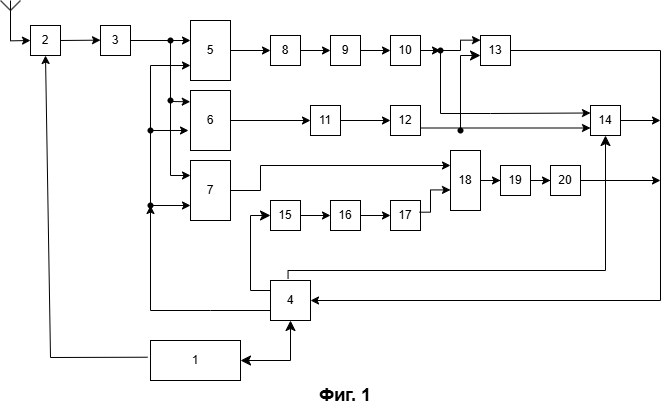
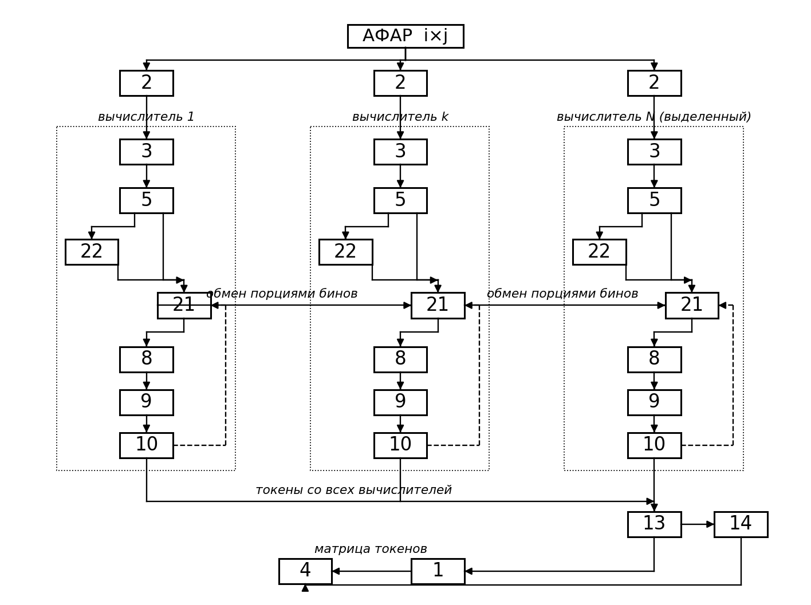

# Название изобретения

Устройство распознавания истинной цели на фоне самоприкрывающей ретрансляционной помехи и целеуказания.

# Область техники

Изобретение относится к радиолокации, а именно к устройствам защиты радиолокационных станций с активной фазированной антенной решёткой (АФАР) от активных ретрансляционных (DRFM) самоприкрывающих помех, и обеспечивает распознавание истинной цели среди ложных отметок и выдачу целеуказания.

# Уровень техники

Известно устройство подавления активной помехи (RU2549375C1, прототип), содержащее приёмные каналы (основной и вспомогательный) и блок корреляции для компенсации помехи в главном луче; структурного различителя «истинная/ложная цель» оно не содержит и при самоприкрытии, когда помеха излучается с носителя цели, задачу не решает.

Известны вычислительные устройства нейросетевой классификации радиолокационного куба «дальность–угол–скорость» (US10962637B2, US12181562), устройства формирования азимут-угломестной картины преобразованием Фурье по бинам дальности (EP0097490A2), устройства планирования радиолокационного ресурса и наведения луча (US11747438) и устройства GPU-обработки радиолокационных данных (CN101441271A). По отдельности они не обеспечивают распознавания истинной цели при самоприкрытии.

Известны также устройства распределённой обработки радиолокационного сигнала, в которых приёмные микросхемы вычисляют дальностное преобразование Фурье по своим каналам, а угловое преобразование выполняет отдельный центральный процессор (US11796628B2, US10627480B2), и вычислительные кластеры обработки сигналов антенных решёток, в которых устройство первичной обработки на программируемой логике через коммутируемую сеть доставляет каждому узлу данные всех приёмных каналов в своей полосе частот с прямой записью в размеченный кольцевой буфер узла (CHIME Pathfinder, arXiv:1503.06189, 1503.06202; Tianlai, arXiv:2406.19013). В первых угловое преобразование централизовано на выделенном процессоре, во вторых состав межузловой передачи задан заранее и от содержания обстановки не зависит; ни те, ни другие не содержат ни структурного токена, ни причинностного арбитра и распознавания истинной цели при самоприкрытии не обеспечивают.

Известно устройство распределённой обработки радиолокационного сигнала (US11796628B2), в котором приёмные каналы вычисляют дальностное преобразование Фурье локально, а отдельный процессор вычисляет по их результатам угловое преобразование с совмещением передачи и вычисления. Угловое преобразование в нём централизовано на выделенном процессоре, обмен выполняется в полном объёме независимо от содержания сцены, структурного различителя истинной и ложной цели устройство не содержит.

Известно устройство двухэтапной обработки радиолокационного сигнала (US11808881B2), формирующее кадр пониженного разрешения для отбора участков интереса и кадр повышенного разрешения для отобранных участков. Устройство требует формирования двух отдельных кадров и признака причинностного различения не содержит.

# Раскрытие сущности изобретения

**Решаемая задача** — надёжное распознавание истинной цели на фоне самоприкрывающей ретрансляционной помехи при ограниченной латентности обработки и апертуре произвольного размера.

**Технический результат** — повышение достоверности распознавания истинной цели и снижение вычислительных затрат. Результат достигается за счёт единого вычислительного ядра, сводящего большой объём принятых данных к разреженной матрице токенов, причинностного арбитра, выносящего окончательную метку по физическому признаку, сменных интерфейсных блоков, приводящих разнотипные зондирующие сигналы к общему массиву «апертура×апертура×дальность», а также конвейерного перераспределения данных между несколькими вычислителями, позволяющего уложить рабочий такт в отведённое время при апертуре произвольного размера.

# Краткое описание чертежей

На фиг. 1 представлена блок-схема заявляемого устройства; на фиг. 2 — блок-схема исполнения с несколькими приёмными каналами и сопряжёнными с ними вычислителями.

# Осуществление изобретения

Заявляемое устройство (фиг. 1) содержит блок управления системой 1, радиочастотный тракт 2 с активной фазированной антенной решёткой, блок записи данных на графический процессор 3, блок управления потоком данных и алгоритмами 4, интерфейсный блок линейно-частотно-модулированного сигнала 5, интерфейсный блок амплитудно-модулированного сигнала 6, интерфейсный блок фазоманипулированного сигнала 7, блок формирования апертуры 8, блок углового двумерного преобразования Фурье 9, блок токенизации 10, блок объёмного трёхмерного преобразования Фурье 11, блок токенизации 12, причинностный арбитр 13, блок объёмного добора 14, блок формирования опорного кода 15, блок формирования векторов циклических сдвигов 16, блок вычисления спектра опор 17, блок сопряжённого перемножения 18, блок обратного преобразования Фурье 19, блок токенизации выхода коррелятора 20, блок конвейерного перераспределения 21 и блок группировки и поканального суммирования по участкам дальности 22. Блоки 5–22 реализованы в графическом процессоре.

Первый выход блока управления системой 1 соединён со входом радиочастотного тракта 2, второй выход — со вторым входом блока управления потоком данных 4. Выход радиочастотного тракта 2 соединён со входом блока записи данных 3, выход которого соединён с первыми входами интерфейсных блоков 5, 6 и 7.

Первый выход блока управления потоком данных 4 соединён со вторыми входами интерфейсных блоков 5, 6 и 7; второй выход блока 4 соединён со входом блока формирования опорного кода 15; третий выход блока 4 соединён с третьим входом блока объёмного добора 14; четвёртый выход блока 4 соединён со входом блока управления системой 1; пятый выход блока 4 соединён с первым управляющим входом блока конвейерного перераспределения 21; шестой выход блока 4 соединён с управляющим входом блока группировки и поканального суммирования 22.

Выход интерфейсного блока 5 соединён с первым входом блока конвейерного перераспределения 21 и со входом блока группировки и поканального суммирования 22, выход которого соединён со вторым входом блока 21. Выход блока 21 соединён со входом блока формирования апертуры 8, выход которого соединён со входом блока углового двумерного преобразования Фурье 9, соединённого со входом блока токенизации 10. Второй выход блока токенизации 10 соединён со вторым управляющим входом блока 21.

Выход интерфейсного блока 6 соединён со входом блока объёмного трёхмерного преобразования Фурье 11, выход которого соединён со входом блока токенизации 12.

Первый выход блока токенизации 10 соединён с первым входом причинностного арбитра 13 и с первым входом блока объёмного добора 14. Выход блока токенизации 12 соединён со вторым входом причинностного арбитра 13 и со вторым входом блока объёмного добора 14.

Выход интерфейсного блока 7 соединён с первым входом блока сопряжённого перемножения 18. Выход блока формирования опорного кода 15 соединён со входом блока формирования векторов циклических сдвигов 16, выход которого соединён со входом блока вычисления спектра опор 17, а выход последнего — со вторым входом блока сопряжённого перемножения 18. Выход блока 18 соединён со входом блока обратного преобразования Фурье 19, выход которого соединён со входом блока токенизации выхода коррелятора 20.

Выходы причинностного арбитра 13, блока объёмного добора 14 и блока токенизации выхода коррелятора 20 соединены с первым входом блока управления потоком данных 4.

В исполнении с несколькими вычислителями (фиг. 2) устройство содержит несколько приёмных каналов и столько же сопряжённых с ними вычислителей. Блоки 3, 5, 8, 9, 10, 21 и 22 присутствуют в каждом вычислителе; блоки 13 и 14 размещены на одном выделенном вычислителе, входы которого соединены с выходами блоков токенизации 10 всех вычислителей; блоки 1 и 4 существуют в единственном экземпляре и управляют всеми вычислителями; блоки 6, 7, 11, 12 и 15–20 размещаются на выделенном вычислителе, поскольку соответствующие режимы работы с распределением приёма по подрешёткам не совмещаются. Блок конвейерного перераспределения 21 каждого вычислителя обменивается данными с одноимёнными блоками остальных вычислителей.

**Устройство работает следующим образом.**

Блок управления системой 1 задаёт тип зондирующего сигнала (ЛЧМ, АМ или ФМ), его параметры и время воздействия на объект, выдавая соответствующие команды в радиочастотный тракт 2 и в блок управления потоком данных 4. Блок 4 по этим командам задаёт, какой интерфейсный блок работает, а также размеры и позиции обрабатываемых данных в памяти графического процессора.

Радиочастотный тракт 2 формирует цифро-аналоговым преобразователем зондирующий сигнал заданного типа, излучает его активной фазированной антенной решёткой, принимает отражённый сигнал, оцифровывает его аналого-цифровым преобразователем и выполняет первичную обработку в зависимости от формы сигнала — децимацию с заданным шагом и, для ЛЧМ, гетеродинное сжатие (дечирпирование), при котором задержка цели переходит в постоянную частоту биений. Данные передаются по оптическому каналу через приёмный канал и записываются блоком 3 в память графического процессора последовательно по антеннам в виде массива Q антенн по l комплексных отсчётов (Q·l), где каждый отсчёт представлен двумя вещественными числами. Блок 3 раздаёт записанные данные на первые входы интерфейсных блоков 5, 6 и 7; по команде блока 4, поступающей на их вторые входы, работает тот интерфейсный блок, который соответствует текущему типу сигнала.

При линейно-частотно-модулированном сигнале интерфейсный блок 5 выполняет дальностное преобразование Фурье по каждому каналу после дечирпирования, формируя ось дальности (разрешение по дальности определяется девиацией частоты: Δr = c/(2·ΔF)). Поскольку задержка цели неотрицательна, дальностная шкала односторонняя, и число различимых бинов дальности вдвое меньше размера преобразования.

Блок 8 переформатирует массив Q·l в апертуру размерности i×j на каждом бине дальности, где i и j — числа элементов решётки по двум осям. Блок 9 выполняет угловое двумерное преобразование Фурье на каждом бине дальности, обрабатывая обе оси **независимо**: по каждой оси выполняется весовое взвешивание по действительно имеющимся элементам решётки, затем ось дополняется нулями до ближайшей степени двойки (до i_пад и j_пад), после чего вычисляется угловая шкала по каждой оси отдельно: при шаге решётки d = λ/2 `sinθ_x = k_x/(i_пад/2)`, `sinθ_y = k_y/(j_пад/2)`. Разрешение по осям при i ≠ j различается и определяется действительным числом элементов, тогда как число угловых ячеек M = i_пад·j_пад определяется размерами после дополнения нулями.

При размере оси апертуры, превышающем нативный размер m матричной операции вычислителя, блок 9 выполняет преобразование по этой оси блочной раскладкой: ось разделяется на нативные блоки, между которыми вводятся промежуточные поворачивающие множители и второй уровень сложения; неоднозначность снимается соотношением `k = k₁ + m·k₂`. Число уровней раскладки определяется отношением размера оси к нативному размеру; остаточный малый множитель выполняется обычной бабочкой. При размере оси, не превышающем нативного размера, преобразование выполняется одной матричной операцией. Аппаратная матричная операция при этом не изменяется, изменяется только глубина логической раскладки на неё, что и позволяет удержать вычисление на матричных блоках при апертуре произвольного размера.

Блок 10 сворачивает полученный угловой спектр в структурный токен по инвариантным к расщеплению (страддлу) признакам распределения энергии — пиковому отношению PR = (Σp)²/Σp², мере разреженности Хойера, доле энергии главного лепестка, интегральному отношению главного лепестка к боковым, отношению максимума к среднему и полной энергии среза, — причём признаки, значение которых зависит от числа угловых ячеек, нормируются на M, благодаря чему пороги классификации не зависят от размера апертуры. На основе предобученной нейронной сети блок 10 относит срез к классу состояния, выполняя функцию классификатора-гейта; на выходе формируется массив структур (токенов).

Формирование секции углового среза блоком 8, преобразование блоком 9 и свёртку в токен блоком 10 выполняют в быстрой внутрикристальной памяти рабочей группы графического процессора, причём во внешнюю память выгружается **только токен**, а не полная угловая карта: токенизация выполняется слитно с последним уровнем блочной раскладки. Секцией является плитка углового среза, размер которой согласован с нативным размером матричной операции; при апертуре, не превышающей нативного размера, секцией является срез целиком.

При амплитудно-модулированном сигнале интерфейсный блок 6 формирует из массива Q·l объёмный участок «апертура×апертура×дальность» (i×j×L) с перекрытием по дальности, причём размеры участка и перекрытие задаются блоком 4. При необходимости выполняется смешанный анализ участками разного размера: там, где в предыдущем такте отклик отсутствовал, берутся крупные участки, чтобы не пропустить одиночный всплеск, а на участках с откликом — мелкие. Поскольку принятые данные остаются в памяти графического процессора, а решения ведут по компактной матрице токенов, блок управления системой 1 определяет, какие участки исследовать, до какого размера спускаться и сколько точек брать, а блок 4 исполняет это на графическом процессоре, перенарезая одни и те же данные участками произвольного размера, шага и положения. При грубом проходе крупным шагом и глубоким форматом блок 1 отбирает ограниченное число наиболее ярких выбросов и по ним командует тонкий добор — спуск по формату и повторное чтение тех же под-участков мелким шагом для уточнения положения; менее яркие выбросы до-исследуются на последующих тактах. При сплошном проходе мелким шагом объём сразу получают в полном разрешении и добор не выполняют. Пустой в предыдущем такте участок может быть пропущен. Блок 11 выполняет объёмное трёхмерное преобразование Фурье на каждом таком участке, удерживая **все** выходы преобразования по третьей оси участка. Блок 12 сворачивает объёмный спектр в токен по тем же инвариантным признакам, обобщённым на объём (главный лепесток 3×3×3, охранная зона 5×5×5, пороговое обнаружение OS-CFAR по объёму).

Тем самым объёмный участок формируется произвольного размера и положения, а двумерная токенизация тракта ЛЧМ является частным случаем объёмной при глубине участка, равной единице; интерфейсные блоки 5 и 6 отличаются лишь способом заполнения объёма, тогда как токенизация (блоки 10 и 12), причинностный арбитр 13 и блок объёмного добора 14 — общие для всех типов сигнала.

Массивы токенов с выходов блоков 10 и 12 поступают на входы причинностного арбитра 13. Отнесение срезов к трём классам состояния (шум, собранный источник, размазанная помеха) выполнено нейронной сетью ещё на этапе токенизации (блоки 10, 12), которая тем самым служит гейтом-приоритизатором; окончательное разбиение сцены на четыре класса (шум, одиночная локализованная цель, заградительный сигнал, гребёнка ложных целей) и метку «истинная/ложная цель» выносят на втором проходе — по профилю токенов вдоль дальности — причинностный арбитр 13 и блок объёмного добора 14. Ретранслятор причинно только задерживает сигнал (τ ≥ 0), поэтому ложные отметки всегда дальше истинной; истинной целью признаётся ближний по дальности член причинностной группы (правило переднего края) и/или отклик, согласованный с текущим кодом зондирования. На выходе блока 13 формируется массив структур об одиночных объектах (углы, дальность, метка) либо признак необходимости углублённого исследования.

Параллельно те же массивы токенов с выходов блоков 10 и 12 поступают на входы блока объёмного добора 14, который по команде блока 4 (третий вход) получает адрес и размеры интересующего объёмного участка и посредством рекуррентной нейронной сети (LSTM/GRU) над потоком токенов области интереса уточняет угол и тонкую дальность трудного кандидата с нерегулярной структурой (рваная гребёнка, дрожащая задержка, наложенные отклики), а также характеризует помеху (заградительная либо гребёнка ложных целей).

При фазоманипулированном сигнале интерфейсный блок 7 вычисляет спектр принятого сигнала — преобразование Фурье уже сформированных приёмных лучей. Параллельно блок 15 по команде блока 4 формирует сопряжённый опорный сигнал m-последовательности агильной длины (2⁸…2²⁰, меняющейся от такта к такту, с дополнением нулями до размера преобразования Фурье) на число принятых точек; блок 16 формирует векторы циклических сдвигов опоры (гипотезы задержки, они же дальностные стробы текущего кода); блок 17 вычисляет их спектр. Блок 18 выполняет сопряжённое перемножение спектра опор и спектра принятого сигнала, блок 19 — обратное преобразование Фурье произведения (corr = IFFT(conj(FFT(ref))·FFT(inp))), а блок 20 токенизирует корреляционный отклик, извлекая 3–5 наибольших значений (положение корреляционного пика соответствует дальности, тонкая дальность — интерполяцией пика) и формируя массив структур об объекте. Тем самым выходом всех трёх трактов является единая разреженная матрица токенов.

Массивы структур с выходов блоков 13, 14 и 20 поступают в блок управления потоком данных 4, который передаёт разреженную матрицу токенов и параметры обнаруженных объектов в блок управления системой 1. Блок 1 формирует целеуказание и параметры следующего такта — тип сигнала, новый код и его длину, направления и площади многолучевого опроса, — замыкая когнитивную петлю: дешёвый инвариантный признак (токен) гейтирует дорогой агильный зондирующий сигнал, физика (арбитр 13) выносит решение, а нейронная сеть служит адъюнктом.

**Работа устройства с несколькими вычислителями (фиг. 2).**

При числе элементов решётки, не позволяющем принять и обработать объём такта одним приёмным каналом и одним вычислителем, радиочастотный тракт 2 выдаёт данные по нескольким приёмным каналам. Каждый приёмный канал конструктивно сопряжён со своим вычислителем — размещён с ним на общем интерфейсе и общем узле памяти — и принимает **свою подрешётку** элементов решётки; блок записи 3 соответствующего вычислителя записывает данные непосредственно в его память, минуя общий буфер управляющей машины. Каждому вычислителю достаётся своя группа каналов, но вся ось быстрого времени, поэтому интерфейсные блоки 5 всех вычислителей выполняют дальностное преобразование Фурье **параллельно и независимо**, без обмена между вычислителями.

Блок группировки и поканального суммирования 22 группирует бины дальности в участки заданной глубины D и складывает по оси дальности отсчёты **своих** каналов внутри каждого участка. Операция сложения **поканальна** — она выполняется над отсчётами одного канала и знания остальных каналов не требует, поэтому выполняется на том вычислителе, где канал принят, **до** какого-либо обмена. В результате вместо D бинов на участок остаётся одна суммарная выборка, то есть объём данных, подлежащих обмену, сокращается в D раз. Складывание по оси дальности является удержанием нулевого выхода преобразования Фурье по этой оси — того же преобразования, все выходы которого удерживает блок 11 в тракте амплитудно-модулированного сигнала. Глубину участка D задаёт блок 4 как наименьшую из величин, определяемых энергетическим запасом, убывающим с дальностью, и разрежённостью обстановки; при заградительной помехе группировка укрупняется либо не применяется.

Блок конвейерного перераспределения 21 делит бины дальности на непрерывные блоки равной длины по номеру бина — первый вычислитель принимает блок от нулевого бина, каждый следующий очередной блок той же длины — и набирает свой блок порциями, получая недостающие каналы от блоков 21 остальных вычислителей. Расписание обмена задаётся блоком 4 до начала такта и в течение такта не пересчитывается, поскольку границы блоков от обстановки не зависят. Блок 21 совмещает передачу очередной порции с обработкой предыдущей блоками 8, 9 и 10 того же вычислителя; размер порции блок 4 задаёт из условия непревышения временем передачи порции времени её обработки.

Блок 21 выполняет перераспределение **в два прохода**. Первым проходом перераспределяются суммарные выборки участков, поступающие со второго входа от блока 22; собрав их, вычислитель получает **полную апертуру** суммарной выборки участка, и блоки 8, 9 и 10 выполняют по ней одно угловое преобразование вместо D, сворачивают результат в структурный токен и относят участок к шуму либо к содержащему отклик тем же классификатором-гейтом. Перечень участков, отнесённых к содержащим отклик, поступает со второго выхода блока 10 на второй управляющий вход блока 21. Вторым проходом блок 21 перераспределяет полные данные, поступающие с первого входа от блока 5, **только** по этим участкам, и блоки 8, 9, 10 обрабатывают их поячеечно по всем бинам участка. Участок, отнесённый к шуму, вторым проходом не перераспределяется. Данные для второго прохода находятся в памяти вычислителей с момента приёма и повторного приёма не требуют.

Существенно, что блок углового двумерного преобразования Фурье 9 **не разделён** между вычислителями: срез «апертура×апертура» на каждом бине дальности формируется целиком в одном вычислителе, а обмен размещён между блоком 5 и блоком 8, то есть на границе двух раздельных преобразований Фурье.

Токены с выходов блоков 10 всех вычислителей поступают на причинностный арбитр 13 выделенного вычислителя, где выполняется арбитраж и уточнение блоком 14. Объём этой передачи мал, поскольку передаются токены, а не угловые карты.

Число вычислителей является параметром устройства: при одном вычислителе блок 21 вырождается в локальную пересборку данных внутри одного вычислителя, а конвейерное совмещение передачи с обработкой сохраняется.

Вычислители могут быть сгруппированы в узлы, соединённые между собой сетью с прямым доступом к памяти. Каждый узел содержит свои приёмные каналы, принимающие его часть подрешёток элементов решётки, свои блоки записи 3, интерфейсные блоки 5, блоки 22, 21, 8, 9 и 10; разделение потока выполняется на входе — радиочастотный тракт 2 доставляет каждому узлу его подрешётки по своим линиям, поэтому сырые принятые данные между узлами не передаются. Обменные интерфейсы блоков конвейерного перераспределения 21 разных узлов соединены через указанную сеть, и межузловое перераспределение выполняется по тем же правилам, что и перераспределение внутри узла: непрерывные блоки бинов, порции, статическое расписание от блока 4 и два прохода — суммарные выборки участков, затем полные данные только участков с откликом. Токены со всех узлов поступают на причинностный арбитр 13 и блок объёмного добора 14 выделенного узла.

Ограничение объёма межузлового обмена здесь является условием работоспособности, а не улучшением: пропускная способность межузловой сети ниже внутриузловой, поэтому передача полного объёма перераспределения между узлами в длительность рабочего такта не укладывается, тогда как передача, сокращённая первым проходом в D раз и ограниченная вторым проходом участками с откликом, укладывается. Расширение устройства выполняется добавлением узла с его приёмными каналами и подрешётками; состав блоков узла и порядок их работы при этом не изменяются. Возможен также вариант, в котором радиочастотный тракт 2 распределяет данные по узлам не по подрешёткам, а по полосам частот биений — каждому узлу все элементы решётки в его полосе, которой соответствует своя часть бинов дальности; в этом варианте межузловое перераспределение блоками 21 не требуется.

Возможность осуществления изобретения подтверждается наличием работающего корреляционного модуля FM-m на графическом процессоре (ROCm/HIP, hipFFT/rocFFT).

# Формула изобретения

**1.** Устройство распознавания истинной цели на фоне самоприкрывающей ретрансляционной помехи и целеуказания, содержащее радиочастотный тракт (2) с активной фазированной антенной решёткой, аналого-цифровым преобразователем, децимацией и гетеродинным сжатием, а также вычислитель на графическом процессоре, **отличающееся тем, что** вычислитель содержит:

блок записи данных (3), выполненный с возможностью приёма массива Q·l комплексных отсчётов и раздачи данных на первые входы интерфейсных блоков (5, 6, 7);

сменные интерфейсные блоки по типу зондирующего сигнала — линейно-частотно-модулированный (5) с последующими блоками формирования апертуры (8) и углового двумерного преобразования Фурье (9), амплитудно-модулированный (6) с последующим блоком объёмного трёхмерного преобразования Фурье (11), приводящие данные к общему массиву «апертура×апертура×дальность», и фазоманипулированный (7), формирующий спектр принятого сигнала;

причём блок углового двумерного преобразования Фурье (9) выполнен с возможностью независимой обработки двух осей апертуры — весового взвешивания по действительно имеющимся элементам решётки по каждой оси, последующего дополнения каждой оси нулями до ближайшей степени двойки и вычисления угловой шкалы по каждой оси отдельно;

блоки токенизации (10, 12), выполненные с возможностью свёртки спектра в структурный токен по инвариантным к расщеплению признакам распределения энергии, нормированным на число угловых ячеек, на основе предобученной нейронной сети, выполняющей функцию классификатора-гейта;

причинностный арбитр (13), входы которого соединены с выходами блоков токенизации (10, 12) и который устанавливает окончательную метку истинной либо ложной цели по разреженной матрице токенов согласно правилу ближнего по дальности члена причинностной группы (τ ≥ 0) и/или согласования отклика с текущим кодом зондирования;

коррелятор фазоманипулированного сигнала (15–20), формирующий сопряжённый опорный агильный код переменной длины и векторы его циклических сдвигов, вычисляющий корреляцию через преобразование Фурье и токенизирующий корреляционный отклик (20);

и блоки управления — блок управления системой (1), задающий тип сигнала, его параметры и время воздействия, и блок управления потоком данных и алгоритмами (4), выходы которого соединены со вторыми входами интерфейсных блоков (5, 6, 7) и со входом блока формирования опорного кода (15), а вход — с выходами причинностного арбитра (13) и блока токенизации выхода коррелятора (20);

причём выходом всех интерфейсных трактов является единая разреженная матрица токенов, по которой формируется целеуказание.

**2.** Устройство по п.1, отличающееся тем, что блок формирования опорного кода (15) формирует код переменной длины от 2⁸ до 2²⁰, меняющийся от такта к такту, с дополнением нулями до размера преобразования Фурье.

**3.** Устройство по п.1, отличающееся тем, что блоки формирования апертуры (8), углового преобразования (9) и токенизации (10) выполняют обработку секции углового среза в быстрой внутрикристальной памяти рабочей группы графического процессора с выгрузкой во внешнюю память только токена, а не полной угловой карты, причём размер секции согласован с нативным размером матричной операции вычислителя, а угловое и объёмное преобразования Фурье выполняются на матричных (тензорных) вычислительных блоках.

**4.** Устройство по п.3, отличающееся тем, что блок углового двумерного преобразования Фурье (9) при размере оси апертуры, превышающем нативный размер матричной операции вычислителя, выполняет преобразование по указанной оси блочной раскладкой — разделением оси на нативные блоки, преобразованием внутри блоков, умножением на промежуточные поворачивающие множители и вторым уровнем сложения, причём число уровней раскладки определено отношением размера оси к нативному размеру, — а при размере оси, не превышающем нативного размера, одной матричной операцией.

**5.** Устройство по п.1, отличающееся тем, что содержит блок объёмного добора (14) на рекуррентной нейронной сети, первый и второй входы которого соединены с выходами блоков токенизации (10, 12), третий вход — с выходом блока управления потоком данных (4), задающим границы области интереса, а выход — со входом блока управления потоком данных (4), выполненный с возможностью уточнения угла и тонкой дальности трудного кандидата по потоку токенов области интереса.

**6.** Устройство по п.1, отличающееся тем, что амплитудно-модулированный интерфейсный блок (6) формирует объёмный участок «апертура×апертура×дальность» произвольного размера и положения со скользящим трёхмерным преобразованием переменного шага, единообразно с линейно-частотно-модулированным трактом, для которого двумерная токенизация является частным случаем объёмной при глубине участка, равной единице.

**7.** Устройство по п.6, отличающееся тем, что интерфейсный блок (6) под управлением блока управления системой (1) и блока управления потоком данных (4) выполнен с возможностью адаптивной нарезки одних и тех же принятых данных, остающихся в памяти графического процессора, участками произвольного размера, шага и положения, причём при грубом проходе крупным шагом блок управления системой (1) отбирает ограниченное число наиболее ярких выбросов и по ним выполняет тонкий добор — повторную обработку тех же участков уменьшенным размером трёхмерным преобразованием Фурье, — а при сплошном проходе мелким шагом добор не выполняется.

**8.** Устройство по п.1, отличающееся тем, что блок управления потоком данных (4) передаёт разреженную матрицу токенов и параметры объектов в блок управления системой (1), а блок управления системой (1) формирует целеуказание и параметры следующего такта.

**9.** Устройство по п.1, отличающееся тем, что блоки токенизации (10, 12) относят срез к трём классам состояния (шум, собранный источник, размазанная помеха), а причинностный арбитр (13) и блок объёмного добора (14) выполняют окончательное отнесение сцены к четырём классам (шум, одиночная локализованная цель, заградительный сигнал, гребёнка ложных целей) по профилю токенов вдоль дальности.

**10.** Устройство по п.1, отличающееся тем, что содержит несколько приёмных каналов и столько же сопряжённых с ними вычислителей, причём каждый приёмный канал конструктивно сопряжён со своим вычислителем и выполнен с возможностью приёма своей подрешётки элементов активной фазированной антенной решётки, блок записи данных (3) каждого вычислителя выполнен с возможностью записи принятых данных непосредственно в память сопряжённого вычислителя, минуя общий буфер управляющей машины, а интерфейсные блоки (5) всех вычислителей выполняют дальностное преобразование Фурье параллельно и независимо, при этом блок углового двумерного преобразования Фурье (9) между вычислителями не разделён и формирует срез «апертура×апертура» целиком в одном вычислителе.

**11.** Устройство по п.10, отличающееся тем, что содержит блок конвейерного перераспределения (21), первый вход которого соединён с выходом интерфейсного блока (5), выход — со входом блока формирования апертуры (8) того же вычислителя, первый управляющий вход — с пятым выходом блока управления потоком данных (4), а обменный интерфейс — с одноимёнными блоками остальных вычислителей, и который выполнен с возможностью деления бинов дальности на непрерывные блоки равной длины по номеру бина, набора своего блока порциями и совмещения передачи очередной порции с обработкой предыдущей, причём размер порции задан блоком управления потоком данных (4) из условия непревышения временем передачи порции времени её обработки, а расписание перераспределения задано до начала рабочего такта и в течение такта не пересчитывается.

**12.** Устройство по п.10, отличающееся тем, что причинностный арбитр (13) и блок объёмного добора (14) размещены на одном выделенном вычислителе, входы которого соединены с выходами блоков токенизации (10) всех вычислителей.

**13.** Устройство по пп. 11 и 12, отличающееся тем, что вычислители сгруппированы в узлы, соединённые между собой сетью с прямым доступом к памяти, причём каждый узел содержит свои приёмные каналы, выполненные с возможностью приёма его части подрешёток элементов активной фазированной антенной решётки, и свой блок конвейерного перераспределения (21), обменный интерфейс которого соединён с одноимёнными блоками остальных узлов через указанную сеть и выполнен с возможностью межузлового перераспределения по тем же правилам, что и перераспределение внутри узла, при этом принятые данные между узлами не передаются, а выделенный вычислитель с причинностным арбитром (13) и блоком объёмного добора (14) размещён на одном из узлов и соединён с выходами блоков токенизации (10) всех узлов.

**14.** Устройство по п.11, отличающееся тем, что содержит блок группировки и поканального суммирования по участкам дальности (22), вход которого соединён с выходом интерфейсного блока (5), выход — со вторым входом блока конвейерного перераспределения (21), а управляющий вход — с шестым выходом блока управления потоком данных (4), выполненный с возможностью группировки бинов дальности в участки заданной глубины и складывания по оси дальности отсчётов только тех каналов, которые приняты данным вычислителем, до какого-либо обмена, причём указанное складывание является удержанием нулевого выхода преобразования Фурье по оси дальности, все выходы которого удерживает блок объёмного трёхмерного преобразования Фурье (11).

**15.** Устройство по п.14, отличающееся тем, что блок конвейерного перераспределения (21) выполнен с возможностью перераспределения в два прохода — первым проходом суммарных выборок участков, по собранной полной апертуре которых блоки (8, 9, 10) выносят предварительное решение об отнесении участка к шуму либо к содержащему отклик, и вторым проходом полных данных только тех участков, которые отнесены к содержащим отклик, — при этом перечень таких участков поступает со второго выхода блока токенизации (10) на второй управляющий вход блока (21).

**16.** Устройство по п.14, отличающееся тем, что глубина участка задана блоком управления потоком данных (4) как наименьшая из величин, определяемых энергетическим запасом, убывающим с дальностью, и разрежённостью обстановки, а при заградительной помехе группировка укрупняется либо не применяется.

# Реферат

Устройство распознавания истинной цели на фоне самоприкрывающей ретрансляционной (DRFM) помехи в моностатическом радаре с АФАР. Устройство содержит блок управления системой (1), радиочастотный тракт (2), блок записи данных на графический процессор (3), блок управления потоком данных и алгоритмами (4), сменные интерфейсные блоки по типу зондирующего сигнала — ЛЧМ (5) с блоками формирования апертуры (8) и углового двумерного преобразования Фурье (9), АМ (6) с блоком объёмного трёхмерного преобразования Фурье (11) и ФМ (7), — приводящие данные к общему массиву «апертура×апертура×дальность», блоки токенизации (10, 12) по инвариантным к расщеплению признакам, причинностный арбитр (13), блок объёмного добора на рекуррентной нейронной сети (14) и коррелятор фазоманипулированного сигнала с агильным кодом переменной длины (15–20) с токенизацией корреляционного отклика (20).

Блок углового преобразования (9) обрабатывает обе оси апертуры независимо — взвешивание по действительно имеющимся элементам, дополнение нулями до степени двойки, отдельная угловая шкала по каждой оси, — а при оси, превышающей нативный размер матричной операции, выполняет преобразование блочной раскладкой на нативные блоки с промежуточными поворачивающими множителями.

В исполнении с несколькими вычислителями устройство содержит несколько приёмных каналов, каждый из которых конструктивно сопряжён со своим вычислителем и принимает свою подрешётку элементов решётки, блок конвейерного перераспределения (21), делящий бины дальности на непрерывные блоки и совмещающий передачу очередной порции с обработкой предыдущей, и блок группировки и поканального суммирования по участкам дальности (22), сокращающий объём первого прохода обмена. Блок (9) между вычислителями не разделён; причинностный арбитр (13) и блок объёмного добора (14) размещены на выделенном вычислителе. Вычислители могут быть сгруппированы в узлы, соединённые сетью с прямым доступом к памяти, причём межузловое перераспределение ведётся по тем же правилам, что и внутриузловое, а принятые данные между узлами не передаются.

Достигается повышение достоверности распознавания истинной цели при самоприкрытии и снижение вычислительных затрат, а также возможность уложить рабочий такт в отведённое время при апертуре произвольного размера. 15 з.п. ф-лы, 2 ил.
