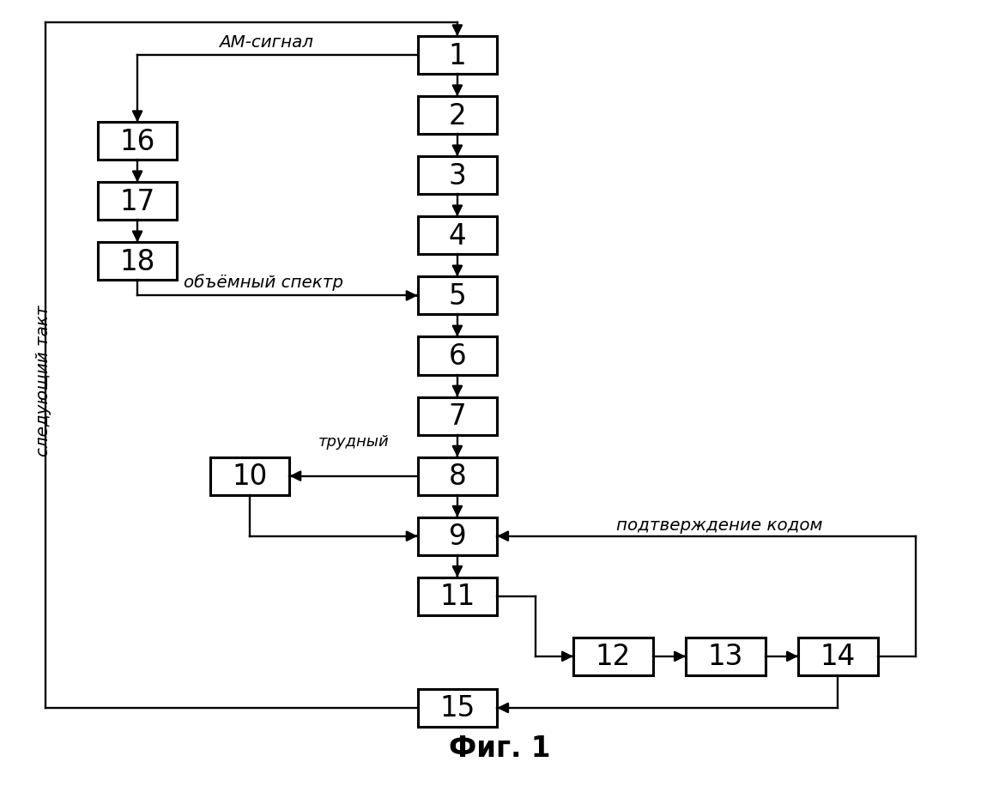
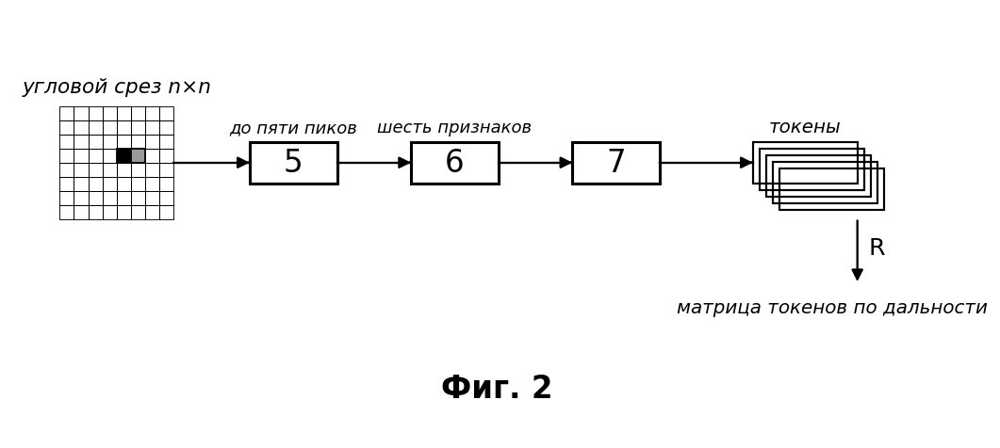
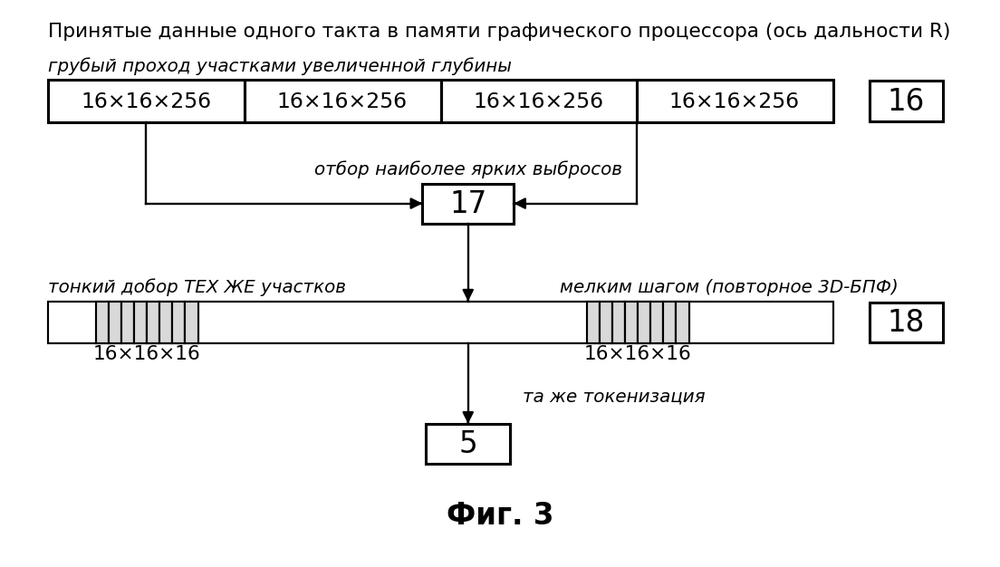
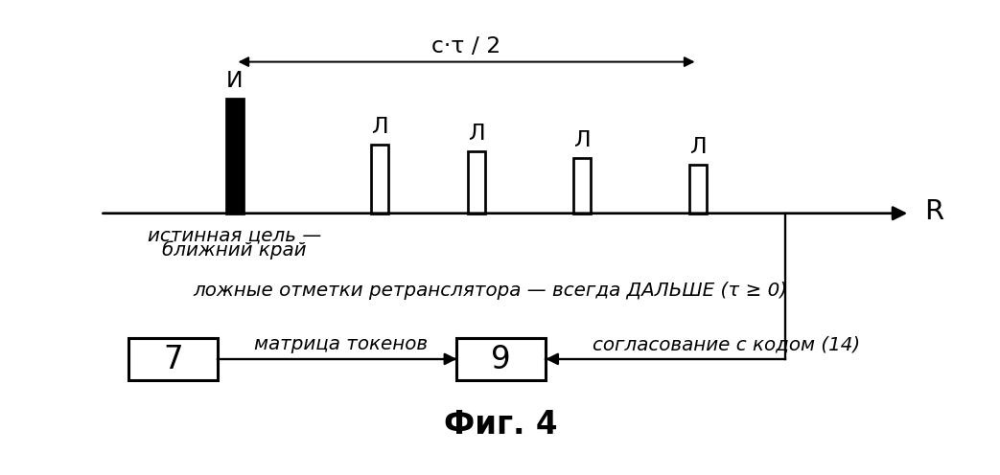

# Название изобретения

Способ распознавания истинной цели на фоне самоприкрывающей ретрансляционной помехи и целеуказания.

# Область техники

Изобретение относится к области радиолокации, конкретно к способу распознавания истинной цели на фоне самоприкрывающей ретрансляционной (DRFM) помехи и выдачи целеуказания в моностатической радиолокационной станции (РЛС) с активной фазированной антенной решёткой (АФАР), и может найти применение в широком классе РЛС с АФАР, решающих задачу обнаружения и сопровождения целей в условиях активного радиоэлектронного противодействия.

# Уровень техники

Классическая помеховая обстановка предполагает, что постановщик помех и цель пространственно разнесены: помеха приходит с одного направления, полезное отражение — с другого. На этом допущении построено большинство известных способов защиты — компенсация помехи по вспомогательному каналу, формирование провалов диаграммы направленности в направлении постановщика, пространственно-временная адаптивная обработка.

Известен способ подавления активной помехи /1/, принятый за **прототип**, основанный на приёме излучения источника помех по основному и вспомогательному приёмным каналам и вычислении взаимной корреляции между ними с последующей компенсацией помехи в главном луче диаграммы направленности. Способ обеспечивает подавление помехи от отдельно расположенного постановщика, однако обладает существенными ограничениями:

1. **Способ опирается на пространственное разнесение цели и помехи.** При самоприкрытии, когда ретранслятор размещён на самом носителе цели, помеха и полезный отклик приходят с одного направления и по одному лучу; вспомогательный канал не даёт компенсирующей выборки, и механизм компенсации перестаёт работать.

2. **Способ не содержит структурного различителя «истинная цель / ложная цель».** Современный ретранслятор с цифровой радиочастотной памятью (DRFM) запоминает зондирующий сигнал и переизлучает его копии с задержками, порождая гребёнку ложных отметок. Каждая такая отметка когерентна с зондирующим сигналом и по всем энергетическим и корреляционным признакам неотличима от отражения реальной цели. Компенсация помехи по мощности здесь бесполезна: подавлять нужно не энергию, а **ложность**.

3. **Компенсация ведётся по мощности, а не по причинности.** Признак, по которому ложную отметку можно отделить от истинной физически, — направление причинно-следственной связи: ретранслятор способен только **задержать** сигнал, но не опередить его. Прототип этот признак не использует.

Известны способы нейросетевой классификации радиолокационных данных на трёхмерном массиве «дальность–угол–скорость» /2, 3/. Они обучают свёрточную сеть непосредственно на сыром радиолокационном кубе и выдают решение «конец в конец». Ограничения: (а) объём входных данных остаётся полным, вычислительные затраты и латентность высоки; (б) решение выносит нейронная сеть, то есть оно не поверяется физическим законом и деградирует на сценах, которых не было в обучающей выборке; (в) структурного признака ложной цели, инвариантного к обучению, такие способы не образуют.

Известен способ формирования азимут-угломестной картины преобразованием Фурье по бинам дальности /4/ и известны способы обработки радиолокационных данных на графическом процессоре /5/. Оба относятся к вычислительной части задачи и признака различения истинной и ложной цели не содержат.

Известен способ планирования радиолокационного ресурса и наведения луча средствами машинного обучения /6/. Он решает задачу распределения ресурса, но не задачу распознавания цели на фоне самоприкрытия и не связывает наведение зонда со структурными признаками сцены.

Таким образом, в известном уровне техники не выявлено способа, который решал бы задачу распознавания истинной цели **при самоприкрытии** — то есть тогда, когда помеха и цель неразделимы ни по направлению, ни по спектру, ни по энергии, — при этом укладываясь в ограниченную латентность обработки.

# Задача изобретения

Задачей изобретения является разработка способа распознавания истинной цели на фоне самоприкрывающей ретрансляционной помехи и целеуказания в моностатической РЛС с АФАР, свободного от указанных ограничений.

# Технический результат

Техническим результатом является повышение достоверности распознавания истинной цели при самоприкрытии и снижение вычислительных затрат на обработку.

# Сущность изобретения

Решение поставленной задачи и достижение заявленного технического результата обеспечивается тем, что за каждый рабочий такт излучают широкий линейно-частотно-модулированный (ЛЧМ) зондирующий сигнал и принимают отражённый сигнал элементами АФАР. Принятый сигнал подвергают гетеродинному сжатию (дечирпированию), получая N комплексных отсчётов, где N — переменная за такт величина. Далее формируют массив «апертура×апертура×дальность» размерности n×n×N посредством двух раздельных преобразований Фурье — глобального дальностного по оси быстрого времени и поячеечного углового n×n на каждом бине дальности. Затем для каждого среза дальности полную угловую карту заменяют структурным токеном, содержащим ограниченное число наиболее ярких угловых пиков и вектор инвариантных к расщеплению (страддлу) признаков распределения энергии. Полученные токены классифицируют нейросетевым классификатором, который выполняет функцию гейта-приоритизатора, а окончательную метку «истинная цель / ложная цель» устанавливают причинностным арбитром — по признаку ближнего по дальности члена причинностной группы (правило переднего края, τ ≥ 0) и/или согласования отклика с текущим кодом зондирования. По совокупности токенов (матрице токенов) формируют целеуказание и излучают в выбранные площади многолучевой агильный фазоманипулированный зондирующий сигнал с кодом переменной длины 2ⁿ, дополняемой нулями до размера преобразования Фурье, причём код меняется от такта к такту.

Такая последовательность действий переносит решение с энергетического признака на **причинностный**: ретранслятор физически способен только задержать сигнал, поэтому все порождённые им ложные отметки лежат **дальше** истинной цели, а свежий, меняющийся от такта к такту код зондирования противник не может отразить, не услышав его. Дешёвый инвариантный признак (токен) при этом гейтирует дорогой агильный зонд, а решение по компактной матрице токенов принимается вместо решения по полному объёму данных. Следствием этого является повышение достоверности распознавания истинной цели именно в той обстановке, где известные способы неработоспособны (самоприкрытие), и снижение вычислительных затрат — объём данных, передаваемых на этап принятия решения, сокращается на два-три порядка (полная угловая карта среза 16×16 = 256 комплексных отсчётов заменяется токеном из нескольких пиков и шести скалярных признаков).

# Краткое описание чертежей

Сущность изобретения поясняется рисунками, представленными на фиг. 1 – фиг. 4. Позиции 1–18 на всех чертежах сквозные и обозначают операции способа.

На фиг. 1 представлена схема осуществления способа — последовательность операций одного рабочего такта; на фиг. 2 — свёртка углового среза в структурный токен (детализация операций 5, 6, 7); на фиг. 3 — объёмный примитив с переменной размерностью (детализация операций 16, 17, 18); на фиг. 4 — работа причинностного арбитра (детализация операции 9): взаимное расположение истинного отклика и порождённых ретранслятором ложных отметок на оси дальности при неотрицательной задержке.

# Раскрытие сущности изобретения

Согласно фиг. 1 – фиг. 4 способ осуществляют за каждый рабочий такт в следующей последовательности действий. Позиции 1–18 сквозные для всех чертежей.

Приняты обозначения: Q — число антенн решётки (принятый массив Q·l), l — число комплексных отсчётов на антенну, N — число отсчётов после гетеродинного сжатия (число бинов дальности), n — сторона апертуры (n×n, в частности 16), L — глубина объёмного участка, k — номер углового бина, K — число гипотез задержки (сопряжённых опор), S — число лучей опроса.

Излучают 1 широкий линейно-частотно-модулированный (ЛЧМ) зондирующий сигнал и принимают отражённый сигнал элементами АФАР. Принятый сигнал подвергают гетеродинному сжатию 2 (дечирпу), при котором задержка цели переходит в постоянную частоту биений (`f_b = μ·2R/c`, `μ = ΔF/T_c`), и получают N комплексных отсчётов, где N — переменная за такт величина.

Далее формируют массив «апертура×апертура×дальность» размерности n×n×N (в частности 16×16×N, где n = 2^m выбирают так, чтобы срез n×n размещался в быстрой памяти рабочей группы графического процессора и отображался на матричный (тензорный) вычислительный блок) посредством **двух раздельных** преобразований Фурье: выполняют глобальное дальностное преобразование Фурье 3 по оси быстрого времени (после него ось дальности содержит N бинов), а затем поячеечное угловое преобразование n×n 4 на каждом бине дальности. Магнитуду с центрированием (fftshift) вычисляют только после углового преобразования. Разрешение по дальности определяется девиацией частоты: `Δr = c/(2·ΔF)`; угловая шкала при шаге решётки `d = λ/2` составляет `sinθ = k/8`, где k — номер углового бина.

Существенно, что это **не** трёхмерное преобразование Фурье: тон дальности задан на всю запись, поэтому дальностное преобразование 3 выполняют глобально и однократно, а угловое 4 — поячеечно и независимо на каждом бине. Такое разделение позволяет выполнить угловое преобразование целиком в быстрой памяти рабочей группы и на матричных блоках.

Для каждого среза дальности полную угловую карту (256 = 16×16 ячеек) заменяют структурным токеном (фиг. 2). Выделяют 5 до пяти наиболее ярких угловых пиков, каждый из которых задают угловыми координатами (k_x, k_y), амплитудой и признаком кромки. Устойчивое обнаружение пиков выполняют посредством CFAR порядковой статистики (OS-CFAR) по угловой координате. Вычисляют 6 вектор инвариантных к расщеплению (страддлу — делению энергии пика между соседними угловыми бинами) признаков распределения энергии: пиковое отношение `PR = (Σpᵢ)²/Σpᵢ²`, где `pᵢ = |Aᵢ|²`; меру разреженности Хойера; долю энергии главного лепестка в окне 3×3; интегральное отношение главного лепестка к боковым при охранной зоне 5×5; отношение максимума к среднему (max/mean) и полную энергию среза — всего шесть признаков. Формируют 7 структурный токен из массива пиков и вектора признаков; сборку токенов ведут по дальности, образуя разреженную матрицу токенов.

Именно инвариантность признаков к страддлу делает токен пригодным для принятия решения: смещение цели на доли углового бина не меняет значений признаков, тогда как сырое пиковое отношение при этом «ломается».

Классифицируют 8 срез нейросетевым классификатором (сеть 6→16→3 по числу признаков) и относят его к одному из трёх классов состояния — шум, собранный (локализованный) источник, размазанная (заградительная) помеха. Классификатор выполняет функцию **гейта** и приоритизатора, но не арбитра: он лишь указывает, куда смотреть дальше. На втором проходе — по профилю токенов вдоль дальности — класс «собранный» распадается на одиночную локализованную цель и гребёнку ложных целей, что вместе с шумом и заградительной помехой образует четыре класса состояния сцены.

Окончательную метку «истинная цель / ложная цель» устанавливают причинностным арбитром 9 (фиг. 4). Истинной целью признают ближний по дальности член причинностной группы: ретранслятор причинно только **задерживает** сигнал (`τ ≥ 0`), поэтому порождённые им ложные отметки всегда лежат дальше истинной на величину `c·τ/2` (правило переднего края). Дополнительно и/или альтернативно истинным признают отклик, **согласованный с текущим кодом зондирования**: код меняется от такта к такту, и противник не может ответить на код, которого ещё не слышал. Область применения правила переднего края — самозащитная (самоприкрывающая) помеха; уводящую помеху, размещённую на ином носителе, разделяют по свежести кода зондирования и угловому разнесению.

На трудных кандидатах с нерегулярной структурой (рваная гребёнка, дрожащая задержка, наложенные отклики) дополнительно применяют 10 резидентную последовательностную нейронную сеть (рекуррентную, LSTM/GRU) над потоком токенов области интереса вдоль дальности, которая уточняет угол и тонкую дальность кандидата; уточнённые значения возвращают в арбитр 9. Входом сети служат **готовые разреженные токены** области интереса (текущий срез и один-два последующих по дальности), а не сырой объём данных, — именно поэтому добор остаётся дешёвым.

По совокупности токенов (матрице токенов) формируют 11 целеуказание: номер бина дальности, тонкую дальность интерполяцией корреляционного пика и углы. Излучают в выбранные площади многолучевой агильный фазоманипулированный зондирующий сигнал FM-m с кодом переменной длины 2ⁿ (2⁸…2²⁰), дополняемой нулями до размера преобразования Фурье, причём код меняется от такта к такту, а эталонного (канонического) полинома не существует. Формируют 12 сопряжённый опорный код и векторы его циклических сдвигов — K гипотез задержки, представляющих собой дальностные стробы текущего кода. Корреляцию выполняют 13 через быстрое преобразование Фурье: `corr = IFFT(conj(FFT(ref))·FFT(inp))`, — для S лучей против K гипотез задержки одновременно, с батчингом по свободной памяти графического процессора. На выходе обратного преобразования формируют 14 вторичный набор токенов из 3–5 наибольших значений отклика, что сокращает объём данных, передаваемых на дальнейшую обработку; положение корреляционного пика соответствует дальности. Результат опроса 14 возвращают в арбитр 9 как подтверждение согласования с текущим кодом.

Выдают 15 параметры цели (углы, дальность, метка) и формируют следующий такт — новый код, его длину и площади опроса, — после чего цикл повторяется с позиции 1.

Формирование углового среза, свёртку среза в токен и классификацию (операции 4–8) выполняют целиком в быстрой внутрикристальной памяти рабочей группы графического процессора без выгрузки промежуточных данных во внешнюю память, а поячеечное угловое преобразование 4 — на матричных (тензорных) вычислительных блоках. Именно это обеспечивает вторую составляющую технического результата — снижение вычислительных затрат.

**Объёмный примитив с переменной размерностью (фиг. 3).**

Способ инвариантен к типу фронтенда, и это свойство образует самостоятельное техническое решение. При ином, например амплитудно-модулированном, зондирующем сигнале тот же токен формируют из объёмного участка «апертура×апертура×дальность» размера n×n×L произвольного размера, шага и положения: применяют трёхмерное преобразование Фурье и трёхмерное пороговое обнаружение (OS-CFAR по объёму) с признаками, обобщёнными на объём (главный лепесток 3×3×3, охранная зона 5×5×5). Двумерная токенизация ЛЧМ-тракта является частным случаем объёмной при глубине участка L = 1 — именно это и связывает оба решения в единый изобретательский замысел: **фронтенды разные, токен 7 и арбитр 9 одни и те же**.

Существенно, что размерность участка **изменяют в течение одного рабочего такта**. Принятые данные остаются в памяти графического процессора и повторно не пересылаются, поэтому одни и те же данные нарезают дважды. Сначала выполняют грубый проход 16 участками увеличенной глубины (в частности 16×16×256) с трёхмерным преобразованием Фурье по каждому участку — он дёшев, покрывает всю дальность и отвечает на вопрос «есть/нет и примерно где». Затем отбирают 17 ограниченное число наиболее ярких выбросов (например, три-четыре). После чего по адресам отобранных выбросов выполняют тонкий добор 18 — повторное трёхмерное преобразование Фурье **тех же самых участков** участками уменьшенной глубины (в частности 16×16×16), что и даёт разрешение по дальности. Выход операции 18 поступает на ту же токенизацию 5, 6, 7. При сплошном проходе участками уменьшенной глубины добор 18 не выполняют; участок, оказавшийся пустым в предыдущем такте, пропускают, а участок, в котором отклик отсутствовал продолжительное время, обрабатывают участком увеличенной глубины, чтобы не пропустить одиночный всплеск.

Выигрыш здесь не в точности, а в **произведении «площадь × время»**: грубый проход 16 стоит в 16 раз меньше по числу участков, а тонкий добор 18 выполняется лишь на нескольких адресах вместо всей дальности.

Возможность осуществления способа подтверждается наличием работающего корреляционного модуля FM-m на графическом процессоре (программная среда ROCm/HIP, библиотеки hipFFT/rocFFT).

# Формула изобретения

**1.** Способ распознавания истинной цели на фоне самоприкрывающей ретрансляционной помехи и целеуказания в моностатической радиолокационной станции с активной фазированной антенной решёткой (АФАР), **характеризующийся тем, что** за каждый рабочий такт излучают широкий линейно-частотно-модулированный зондирующий сигнал и принимают отражённый сигнал элементами АФАР, принятый сигнал подвергают гетеродинному сжатию с получением N комплексных отсчётов, где N — переменная за такт величина, далее формируют массив «апертура×апертура×дальность» размерности n×n×N, в частности 16×16×N, посредством двух раздельных преобразований Фурье — глобального дальностного преобразования по оси быстрого времени и поячеечного углового преобразования n×n на каждом бине дальности, затем для каждого среза дальности полную угловую карту заменяют структурным токеном, содержащим ограниченное число наиболее ярких угловых пиков и вектор инвариантных к расщеплению признаков распределения энергии, после чего срез относят к классу состояния нейросетевым классификатором, выполняющим функцию гейта, а окончательную принадлежность отклика истинной либо ложной цели устанавливают причинностным арбитром по признаку ближнего по дальности члена причинностной группы при неотрицательной задержке ретранслятора (τ ≥ 0) и/или согласования отклика с текущим кодом зондирования, и по совокупности токенов формируют целеуказание и излучают в выбранные площади многолучевой агильный фазоманипулированный зондирующий сигнал с кодом переменной длины 2ⁿ, дополняемой нулями до размера преобразования Фурье, причём код меняется от такта к такту.

**2.** Способ по п. 1, отличающийся тем, что структурный токен содержит до пяти наиболее ярких угловых пиков, каждый из которых задан угловыми координатами, амплитудой и признаком кромки, и вектор из шести признаков — пикового отношения `PR = (Σpᵢ)²/Σpᵢ²`, меры разреженности Хойера, доли энергии главного лепестка в окне 3×3, интегрального отношения главного лепестка к боковым, отношения максимума к среднему и полной энергии среза, — причём массив пиков упорядочен по углу, а сборка токенов ведётся по дальности.

**3.** Способ по п. 1, отличающийся тем, что устойчивое обнаружение пиков на угловой карте выполняют посредством CFAR порядковой статистики по угловой координате.

**4.** Способ по п. 1, отличающийся тем, что причинностный арбитр применяют в области самозащитной помехи, а уводящую помеху, размещённую на ином носителе, разделяют по свежести кода зондирования и угловому разнесению.

**5.** Способ по п. 1, отличающийся тем, что нейросетевой классификатор-гейт относит срез к трём классам состояния — шум, собранный источник и размазанная заградительная помеха, — а окончательное отнесение сцены к четырём классам — шум, одиночная локализованная цель, заградительная помеха и гребёнка ложных целей — выполняют на втором проходе по профилю токенов вдоль дальности.

**6.** Способ по п. 1, отличающийся тем, что корреляцию с кодом зондирования выполняют через быстрое преобразование Фурье по K сопряжённым опорам текущего кода, где K — число гипотез задержки, для S лучей одновременно с батчингом по свободной памяти графического процессора, а на выходе обратного преобразования Фурье формируют вторичный набор токенов из трёх — пяти наибольших значений корреляционного отклика.

**7.** Способ по п. 1, отличающийся тем, что на трудных кандидатах с нерегулярной структурой дополнительно применяют резидентную последовательностную нейронную сеть над потоком токенов области интереса, уточняющую угол и тонкую дальность кандидата, причём входом сети служат готовые разреженные токены области интереса, а не сырой массив данных, после чего решение подтверждают корреляцией с текущим кодом.

**8.** Способ по п. 1, отличающийся тем, что формирование углового среза, свёртку среза в токен и классификацию выполняют в быстрой внутрикристальной памяти рабочей группы графического процессора без выгрузки промежуточных данных во внешнюю память, а поячеечное угловое преобразование n×n — на матричных вычислительных блоках.

**9.** Способ распознавания истинной цели на фоне самоприкрывающей ретрансляционной помехи и целеуказания в моностатической радиолокационной станции с активной фазированной антенной решёткой (АФАР), **характеризующийся тем, что** излучают зондирующий сигнал, принимают отражённый сигнал элементами АФАР и размещают принятые данные в памяти графического процессора, после чего в пределах одного рабочего такта из одних и тех же принятых данных, не пересылая их повторно, формируют объёмные участки «апертура×апертура×дальность» размерности n×n×L произвольного размера, шага и положения, причём глубину L участка изменяют в течение этого же такта: сначала выполняют грубый проход участками увеличенной глубины, в частности 16×16×256, с трёхмерным преобразованием Фурье по каждому участку, отбирают по результатам грубого прохода ограниченное число наиболее ярких выбросов, а затем по адресам отобранных выбросов выполняют тонкий добор — повторное трёхмерное преобразование Фурье тех же участков участками уменьшенной глубины, в частности 16×16×16; каждый обработанный участок сворачивают в структурный токен по инвариантным к расщеплению признакам распределения энергии, обобщённым на объём, с трёхмерным пороговым обнаружением; и по совокупности полученных токенов устанавливают принадлежность отклика истинной либо ложной цели причинностным арбитром — по признаку ближнего по дальности члена причинностной группы при неотрицательной задержке ретранслятора (τ ≥ 0) и/или согласования отклика с текущим кодом зондирования.

**10.** Способ по п. 9, отличающийся тем, что признаки, обобщённые на объём, включают долю энергии главного лепестка в окне 3×3×3 и интегральное отношение главного лепестка к боковым при охранной зоне 5×5×5, а трёхмерное пороговое обнаружение выполняют посредством CFAR порядковой статистики по объёму, причём формируемый токен совпадает с токеном, получаемым по п. 1 из дальностно-разрешённого линейно-частотно-модулированного тракта, а двумерная токенизация по п. 1 является частным случаем объёмной при глубине участка, равной единице.

**11.** Способ по п. 9, отличающийся тем, что при сплошном проходе участками уменьшенной глубины тонкий добор не выполняют, участок, в котором отклик отсутствовал в предыдущем такте, пропускают, а участок, в котором отклик отсутствовал продолжительное время, обрабатывают участком увеличенной глубины.

# Список литературы

1. RU 2549375 C1 — способ подавления активной помехи (прототип).
2. US 10962637 B2 — нейросетевая классификация радиолокационных данных.
3. US 12181562 — нейросетевая обработка радиолокационного куба.
4. EP 0097490 A2 — формирование азимут-угломестной картины преобразованием Фурье по бинам дальности.
5. CN 101441271 A — обработка радиолокационных данных на графическом процессоре.
6. US 11747438 — планирование радиолокационного ресурса и наведение луча средствами машинного обучения.

# Реферат

Изобретение относится к радиолокации и предназначено для распознавания истинной цели на фоне самоприкрывающей ретрансляционной (DRFM) помехи в моностатической РЛС с АФАР.

Заявлена **группа изобретений** из двух способов, связанных единым замыслом — общим структурным токеном и общим причинностным арбитром.

**Первый способ.** За каждый рабочий такт излучают широкий ЛЧМ-сигнал; после гетеродинного сжатия формируют массив «апертура×апертура×дальность» размерности n×n×N двумя раздельными преобразованиями Фурье — глобальным дальностным и поячеечным угловым n×n на каждом бине дальности. Каждый срез дальности сворачивают в компактный структурный токен: до пяти наиболее ярких угловых пиков и вектор из шести инвариантных к расщеплению признаков распределения энергии. Нейросетевой классификатор выполняет функцию гейта, а окончательную метку «истинная / ложная цель» выносит причинностный арбитр: ретранслятор физически способен только задержать сигнал (τ ≥ 0), поэтому истинной целью является ближний по дальности член причинностной группы; дополнительно решение подтверждают согласованием отклика с текущим кодом зондирования, который меняется от такта к такту. По матрице токенов формируют целеуказание и излучают в выбранные площади многолучевой агильный фазоманипулированный зонд с кодом переменной длины 2ⁿ.

**Второй способ — объёмный примитив с переменной размерностью.** Принятые данные размещают в памяти графического процессора и обрабатывают **объёмными участками** «апертура×апертура×дальность» размерности n×n×L произвольного размера, шага и положения, а не поканально. В пределах **одного** рабочего такта из **одних и тех же** данных, не пересылая их повторно, глубину участка L изменяют: сначала выполняют грубый проход участками увеличенной глубины (в частности 16×16×256) с трёхмерным преобразованием Фурье, отвечающий на вопрос «есть/нет и примерно где»; затем отбирают ограниченное число наиболее ярких выбросов; затем по их адресам выполняют тонкий добор — повторное трёхмерное преобразование Фурье **тех же самых участков** участками уменьшенной глубины (в частности 16×16×16), дающее разрешение по дальности. Каждый участок сворачивают в **тот же** структурный токен, и метку выносит **тот же** причинностный арбитр. Двумерная токенизация первого способа является частным случаем объёмной при глубине участка L = 1: интерфейс под тип сигнала сменный, а ядро обработки — одно.

Достигается повышение достоверности распознавания истинной цели в обстановке самоприкрытия, где известные способы неработоспособны, и снижение вычислительных затрат: полный объём данных заменяется разреженной матрицей токенов, а грубый проход крупным участком обходится в разы дешевле сплошной мелкой обработки, тогда как точность восстанавливается тонким добором лишь на нескольких адресах. 9 з.п. ф-лы, 4 ил.
