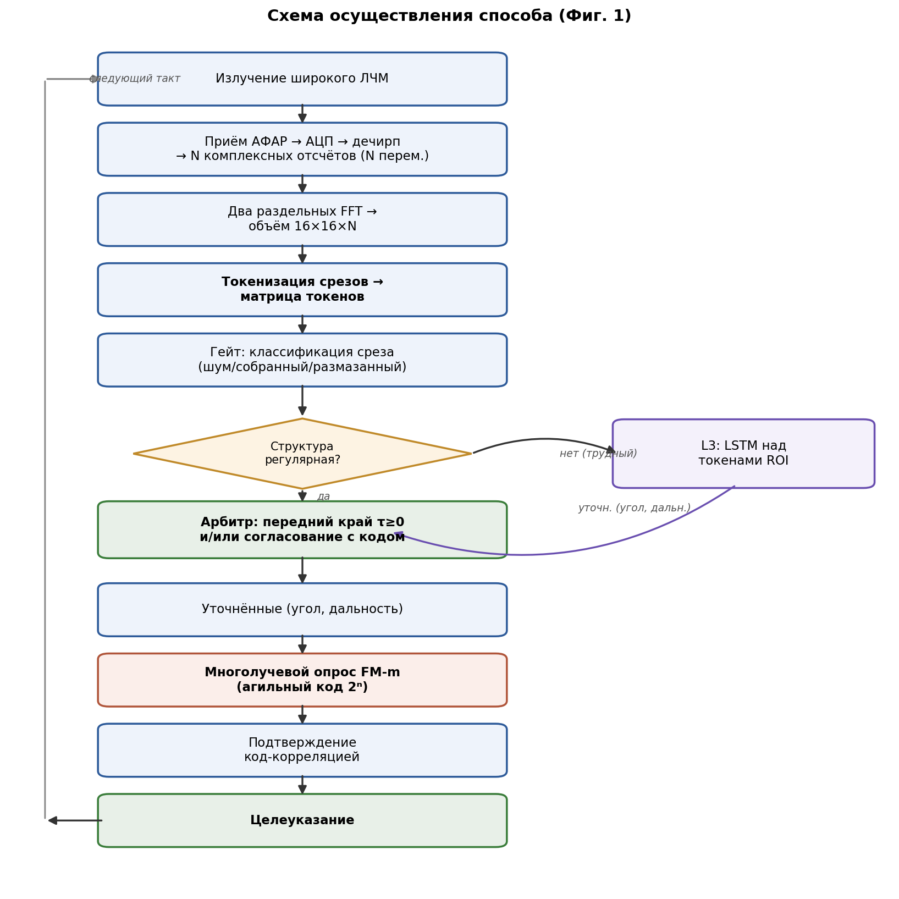

# Название изобретения

Способ распознавания истинной цели на фоне самоприкрывающей ретрансляционной помехи.

# Область техники

Изобретение относится к радиолокации, а именно к способам защиты радиолокационных станций с активной фазированной антенной решёткой (АФАР) от активных ретрансляционных (DRFM) самоприкрывающих помех, и может применяться для распознавания истинной цели среди ложных отметок.

# Уровень техники

Известен способ подавления активной помехи (RU2549375C1, прототип), основанный на приёме излучения источника помех по основному и вспомогательному каналам и вычислении корреляции между ними для компенсации помехи в главном луче. Способ рассчитан на геометрию отдельного постановщика и не содержит структурного различителя «истинная/ложная цель»: при самоприкрытии, когда помеха излучается с носителя цели, отклик ретранслятора структурно неотличим от отражения цели, и задача не решается.

Известны нейросетевые способы классификации радиолокационных данных на трёхмерном массиве «дальность–угол–скорость» (US10962637B2, US12181562) и способы формирования азимут-угломестной картины преобразованием Фурье по бинам дальности (EP0097490A2). По отдельности они не обеспечивают распознавания истинной цели при самоприкрытии.

# Раскрытие сущности изобретения

**Решаемая задача** — надёжное распознавание истинной цели на фоне самоприкрывающей ретрансляционной помехи при ограниченной латентности обработки.

**Технический результат** — повышение достоверности распознавания истинной цели и снижение вычислительных затрат за счёт сведения большого объёма данных к компактной матрице токенов и применения причинностного физического арбитра.

Результат достигается совокупностью действий, выполняемых за каждый рабочий такт: (а) формирование объёма «апертура×апертура×дальность» двумя раздельными преобразованиями Фурье; (б) замена полной угловой карты каждого среза структурным токеном из инвариантных к расщеплению признаков; (в) классификация срезов нейросетевым гейтом при вынесении окончательной метки причинностным арбитром (передний край τ ≥ 0 и/или согласование с текущим кодом); (г) формирование целеуказания по матрице токенов и излучение агильного зонда FM-m. Технический результат обеспечивается именно совокупностью (а)–(г).

# Краткое описание чертежей

На фиг. 1 приведена схема осуществления способа (последовательность операций одного рабочего такта).

# Осуществление изобретения

Способ осуществляют за каждый рабочий такт в следующей последовательности действий (фиг. 1).

Излучают широкий линейно-частотно-модулированный (ЛЧМ) сигнал; принятый сигнал подвергают гетеродинному сжатию (дечирпу), при котором задержка цели переходит в постоянную частоту биений (`f_b = μ·2R/c`, `μ = ΔF/T_c`), и получают N комплексных отсчётов, где N — переменная за такт величина.

Формируют массив «апертура×апертура×дальность» размерности 16×16×N двумя раздельными преобразованиями Фурье: глобальным дальностным по оси быстрого времени (после него ось дальности содержит N бинов) и поячеечным угловым 16×16 на каждом бине дальности; магнитуду с центрированием (fftshift) вычисляют только после углового преобразования. Разрешение по дальности `Δr = c/(2·ΔF)`; угловая шкала `sinθ = k/8` при шаге решётки `d = λ/2`.

Для каждого среза дальности заменяют полную угловую карту (256 = 16×16 ячеек) структурным токеном, содержащим массив до пяти наиболее ярких угловых пиков `(k_x, k_y, амплитуда, кромка)` и вектор инвариантных к расщеплению признаков распределения энергии: пиковое отношение `PR = (Σp)²/Σp²`, меру разреженности Хойера, долю энергии главного лепестка в окне 3×3, интегральное отношение главного лепестка к боковым.

Классификатором (нейросеть 6→16→3) относят срез к классу состояния (шум/собранный/размазанный); классификатор выполняет функцию гейта и приоритизатора. Окончательную метку «истинная/ложная цель» устанавливают причинностным арбитром: истинная цель — ближний по дальности член причинностной группы (ретранслятор причинно только задерживает, `τ ≥ 0`, поэтому ложные отметки всегда дальше), и/или отклик, согласованный с текущим кодом зондирования. Область применения правила — самозащитная помеха; уводящую помеху на ином носителе разделяют по свежести кода и угловому разнесению.

По совокупности токенов (матрице токенов) формируют целеуказание (номер бина дальности, тонкую дальность интерполяцией пика, углы) и излучают в интересуемые площади многолучевой агильный фазоманипулированный зонд FM-m с кодом переменной длины 2ⁿ (2⁸…2²⁰), дополняемой нулями до размера преобразования Фурье, причём код меняется от такта к такту. Корреляцию с кодом выполняют через быстрое преобразование Фурье (`corr = IFFT(conj(FFT(ref))·FFT(inp))`) по k сопряжённым опорам текущего кода; на выходе обратного преобразования формируют вторичный набор токенов из 3–5 наибольших значений отклика.

На трудных кандидатах с нерегулярной структурой (рваная гребёнка, дрожащая задержка) дополнительно применяют резидентную последовательностную нейронную сеть (LSTM/GRU) над потоком токенов области интереса, уточняющую угол и тонкую дальность, с окончательным подтверждением код-корреляцией.

Формирование среза, свёртку в токен и классификацию выполняют целиком в быстрой внутрикристальной памяти рабочей группы графического процессора, а угловое преобразование 16×16 — на матричных (тензорных) вычислительных блоках, что снижает вычислительные затраты.

Возможность осуществления способа подтверждается наличием рабочего корреляционного модуля FM-m на GPU (ROCm/HIP, hipFFT/rocFFT).

# Формула изобретения

**1.** Способ распознавания истинной цели на фоне самоприкрывающей ретрансляционной помехи и целеуказания в моностатическом радаре с активной фазированной антенной решёткой, включающий излучение зондирующего сигнала, приём отражённого сигнала элементами решётки, преобразование Фурье принятого сигнала и обнаружение целей, **отличающийся тем, что** за каждый рабочий такт: (а) излучают широкий линейно-частотно-модулированный сигнал, после гетеродинного сжатия получают N комплексных отсчётов при переменной N и формируют массив «апертура×апертура×дальность» размерности 16×16×N двумя раздельными преобразованиями Фурье — глобальным дальностным и поячеечным угловым 16×16; (б) для каждого среза дальности заменяют полную угловую карту структурным токеном из ограниченного числа наиболее ярких угловых пиков и вектора инвариантных к расщеплению признаков распределения энергии; (в) классификатором относят срез к классу состояния, причём классификатор выполняет функцию гейта, а принадлежность отклика истинной либо ложной цели устанавливают по правилу ближнего по дальности члена причинностной группы (τ ≥ 0) и/или согласования отклика с текущим кодом зондирования; (г) по совокупности токенов формируют целеуказание и излучают в выбранные площади агильный фазоманипулированный зондирующий сигнал с кодом переменной длины 2ⁿ, дополняемой нулями до размера преобразования Фурье, причём код меняется от такта к такту.

**2.** Способ по п.1, отличающийся тем, что вектор признаков включает пиковое отношение `PR = (Σp)²/Σp²`, меру разреженности Хойера, долю энергии главного лепестка в окне 3×3 и интегральное отношение главного лепестка к боковым.

**3.** Способ по п.1, отличающийся тем, что структурный токен содержит до пяти наиболее ярких пиков, заданных угловыми координатами, амплитудой и признаком кромки; массив пиков упорядочен по углу, а сборка токенов ведётся по дальности.

**4.** Способ по п.1, отличающийся тем, что причинностное правило применяют в области самозащитной помехи, а уводящую помеху на ином носителе разделяют по свежести кода зондирования и угловому разнесению.

**5.** Способ по п.1, отличающийся тем, что корреляцию с кодом зондирования выполняют через быстрое преобразование Фурье по k сопряжённым опорам текущего кода с батчингом по свободной памяти графического процессора.

**6.** Способ по п.5, отличающийся тем, что на выходе обратного преобразования Фурье формируют вторичный набор токенов из 3–5 наибольших значений отклика.

**7.** Способ по п.1, отличающийся тем, что на трудных кандидатах с нерегулярной структурой дополнительно применяют резидентную последовательностную нейронную сеть над потоком токенов области интереса, уточняющую угол и тонкую дальность, с подтверждением код-корреляцией.

**8.** Способ по п.1, отличающийся тем, что устойчивое обнаружение на угловой карте выполняют посредством CFAR порядковой статистики по угловой координате.

**9.** Способ по п.1, отличающийся тем, что формирование среза, свёртку в токен и классификацию выполняют в быстрой внутрикристальной памяти рабочей группы графического процессора, а угловое преобразование 16×16 — на матричных вычислительных блоках.

# Реферат

Способ распознавания истинной цели на фоне самоприкрывающей ретрансляционной (DRFM) помехи в моностатическом радаре с АФАР. За каждый такт широкий ЛЧМ-сигнал формирует объём «апертура×апертура×дальность» 16×16×N двумя раздельными преобразованиями Фурье; каждый срез дальности сворачивают в компактный структурный токен из наиболее ярких угловых пиков и инвариантных к расщеплению признаков; нейросетевой гейт классифицирует срезы, а окончательную метку «истинная/ложная цель» выносит причинностный арбитр по правилу ближнего края (τ ≥ 0) и/или согласования с текущим кодом; по матрице токенов формируют целеуказание и излучают агильный зонд FM-m с кодом переменной длины. Достигается повышение достоверности распознавания при самоприкрытии и снижение вычислительных затрат.
