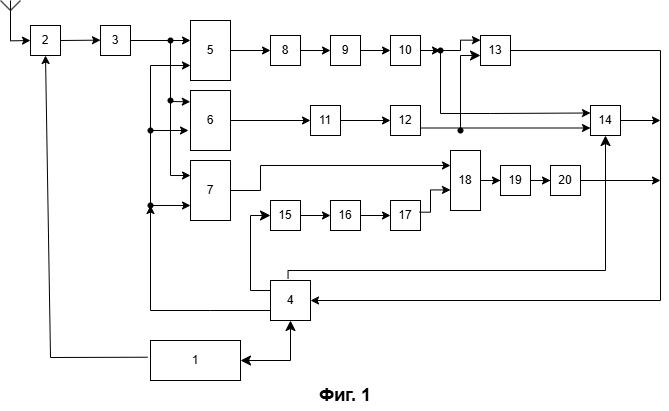

> ⚠️ **КОНЦЕПЦИЯ ИЗМЕНЕНА (2026-07-17):** апертура НЕ фиксированная 16×16, а **i×j** (каждая ось = 2ⁿ, недобор элементов → zero-pad до 2ⁿ); угловая шкала `sinθ = k/(N_pad/2)` считается по каждой оси НЕЗАВИСИМО. Юридический текст: блоки 8/9/6/11/14 и п.5 — апертура 16×16 → i×j, sinθ=k/8 → две оси, zero-pad. Полный список правок — [`00_КОНЦЕПЦИЯ_ixj_2n.md`](00_КОНЦЕПЦИЯ_ixj_2n.md). Текст ниже ещё НЕ переработан под новую концепцию.

---
title: "ЗАЯВКА НА ИЗОБРЕТЕНИЕ (УСТРОЙСТВО)"
---

# Название изобретения

Устройство распознавания истинной цели на фоне самоприкрывающей ретрансляционной помехи и целеуказания.

# Область техники

Изобретение относится к радиолокации, а именно к устройствам защиты радиолокационных станций с активной фазированной антенной решёткой (АФАР) от активных ретрансляционных (DRFM) самоприкрывающих помех, и обеспечивает распознавание истинной цели среди ложных отметок и выдачу целеуказания.

# Уровень техники

Известно устройство подавления активной помехи (RU2549375C1, прототип), содержащее приёмные каналы (основной и вспомогательный) и блок корреляции для компенсации помехи в главном луче; структурного различителя «истинная/ложная цель» оно не содержит и при самоприкрытии, когда помеха излучается с носителя цели, задачу не решает.

Известны вычислительные устройства нейросетевой классификации радиолокационного куба «дальность–угол–скорость» (US10962637B2, US12181562), устройства формирования азимут-угломестной картины преобразованием Фурье по бинам дальности (EP0097490A2), устройства планирования радиолокационного ресурса и наведения луча (US11747438) и устройства GPU-обработки радиолокационных данных (CN101441271A). По отдельности они не обеспечивают распознавания истинной цели при самоприкрытии.

# Раскрытие сущности изобретения

**Решаемая задача** — надёжное распознавание истинной цели на фоне самоприкрывающей ретрансляционной помехи при ограниченной латентности обработки.

**Технический результат** — повышение достоверности распознавания истинной цели и снижение вычислительных затрат. Результат достигается за счёт единого вычислительного ядра, сводящего большой объём принятых данных к разреженной матрице токенов, причинностного арбитра, выносящего окончательную метку по физическому признаку, и сменных интерфейсных блоков, приводящих разнотипные зондирующие сигналы к общему массиву «апертура×апертура×дальность».

Технический результат достигается тем, что устройство содержит радиочастотный тракт и вычислитель на графическом процессоре, реализующий сменные интерфейсы по типу зондирующего сигнала (линейно-частотно-модулированный, амплитудно-модулированный, фазоманипулированный), единую токенизацию по инвариантным к расщеплению признакам, причинностный арбитр, блок объёмного добора на рекуррентной нейронной сети и коррелятор фазоманипулированного сигнала с агильным кодом переменной длины.

# Краткое описание чертежей

На фиг. 1 представлена блок-схема заявляемого устройства.

# Осуществление изобретения

Заявляемое устройство (фиг. 1) содержит блок управления системой 1, радиочастотный тракт 2 с активной фазированной антенной решёткой, блок записи данных на графический процессор 3, блок управления потоком данных и алгоритмами 4, интерфейсный блок линейно-частотно-модулированного сигнала 5, интерфейсный блок амплитудно-модулированного сигнала 6, интерфейсный блок фазоманипулированного сигнала 7, блок формирования апертуры 8, блок углового двумерного преобразования Фурье 9, блок токенизации 10, блок объёмного трёхмерного преобразования Фурье 11, блок токенизации 12, причинностный арбитр 13, блок объёмного добора 14, блок формирования опорного кода 15, блок формирования векторов циклических сдвигов 16, блок вычисления спектра опор 17, блок сопряжённого перемножения 18, блок обратного преобразования Фурье 19 и блок токенизации выхода коррелятора 20. Блоки 5–20 реализованы в графическом процессоре.

Первый выход блока управления системой 1 соединён со входом радиочастотного тракта 2, второй выход — со вторым входом блока управления потоком данных 4. Выход радиочастотного тракта 2 соединён со входом блока записи данных 3, выход которого соединён с первыми входами интерфейсных блоков 5, 6 и 7.

Первый выход блока управления потоком данных 4 соединён со вторыми входами интерфейсных блоков 5, 6 и 7; второй выход блока 4 соединён со входом блока формирования опорного кода 15; третий выход блока 4 соединён с третьим входом блока объёмного добора 14; четвёртый выход блока 4 соединён со входом блока управления системой 1.

Выход интерфейсного блока 5 соединён со входом блока формирования апертуры 8, выход которого соединён со входом блока углового двумерного преобразования Фурье 9, соединённого со входом блока токенизации 10. Выход интерфейсного блока 6 соединён со входом блока объёмного трёхмерного преобразования Фурье 11, выход которого соединён со входом блока токенизации 12.

Выход блока токенизации 10 соединён с первым входом причинностного арбитра 13 и с первым входом блока объёмного добора 14. Выход блока токенизации 12 соединён со вторым входом причинностного арбитра 13 и со вторым входом блока объёмного добора 14.

Выход интерфейсного блока 7 соединён с первым входом блока сопряжённого перемножения 18. Выход блока формирования опорного кода 15 соединён со входом блока формирования векторов циклических сдвигов 16, выход которого соединён со входом блока вычисления спектра опор 17, а выход последнего — со вторым входом блока сопряжённого перемножения 18. Выход блока 18 соединён со входом блока обратного преобразования Фурье 19, выход которого соединён со входом блока токенизации выхода коррелятора 20.

Выходы причинностного арбитра 13, блока объёмного добора 14 и блока токенизации выхода коррелятора 20 соединены с первым входом блока управления потоком данных 4.

**Устройство работает следующим образом.**

Блок управления системой 1 задаёт тип зондирующего сигнала (ЛЧМ, АМ или ФМ), его параметры и время воздействия на объект, выдавая соответствующие команды в радиочастотный тракт 2 и в блок управления потоком данных 4. Блок 4 по этим командам задаёт, какой интерфейсный блок работает, а также размеры и позиции обрабатываемых данных в памяти графического процессора.

Радиочастотный тракт 2 формирует цифро-аналоговым преобразователем зондирующий сигнал заданного типа, излучает его активной фазированной антенной решёткой, принимает отражённый сигнал, оцифровывает его аналого-цифровым преобразователем и выполняет первичную обработку в зависимости от формы сигнала — децимацию с заданным шагом и, для ЛЧМ, гетеродинное сжатие (дечирпирование), при котором задержка цели переходит в постоянную частоту биений. Данные передаются по оптическому каналу через сетевую карту и записываются блоком 3 в память графического процессора последовательно по антеннам в виде массива Q антенн по l комплексных отсчётов (Q·l), где каждый отсчёт представлен двумя вещественными числами. Блок 3 раздаёт записанные данные на первые входы интерфейсных блоков 5, 6 и 7; по команде блока 4, поступающей на их вторые входы, работает тот интерфейсный блок, который соответствует текущему типу сигнала.

При линейно-частотно-модулированном сигнале интерфейсный блок 5 выполняет дальностное преобразование Фурье по каждому лучу после дечирпирования, формируя ось дальности (разрешение по дальности определяется девиацией частоты: Δr = c/(2·ΔF)). Блок 8 переформатирует массив Q·l в апертуру размерности 16×16 на каждом бине дальности. Блок 9 выполняет угловое двумерное преобразование Фурье на каждом бине дальности (при шаге решётки d = λ/2 угловая шкала sinθ = k/8). Блок 10 сворачивает полученный угловой спектр в структурный токен по инвариантным к расщеплению (страддлу) признакам распределения энергии — пиковому отношению PR = (Σp)²/Σp², мере разреженности Хойера, доле энергии главного лепестка, интегральному отношению главного лепестка к боковым, отношению максимума к среднему (max/mean) и полной энергии среза — и на основе предобученной нейронной сети относит срез к классу состояния, выполняя функцию классификатора-гейта; на выходе формируется массив структур (токенов).

При амплитудно-модулированном сигнале интерфейсный блок 6 формирует из массива Q·l объёмный участок «апертура×апертура×дальность» (в частности 16×16×L) с перекрытием по дальности, причём размеры участка и перекрытие задаются блоком 4. При необходимости выполняется смешанный анализ участками разного размера: там, где в предыдущем такте отклик отсутствовал, берутся крупные участки (например 16×16×256), чтобы не пропустить одиночный всплеск, а на участках с откликом — мелкие. Поскольку принятые данные остаются в памяти графического процессора, а решения ведут по компактной матрице токенов, блок управления системой 1 определяет, какие участки исследовать, до какого размера спускаться и сколько точек брать, а блок 4 исполняет это на графическом процессоре, перенарезая одни и те же данные участками произвольного размера, шага и положения. При грубом проходе (крупный шаг, глубокий формат, например 16×16×256) блок 1 отбирает ограниченное число наиболее ярких выбросов (например, три-четыре) и по ним командует тонкий добор — спуск по формату (например, с 256 до 16) и повторное чтение тех же под-кубов мелким шагом (повторный проход трёхмерного преобразования Фурье) для уточнения положения; менее яркие выбросы до-исследуются на последующих тактах. При сплошном проходе мелким шагом (8 или 16) объём сразу получают в полном разрешении и добор не выполняют. Пустой в предыдущем такте участок может быть пропущен. Блок 11 выполняет объёмное трёхмерное преобразование Фурье на каждом таком участке (третья ось — дальность: грубо задаётся позицией окна, тонко — номером спектрального отсчёта). Блок 12 сворачивает объёмный спектр в токен по тем же инвариантным признакам, обобщённым на объём (главный лепесток 3×3×3, охранная зона 5×5×5, пороговое обнаружение OS-CFAR по объёму).

Тем самым объёмный участок формируется произвольного размера и положения, а двумерная токенизация тракта ЛЧМ является частным случаем объёмной при глубине участка, равной единице; интерфейсные блоки 5 и 6 отличаются лишь способом заполнения объёма, тогда как токенизация (блоки 10 и 12), причинностный арбитр 13 и блок объёмного добора 14 — общие для всех типов сигнала.

Массивы токенов с выходов блоков 10 и 12 поступают на входы причинностного арбитра 13. Отнесение срезов к трём классам состояния (шум, собранный источник, размазанная помеха) выполнено нейронной сетью ещё на этапе токенизации (блоки 10, 12), которая тем самым служит гейтом-приоритизатором; окончательное разбиение сцены на четыре класса (шум, одиночная локализованная цель, заградительный сигнал, гребёнка ложных целей) и метку «истинная/ложная цель» выносят на втором проходе — по профилю токенов вдоль дальности — причинностный арбитр 13 и блок объёмного добора 14. Ретранслятор причинно только задерживает сигнал (τ ≥ 0), поэтому ложные отметки всегда дальше истинной; истинной целью признаётся ближний по дальности член причинностной группы (правило переднего края) и/или отклик, согласованный с текущим кодом зондирования. На выходе блока 13 формируется массив структур об одиночных объектах (углы, дальность, метка) либо признак необходимости углублённого исследования.

Параллельно те же массивы токенов с выходов блоков 10 и 12 поступают на входы блока объёмного добора 14, который по команде блока 4 (третий вход) получает адрес и размеры интересующего объёмного участка 16×16×32/64/…/256 и посредством рекуррентной нейронной сети (LSTM/GRU) над потоком токенов области интереса уточняет угол и тонкую дальность трудного кандидата с нерегулярной структурой (рваная гребёнка, дрожащая задержка, наложенные отклики), а также характеризует помеху (заградительная либо гребёнка ложных целей).

При фазоманипулированном сигнале интерфейсный блок 7 вычисляет спектр принятого сигнала — преобразование Фурье уже сформированных приёмных лучей. Параллельно блок 15 по команде блока 4 формирует сопряжённый опорный сигнал m-последовательности агильной длины (2⁸…2²⁰, меняющейся от такта к такту, с дополнением нулями до размера преобразования Фурье) на число принятых точек; блок 16 формирует векторы циклических сдвигов опоры (гипотезы задержки, они же дальностные стробы текущего кода); блок 17 вычисляет их спектр. Блок 18 выполняет сопряжённое перемножение спектра опор и спектра принятого сигнала, блок 19 — обратное преобразование Фурье произведения (corr = IFFT(conj(FFT(ref))·FFT(inp))), а блок 20 токенизирует корреляционный отклик, извлекая 3–5 наибольших значений (положение корреляционного пика соответствует дальности, тонкая дальность — интерполяцией пика) и формируя массив структур об объекте. Тем самым выходом всех трёх трактов является единая разреженная матрица токенов.

Массивы структур с выходов блоков 13, 14 и 20 поступают в блок управления потоком данных 4, который передаёт разреженную матрицу токенов и параметры обнаруженных объектов в блок управления системой 1. Блок 1 формирует целеуказание и параметры следующего такта — тип сигнала, новый код и его длину, направления и площади многолучевого опроса, — замыкая когнитивную петлю: дешёвый инвариантный признак (токен) гейтирует дорогой агильный зондирующий сигнал, физика (арбитр 13) выносит решение, а нейронная сеть служит адъюнктом.

Формирование апертуры, свёртка в токен и классификация выполняются целиком в быстрой внутрикристальной памяти рабочей группы графического процессора (LDS) без выгрузки промежуточных данных во внешнюю память, а угловое и объёмное преобразования Фурье — на матричных (тензорных) вычислительных блоках, что и обеспечивает снижение вычислительных затрат. Возможность осуществления изобретения подтверждается наличием работающего корреляционного модуля FM-m на графическом процессоре (ROCm/HIP, hipFFT/rocFFT).

# Формула изобретения

**1.** Устройство распознавания истинной цели на фоне самоприкрывающей ретрансляционной помехи и целеуказания, содержащее радиочастотный тракт (2) с активной фазированной антенной решёткой, аналого-цифровым преобразователем, децимацией и гетеродинным сжатием, а также вычислитель на графическом процессоре, **отличающееся тем, что** вычислитель содержит:

блок записи данных (3), выполненный с возможностью приёма массива Q·l комплексных отсчётов и раздачи данных на первые входы интерфейсных блоков (5, 6, 7);

сменные интерфейсные блоки по типу зондирующего сигнала — линейно-частотно-модулированный (5) с последующими блоками формирования апертуры (8) и углового двумерного преобразования Фурье (9), амплитудно-модулированный (6) с последующим блоком объёмного трёхмерного преобразования Фурье (11), приводящие данные к общему массиву «апертура×апертура×дальность», и фазоманипулированный (7), формирующий спектр принятого сигнала;

блоки токенизации (10, 12), выполненные с возможностью свёртки спектра в структурный токен по инвариантным к расщеплению признакам распределения энергии на основе предобученной нейронной сети, выполняющей функцию классификатора-гейта;

причинностный арбитр (13), входы которого соединены с выходами блоков токенизации (10, 12) и который устанавливает окончательную метку истинной либо ложной цели по разреженной матрице токенов согласно правилу ближнего по дальности члена причинностной группы (τ ≥ 0) и/или согласования отклика с текущим кодом зондирования;

коррелятор фазоманипулированного сигнала (15–20), формирующий сопряжённый опорный агильный код переменной длины и векторы его циклических сдвигов, вычисляющий корреляцию через преобразование Фурье и токенизирующий корреляционный отклик (20);

и блоки управления — блок управления системой (1), задающий тип сигнала, его параметры и время воздействия, и блок управления потоком данных и алгоритмами (4), выходы которого соединены со вторыми входами интерфейсных блоков (5, 6, 7) и со входом блока формирования опорного кода (15), а вход — с выходами причинностного арбитра (13) и блока токенизации выхода коррелятора (20);

причём выходом всех интерфейсных трактов является единая разреженная матрица токенов, по которой формируется целеуказание.

**2.** Устройство по п.1, отличающееся тем, что блок формирования опорного кода (15) формирует код переменной длины от 2⁸ до 2²⁰, меняющийся от такта к такту, с дополнением нулями до размера преобразования Фурье.

**3.** Устройство по п.1, отличающееся тем, что блоки формирования, преобразования и токенизации (8–12) выполняют угловое и объёмное преобразования Фурье на матричных (тензорных) вычислительных блоках, а формирование среза и токенизацию — в быстрой внутрикристальной памяти рабочей группы графического процессора.

**4.** Устройство по п.1, отличающееся тем, что содержит блок объёмного добора (14) на рекуррентной нейронной сети, первый и второй входы которого соединены с выходами блоков токенизации (10, 12), третий вход — с выходом блока управления потоком данных (4), задающим границы области интереса, а выход — со входом блока управления потоком данных (4), выполненный с возможностью уточнения угла и тонкой дальности трудного кандидата по потоку токенов области интереса.

**5.** Устройство по п.1, отличающееся тем, что амплитудно-модулированный интерфейсный блок (6) формирует объёмный участок «апертура×апертура×дальность» произвольного размера и положения (n×n×L, в частности 16×16×L) со скользящим трёхмерным преобразованием переменного шага, единообразно с линейно-частотно-модулированным трактом, для которого двумерная токенизация является частным случаем объёмной при глубине участка, равной единице.

**6.** Устройство по п.5, отличающееся тем, что интерфейсный блок (6) под управлением блока управления системой (1) и блока управления потоком данных (4) выполнен с возможностью адаптивной нарезки одних и тех же принятых данных, остающихся в памяти графического процессора, участками произвольного размера, шага и положения, причём при грубом проходе крупным шагом блок управления системой (1) отбирает ограниченное число наиболее ярких выбросов и по ним выполняет тонкий добор — повторную обработку тех же участков уменьшенным размером (мелким шагом) трёхмерным преобразованием Фурье для уточнения положения, — а при сплошном проходе мелким шагом добор не выполняется.

**7.** Устройство по п.1, отличающееся тем, что блок управления потоком данных (4) передаёт разреженную матрицу токенов и параметры объектов в блок управления системой (1), а блок управления системой (1) формирует целеуказание и параметры следующего такта.

**8.** Устройство по п.1, отличающееся тем, что блоки токенизации (10, 12) относят срез к трём классам состояния (шум, собранный источник, размазанная помеха), а причинностный арбитр (13) и блок объёмного добора (14) выполняют окончательное отнесение сцены к четырём классам (шум, одиночная локализованная цель, заградительный сигнал, гребёнка ложных целей) по профилю токенов вдоль дальности.

# Реферат

Устройство распознавания истинной цели на фоне самоприкрывающей ретрансляционной (DRFM) помехи в моностатическом радаре с АФАР. Устройство содержит блок управления системой (1), радиочастотный тракт (2), блок записи данных на графический процессор (3), блок управления потоком данных и алгоритмами (4), сменные интерфейсные блоки по типу зондирующего сигнала — ЛЧМ (5) с блоками формирования апертуры (8) и углового двумерного преобразования Фурье (9), АМ (6) с блоком объёмного трёхмерного преобразования Фурье (11) и ФМ (7), — приводящие данные к общему массиву «апертура×апертура×дальность», блоки токенизации (10, 12) по инвариантным к расщеплению признакам, причинностный арбитр (13), блок объёмного добора на рекуррентной нейронной сети (14) и коррелятор фазоманипулированного сигнала с агильным кодом переменной длины (15–20) с токенизацией корреляционного отклика (20). Достигается повышение достоверности распознавания истинной цели при самоприкрытии и снижение вычислительных затрат. 1 ил.
