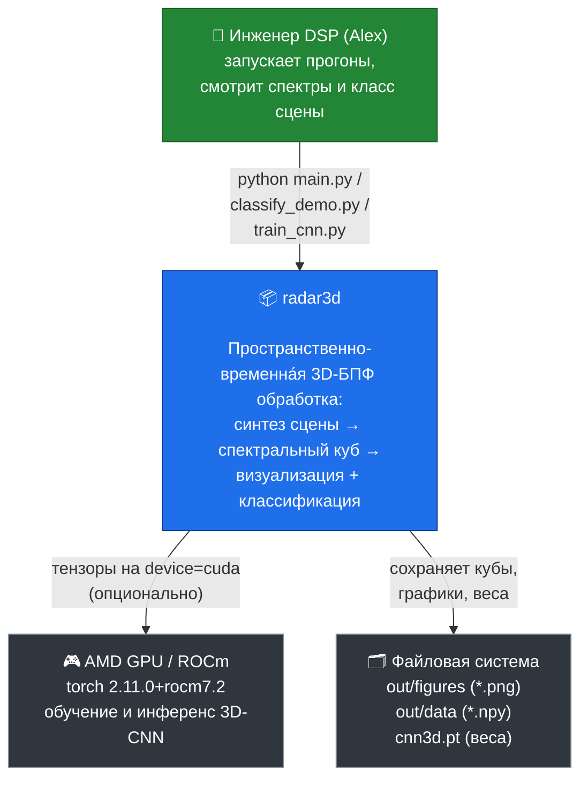

# C1 — System Context (контекст системы)

> Кто пользуется системой и с чем она взаимодействует. Самый верхний уровень C4.

## Назначение

`radar3d` — каркас под **предварительную сортировку сигналов** на матричных ядрах
GPU (каскад 1–2 заявки). Моделирует приём антенной решёткой **i×j** (нечётная
апертура, каждая ось — 2ⁿ после паддинга), выполняет спектральное преобразование
(два раздельных FFT — дальностный + угловой, либо скользящий 3D-FFT) и проводит
куб через полный когнитивный конвейер: **токенизатор** (признаки+триаж) →
**арбитр** (передний край + свежесть FM-m кода) → **целеуказание** пучка →
**трекинг** между тактами; параллельно классифицирует сцену: `empty`, `target`,
`barrage`, `comb`, `ham`.

## Действующие лица и внешние системы

| Элемент | Тип | Роль |
|---------|-----|------|
| **Инженер DSP (Alex)** | человек | запускает сценарии, анализирует спектр/классификацию |
| **radar3d** | система | синтез сцены → 3D-БПФ → визуализация + классификатор |
| **AMD GPU / ROCm** | внешняя (опц.) | обучение/инференс 3D-CNN через PyTorch-ROCm |
| **Файловая система** | внешняя | вход/выход: фигуры PNG, кубы `.npy`, веса `.pt` |

> GPU нужен только для обучаемого `Cnn3DClassifier`. Детерминированный
> `RuleBasedClassifier` и весь спектральный тракт работают на CPU (numpy).

→ Дальше: [C2 — Container](C2-container.md)
