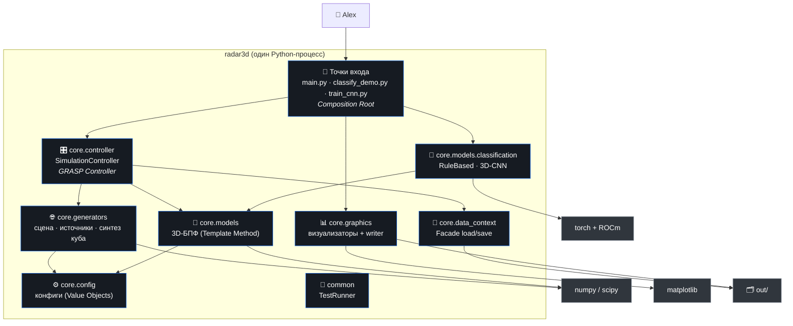

# C2 — Container (контейнеры / пакеты)

> Из каких крупных частей состоит система. Для Python-процесса «контейнеры» —
> это логические пакеты `core.*` + точки входа + внешние библиотеки.

## Контейнеры (пакеты)

| Пакет | Ответственность | Ключевые типы |
|-------|-----------------|---------------|
| **точки входа** | связывание зависимостей (DI), CLI | `main`, `classify_demo`, `train_cnn` |
| `core.controller` | координация прогона | `SimulationController`, `ProcessingOutcome` |
| `core.config` | неизменяемые параметры прогона | `SimulationConfig`, `ArrayConfig`, `RangeConfig`, `SceneConfig`, `*Spec` |
| `core.generators` | синтез сырого куба из сцены | `Scene`, `SceneBuilder`, `Synthesizer`, `EmitterFactory`, источники |
| `core.models` | спектральное преобразование | `RadarModel`, `Fft3DModel`, `AxisWindows`, `SpectralCube` |
| `core.models.classification` | классификация куба | `CubeClassifier`, `RuleBasedClassifier`, `Cnn3DClassifier`, `CubeDatasetGenerator` |
| `core.graphics` | рендер фигур | `Visualizer`, 3 визуализатора, `FigureWriter` |
| `core.data_context` | хранение кубов | `DataContext`, `CubeRepository`, `NpyCubeRepository` |
| `common` | тест-инфраструктура (замена pytest) | `TestRunner`, `AssertionGroup`, `SkipTest` |

## Внешние зависимости

- **numpy/scipy** — массивы, БПФ, статистика (ядро тракта).
- **matplotlib** — рендер фигур (`Agg`, без GUI).
- **torch + ROCm** — только для `Cnn3DClassifier`/`train_cnn` (Python 3.12, cp312).
- **Файловая система** — `out/data` (кубы), `out/figures` (PNG), `cnn3d.pt`.

→ Назад: [C1](C1-context.md) · Дальше: [C3 — Component](C3-component.md)
