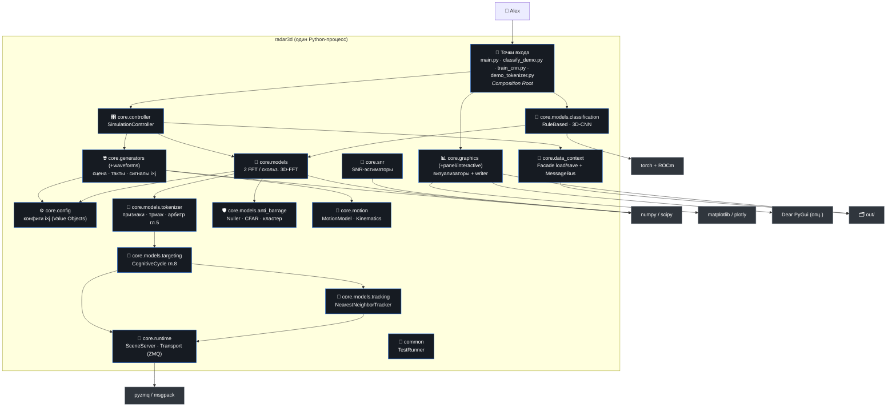

# C2 — Container (контейнеры / пакеты)

> Из каких крупных частей состоит система. Для Python-процесса «контейнеры» —
> это логические пакеты `core.*` + точки входа + внешние библиотеки.

## Контейнеры (пакеты)

| Пакет | Ответственность | Ключевые типы |
|-------|-----------------|---------------|
| **точки входа** | связывание зависимостей (DI), CLI | `main`, `classify_demo`, `train_cnn`, `demo_tokenizer` |
| `core.controller` | координация прогона | `SimulationController`, `ProcessingOutcome` |
| `core.config` | неизменяемые параметры прогона, апертура i×j | `SimulationConfig`, `ProjectConfig`, `ArrayConfig` (`padded_shape`), `RangeConfig`, `SceneConfig`, `*Spec` |
| `core.generators` (+ `waveforms`, `backends`) | синтез сырого куба из сцены/тактов | `Scene`, `SceneBuilder`, `Synthesizer`, `EmitterFactory`, `TactSequence`, `LfmToCube`/`AmToCube`, `WaveformFactory` |
| `core.models` | спектральное преобразование (2 FFT) | `RadarModel`, `Fft3DModel`, `angular_fft`, `RangeFft`, `AxisWindows`, `SpectralCube` |
| `core.models.tokenizer` | признаки, триаж, арбитраж (гл.4–5) | `VolumeTokenizer`, `OsCfarDetector`, `FeatureExtractor`, `RuleBasedTriage`, `Arbiter`/`EdgeArbiter`/`CodeArbiter`/`CombinedArbiter` |
| `core.models.targeting` | целеуказание пучка (гл.8) | `CognitiveCycle`, `BeamTargeting`, `RoiGate` |
| `core.models.tracking` | трекинг между тактами | `Tracker`, `NearestNeighborTracker`, `Track` |
| `core.models.anti_barrage` | подавление заграда + CFAR | `SubspaceNuller`, `RobustMvdrNuller`, `AntiBarragePipeline`, `CaCfarDetector`, `DetectionClusterer` |
| `core.models.classification` | классификация куба | `CubeClassifier`, `RuleBasedClassifier`, `Cnn3DClassifier`, `CubeDatasetGenerator` |
| `core.graphics` (+ `interactive`, `panel`) | рендер фигур (matplotlib/plotly/панель) | `Visualizer`, 3 визуализатора, `FigureWriter`, `InteractiveVisualizer`, `PanelModel` |
| `core.data_context` | хранение кубов + внутрипроцессная шина | `DataContext`, `CubeRepository`, `NpyCubeRepository`, `MessageBus` |
| `core.runtime` | межпроцессный транспорт панели | `SceneServer`, `Transport`/`ZmqTransport`/`FanOutTransport`, `codec` |
| `core.motion` | кинематика цели | `MotionModel`, `TargetState`, `Kinematics` |
| `core.snr` | оценка SNR | `SnrEstimator`, `SpectrumSnrEstimator`, `StatisticsSnrEstimator` |
| `common` | тест-инфраструктура (замена pytest) | `TestRunner`, `AssertionGroup`, `SkipTest` |

## Внешние зависимости

- **numpy/scipy** — массивы, БПФ, статистика (ядро тракта).
- **matplotlib** — рендер фигур (`Agg`, без GUI); **plotly** — опц. интерактивная ветка.
- **torch + ROCm** — только для `Cnn3DClassifier`/`train_cnn` (Python 3.12, cp312).
- **pyzmq + msgpack** — межпроцессный транспорт `core.runtime` (панель, опц.).
- **Dear PyGui** — опц., живая панель `core.graphics.panel` (недоступность не роняет импорт).
- **Файловая система** — `out/data` (кубы), `out/figures` (PNG), `cnn3d.pt`.

→ Назад: [C1](C1-context.md) · Дальше: [C3 — Component](C3-component.md)
