# C3 — Component (компоненты прогона)

> Внутренности главного потока: что происходит при `SimulationController.run()`
> и как куб попадает в визуализацию/классификацию.

```mermaid
flowchart LR
    cfg["SimulationConfig<br/>array · range · scene · seed"]

    subgraph build["1 · Построение сцены (Builder + Factory)"]
        sb["SceneBuilder.build(cfg.scene)"]
        ef["EmitterFactory.create(spec)"]
        scene["Scene (Composite)<br/>Σ SignalSource + ThermalNoise"]
    end

    subgraph synth["2 · Синтез куба"]
        sy["Synthesizer.build(scene)"]
        grid["ArrayGrid.steering(kx,ky)"]
        raw["raw cube<br/>(nx, ny, n_real)"]
    end

    subgraph model["3 · 3D-БПФ (Template Method)"]
        win["AxisWindows.apply<br/>(окно ×3 оси)"]
        fft["np.fftn + fftshift<br/>(угловые оси центрируются)"]
        cube["SpectralCube<br/>(nx, ny, n_fft)"]
    end

    subgraph out["4 · Потребители куба"]
        vis["Visualizer.render → Figure"]
        wr["FigureWriter.write → PNG"]
        clf["CubeClassifier.classify → Classification"]
        dc["DataContext.save_cube → .npy"]
    end

    cfg --> sb --> ef --> scene
    scene --> sy
    sy --> grid
    sy --> raw
    raw --> win --> fft --> cube
    cube --> vis --> wr
    cube --> clf
    raw --> dc

    classDef s1 fill:#1f6feb,stroke:#0d3b8f,color:#fff
    classDef s2 fill:#8957e5,stroke:#5a3aa3,color:#fff
    classDef s3 fill:#bf8700,stroke:#7a5600,color:#fff
    classDef s4 fill:#238636,stroke:#1a6128,color:#fff
    class sb,ef,scene s1
    class sy,grid,raw s2
    class win,fft,cube s3
    class vis,wr,clf,dc s4
```

## Поток данных (по шагам)

1. **Построение сцены** — `SceneBuilder` обходит `cfg.scene.emitters`, через
   `EmitterFactory` (реестр спека→билдер) создаёт конкретные `SignalSource`,
   складывает их в `Scene` (Composite) и добавляет `ThermalNoise` последним.
2. **Синтез куба** — `Synthesizer` берёт `ArrayGrid` (фазовые векторы наведения)
   и детерминированный `np.random.default_rng(seed)`; `Scene.contribute()`
   суммирует вклады всех источников → сырой комплексный куб `(nx, ny, n_real)`.
3. **3D-БПФ** — `Fft3DModel.process()` (шаблонный метод базового `RadarModel`):
   `_apply_windows` (тройка окон) → `_transform` (`fftn` + `fftshift` по угловым
   осям) → `_build_result` (`SpectralCube` с осями `kx/ky` центрированными,
   дальность односторонняя). Магнитуда `(nx, ny, n_fft)`.
4. **Потребители** — `Visualizer` (Strategy) рендерит куб в `Figure`, `FigureWriter`
   пишет PNG; `CubeClassifier` (Strategy) относит куб к классу; `DataContext`
   (Facade) сохраняет сырой куб в `.npy`.

## Размерности эталонного прогона

| Куб | Форма | Где |
|-----|-------|-----|
| сырой (после синтеза) | `(16, 16, 16)` | `Synthesizer.build` |
| спектральный (магнитуда) | `(16, 16, 64)` | `Fft3DModel` (`n_fft=64`, zero-pad) |

→ Назад: [C2](C2-container.md) · Дальше: [C4 — Code](C4-code.md)
