# C3 — Component (компоненты когнитивного конвейера)

> Внутренности главного потока: апертура **i×j** (не квадрат, каждая ось 2ⁿ) →
> фронтенд (2 FFT / скользящий 3D-FFT) → куб → токенизатор → арбитр →
> целеуказание → трекинг. Параллельно — ветка anti-barrage (подавление помехи).
> Детали формул — [`Doc/Patent/00_КОНЦЕПЦИЯ_ixj_2n.md`](../Patent/00_КОНЦЕПЦИЯ_ixj_2n.md).

```mermaid
flowchart LR
    cfg["ProjectConfig / SimulationConfig<br/>ArrayConfig(i×j) · RangeConfig · сцена"]

    subgraph build["1 · Сцена и такт (Builder + Factory)"]
        sb["SceneBuilder / SceneModeler"]
        ef["EmitterFactory.create(spec)"]
        tact["TactSequence / MultiTactSequence"]
    end

    subgraph front["2 · Фронтенд (Strategy)"]
        lfm["LfmToCube: 2 раздельных FFT<br/>range_fft (глобальный) + angular_fft (i×j, поячеечно)"]
        am["AmToCube: скользящий 3D-FFT<br/>по окну nx×ny×D"]
        cube["SpectralCube<br/>(N_pad_x, N_pad_y, L)"]
    end

    subgraph tok["3 · Токенизатор (гл.4/4-бис, Template Method)"]
        cfar["OsCfarDetector<br/>точная Pfa (Rohling)"]
        feat["FeatureExtractor<br/>6 признаков / M"]
        triage["RuleBasedTriage<br/>{noise/source/smeared}"]
        assemble["assemble_range (проход 2)<br/>{target/comb/barrage}"]
    end

    subgraph arb["4 · Арбитр (гл.5, Composite)"]
        edge["EdgeArbiter<br/>передний край τ≥0"]
        code["CodeArbiter<br/>свежесть FM-m кода"]
        comb["CombinedArbiter"]
    end

    subgraph tgt["5 · Целеуказание (гл.8, Facade)"]
        cycle["CognitiveCycle.step()"]
        beam["BeamTargeting → BeamCommand"]
        roi["RoiGate"]
    end

    subgraph trk["6 · Трекинг"]
        tracker["NearestNeighborTracker"]
        track["Track"]
    end

    subgraph ab["ветка anti-barrage (Facade)"]
        null["SubspaceNuller / RobustMvdrNuller"]
        cacfar["CaCfarDetector"]
        clust["DetectionClusterer"]
        pipe["AntiBarragePipeline"]
    end

    subgraph out["Потребители"]
        vis["Visualizer / InteractiveVisualizer"]
        clf["CubeClassifier.classify"]
        dc["DataContext.save_cube"]
        rt["SceneServer → Transport (панель)"]
    end

    cfg --> sb --> ef --> tact
    tact --> lfm
    tact --> am
    lfm --> cube
    am --> cube
    cube --> cfar --> feat --> triage --> assemble
    assemble --> edge --> comb
    assemble --> code --> comb
    comb --> cycle --> beam --> roi
    comb --> tracker --> track
    roi --> tracker
    cube --> null --> cacfar --> clust
    null -.-> pipe
    cacfar -.-> pipe
    clust -.-> pipe
    cube --> vis
    cube --> clf
    cube --> dc
    beam --> rt
    track --> rt

    classDef s1 fill:#1f6feb,stroke:#0d3b8f,color:#fff
    classDef s2 fill:#8957e5,stroke:#5a3aa3,color:#fff
    classDef s3 fill:#bf8700,stroke:#7a5600,color:#fff
    classDef s4 fill:#c9424b,stroke:#8e1f26,color:#fff
    classDef s5 fill:#0aa5a5,stroke:#066b6b,color:#fff
    classDef s6 fill:#5a6b7a,stroke:#333f47,color:#fff
    classDef s7 fill:#a0522d,stroke:#6b3720,color:#fff
    classDef s8 fill:#238636,stroke:#1a6128,color:#fff
    class sb,ef,tact s1
    class lfm,am,cube s2
    class cfar,feat,triage,assemble s3
    class edge,code,comb s4
    class cycle,beam,roi s5
    class tracker,track s6
    class null,cacfar,clust,pipe s7
    class vis,clf,dc,rt s8
```

## Поток данных (по шагам)

1. **Сцена и такт** — `SceneBuilder`/`SceneModeler` через `EmitterFactory`
   (реестр спека→источник) собирают источники; `TactSequence`/`MultiTactSequence`
   продвигают состояние цели (`MotionModel`) по тактам.
2. **Фронтенд (Strategy `WaveformToCube`)** — `LfmToCube`: **два раздельных FFT**
   (дальностный `RangeFft` — глобальный, угловой `angular_fft` — поячеечно, с
   паддингом апертуры до 2ⁿ) — точный тракт; `AmToCube`: скользящий 3D-FFT по
   окну `nx×ny×D` — грубый тракт. Оба дают общий примитив `SpectralCube`
   `(N_pad_x, N_pad_y, L)`.
3. **Токенизатор (гл.4/4-бис, Template Method `VolumeTokenizer.tokenize`)** —
   `OsCfarDetector` (точная Pfa по Rohling) находит пики; `FeatureExtractor`
   считает 6 признаков, нормированных на `M = N_pad_x·N_pad_y`; `RuleBasedTriage`
   (проход 1) относит слайс к `{noise, source, smeared}`; `assemble_range`
   (проход 2) группирует по дальности → `{target, comb, barrage}` (`RangeVerdict`).
4. **Арбитр (гл.5, Composite)** — `EdgeArbiter` проверяет передний край (τ≥0,
   геометрия), `CodeArbiter` — свежесть FM-m кода (`fm_correlate`);
   `CombinedArbiter` объединяет оба вердикта → `TargetDecision`.
5. **Целеуказание (гл.8, Facade `CognitiveCycle.step`)** — `BeamTargeting`
   строит пучок лучей FM-m в конус неопределённости вокруг решения →
   `BeamCommand`; `RoiGate` фильтрует детекции по активным лучам.
6. **Трекинг** — `NearestNeighborTracker` ассоциирует `TargetDecision` между
   тактами по ближайшему соседу → `Track` (скорость линейной регрессией).
7. **Ветка anti-barrage (Facade `AntiBarragePipeline`)** — параллельно основному
   конвейеру: `SubspaceNuller`/`RobustMvdrNuller` подавляют заград по кубу,
   `CaCfarDetector` находит обнаружения, `DetectionClusterer` кластеризует их.
8. **Потребители** — визуализаторы (`Visualizer`/`InteractiveVisualizer`),
   `CubeClassifier` (сцена→класс), `DataContext` (сохранение `.npy`),
   `SceneServer`/`Transport` (публикация такта живой панели, P6).

## Размерности (пример неквадратной апертуры)

| Куб | Форма | Где |
|-----|-------|-----|
| апертура (сырая) | `nx × ny` (напр. `6×15`) | `ArrayConfig` |
| апертура (паддинг 2ⁿ) | `N_pad_x × N_pad_y` (напр. `8×16`) | `ArrayConfig.padded_shape()` |
| спектральный куб | `(N_pad_x, N_pad_y, L)` | `SpectralCube` (`LfmToCube`/`AmToCube`) |

→ Назад: [C2](C2-container.md) · Дальше: [C4 — Code](C4-code.md)
