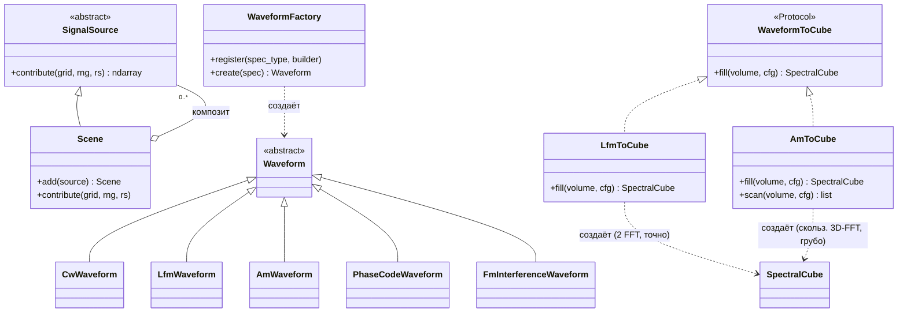
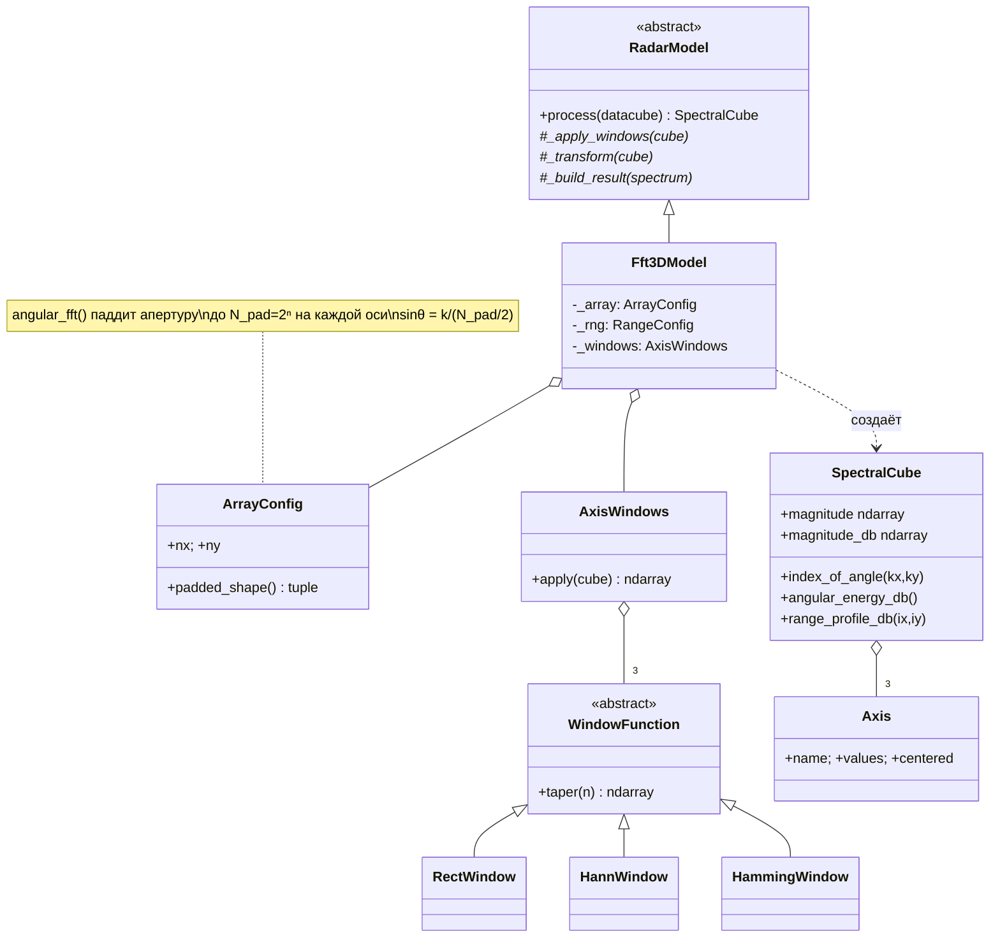
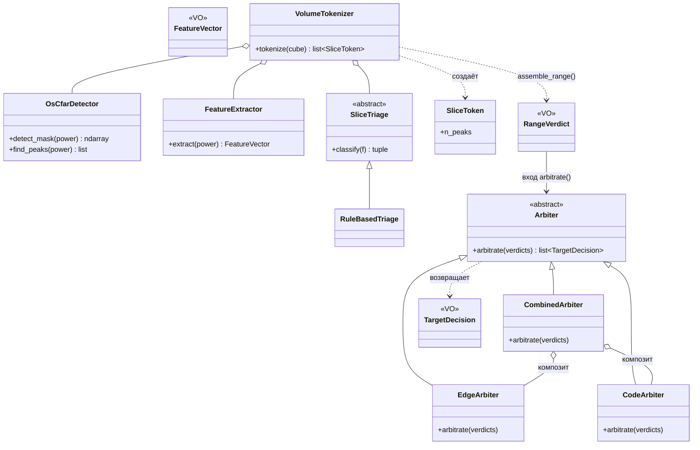
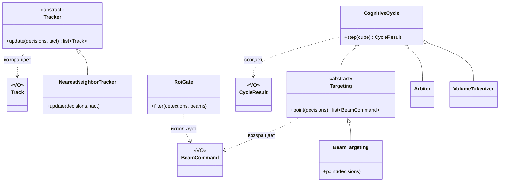
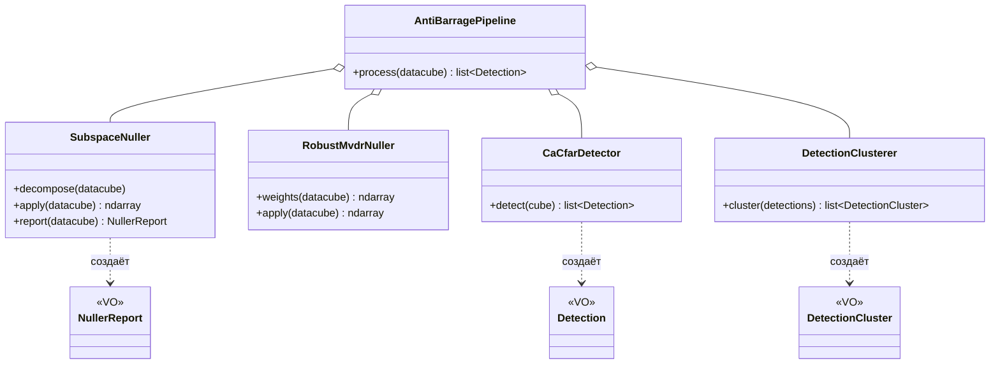
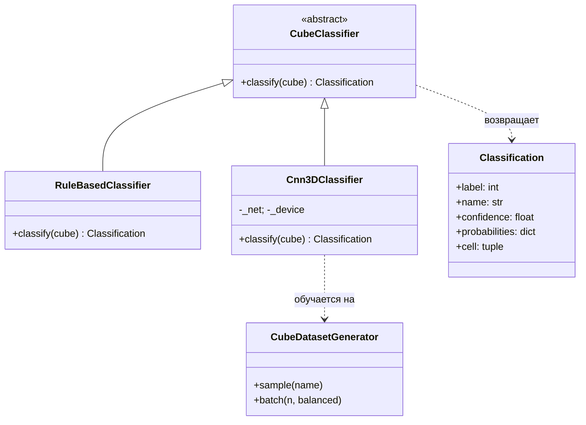
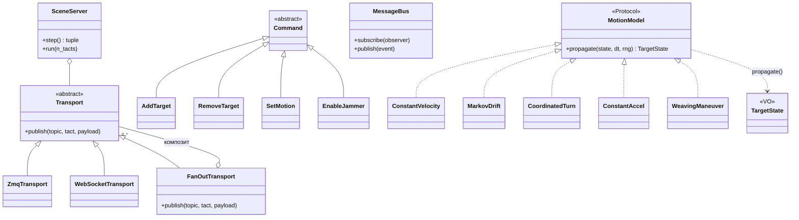
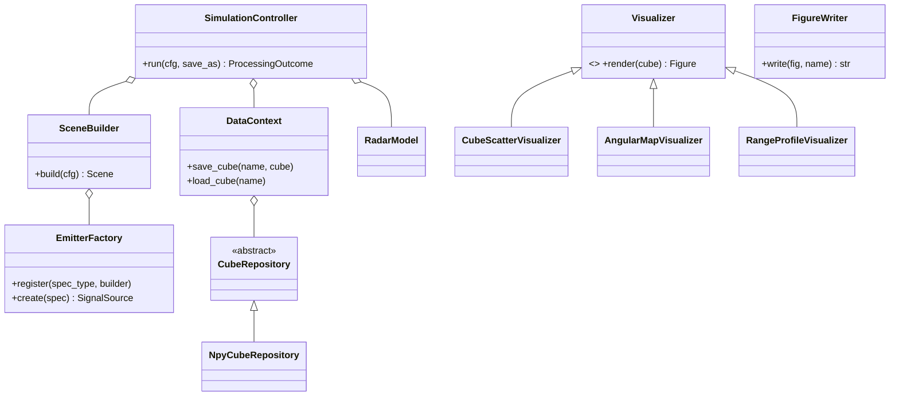

# C4 — Code (классы и связи)

> Самый детальный уровень: иерархии классов и их отношения (UML). Сгруппировано
> по подсистемам когнитивного конвейера. Сверено с исходниками `core/`.
> Полное описание классов — [`Doc/classes.md`](../classes.md).

## Источники сигналов и волны (Composite + Strategy)

## Модель + окна + результат (i×j / 2ⁿ)

## Токенизатор (гл.4/4-бис, Template Method) + Арбитр (гл.5, Composite)

## Целеуказание (гл.8, Facade) + Трекинг

## Anti-barrage (Facade)

## Классификация (Strategy + LSP)

## Runtime (панель, Observer/Composite) + Motion

## Координация, хранение, графика

## Применённые паттерны (GoF / GRASP)

| Паттерн | Где |
|---------|-----|
| **Strategy** | `WindowFunction`, `RadarModel`, `Visualizer`/`InteractiveVisualizer`, `CubeClassifier`, `WaveformToCube` (`LfmToCube`/`AmToCube`), `SliceTriage`, `Arbiter` (`EdgeArbiter`/`CodeArbiter`), `Targeting` (`BeamTargeting`), `Tracker` (`NearestNeighborTracker`), `Transport`, `MotionModel` |
| **Composite** | `Scene` из `SignalSource`; `CombinedArbiter` из `EdgeArbiter`+`CodeArbiter`; `FanOutTransport` из `Transport` |
| **Facade** | `DataContext`, `CognitiveCycle` (токенизатор+арбитр+целеуказание), `AntiBarragePipeline` (nuller+CFAR+кластеризация) |
| **Abstract Factory + Registry** | `EmitterFactory`, `WaveformFactory` |
| **Builder** | `SceneBuilder` |
| **Template Method** | `RadarModel.process`, `VolumeTokenizer.tokenize` |
| **Value Object** | конфиги (`ArrayConfig`/`ProjectConfig`), `SpectralCube`, `Axis`, `Classification`, `SliceToken`/`RangeVerdict`, `TargetDecision`, `BeamCommand`, `Track`, `Detection`, `NullerReport`, `TargetState` |
| **Observer** | `MessageBus` (внутрипроцессный), `SceneServer`/`Transport` (межпроцессный) |
| **Command** | `core.runtime.commands` (`AddTarget`/`RemoveTarget`/`SetMotion`/`EnableJammer`/`Step`) |
| **Protocol / DIP** | `WaveformToCube`, `SnrEstimator`, `MotionModel`, `GenBackend` |
| **Pure Fabrication** | `FigureWriter`, `Synthesizer`, `VolumeBuilder`, репозитории |
| **Dependency Injection** | связывание в `main.py`/`demo_*.py` (Composition Root) |
| **Information Expert** | `SpectralCube` (выборки), `ArrayGrid` (фаза наведения), `ArrayConfig.padded_shape()` |

→ Назад: [C3](C3-component.md) · [Каталог классов](../classes.md)
