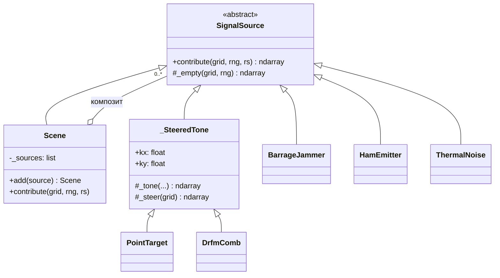
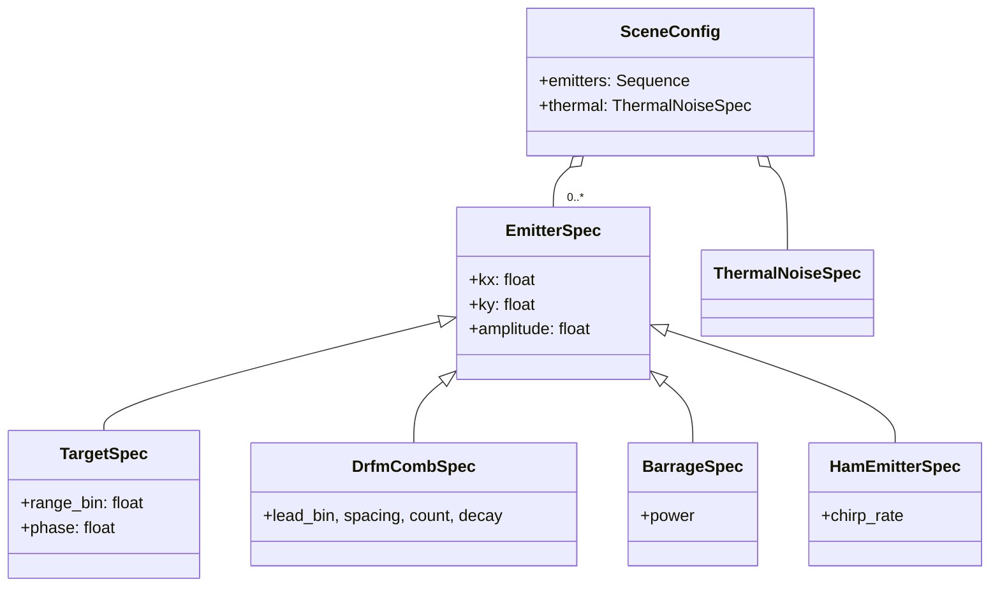
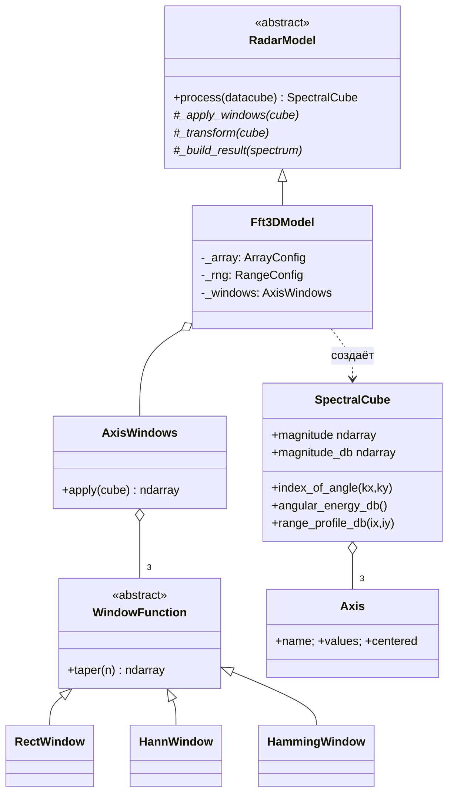
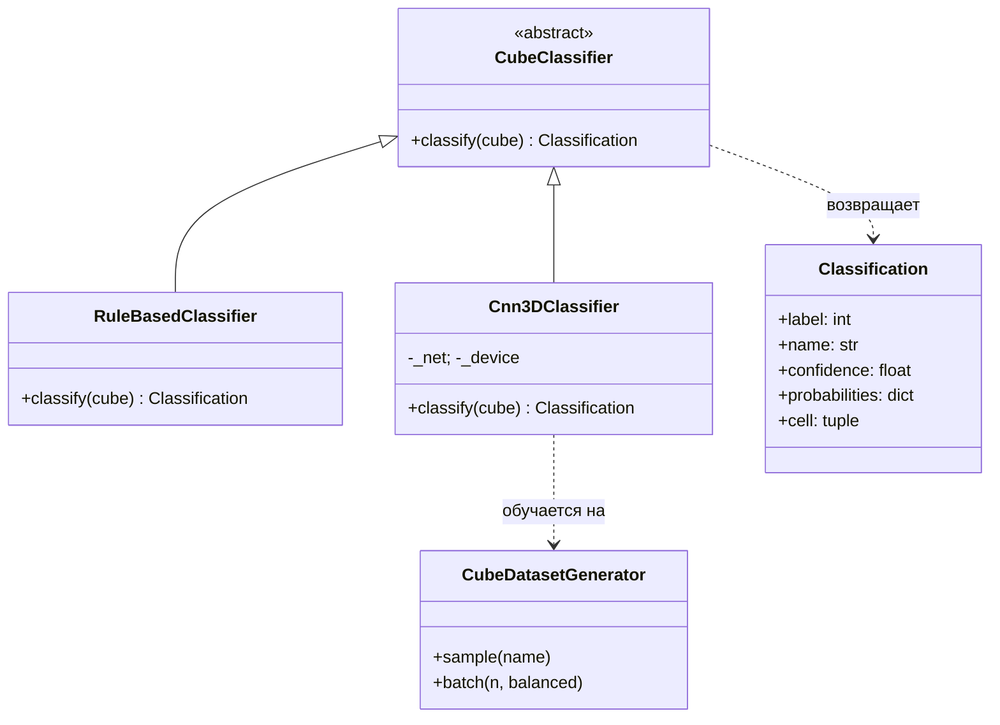
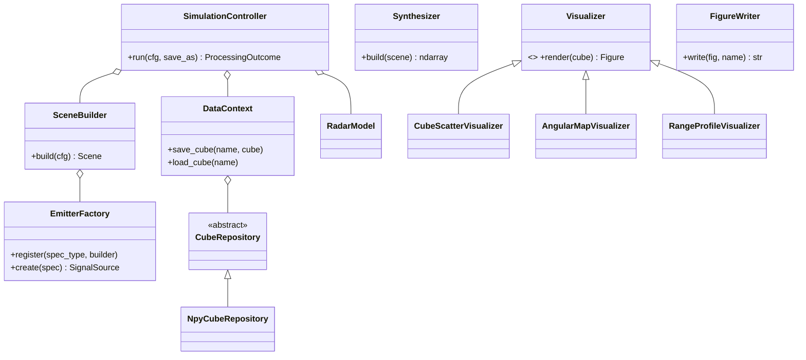

# C4 — Code (классы и связи)

> Самый детальный уровень: иерархии классов и их отношения (UML). Сгруппировано
> по подсистемам. Сверено с исходниками `core/`.

## Источники сигналов (Composite + наследование)

## Спецификации сцены (Value Objects)

## Модель + окна + результат

## Классификация (Strategy + LSP)

## Координация, хранение, графика

## Применённые паттерны (GoF / GRASP)

| Паттерн | Где |
|---------|-----|
| **Strategy** | `WindowFunction`, `RadarModel`, `Visualizer`, `CubeClassifier` |
| **Composite** | `Scene` из `SignalSource` |
| **Abstract Factory + Registry** | `EmitterFactory` (спека → источник, OCP) |
| **Builder** | `SceneBuilder` |
| **Template Method** | `RadarModel.process` (окно → преобразование → упаковка) |
| **Facade** | `DataContext` над репозиториями |
| **Value Object** | конфиги, `*Spec`, `SpectralCube`, `Axis`, `Classification` |
| **Pure Fabrication** | `FigureWriter`, `Synthesizer`, репозитории |
| **Dependency Injection** | связывание в `main.py` (Composition Root) |
| **Information Expert** | `SpectralCube` (выборки), `ArrayGrid` (фаза наведения) |

→ Назад: [C3](C3-component.md) · [Каталог классов](../classes.md)
