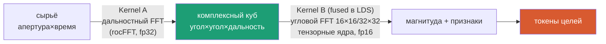
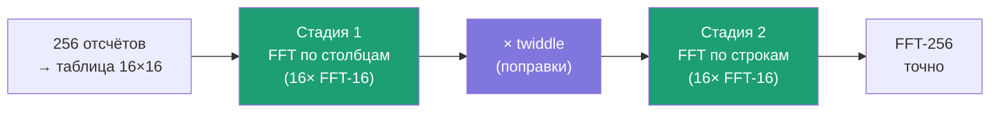
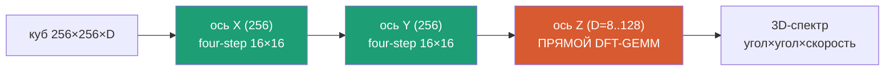
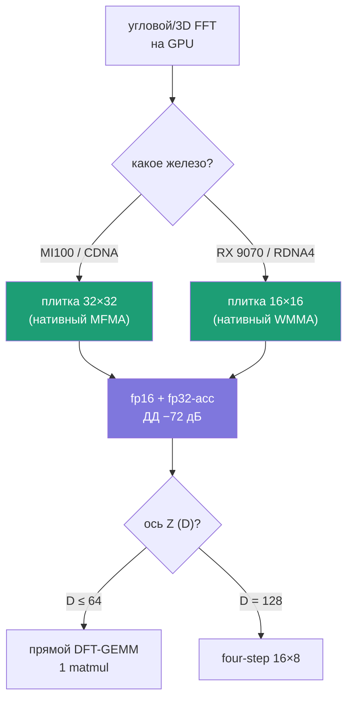

# 3FFT на тензорных ядрах — мастер-разбор

> **Один документ** по всей теме: four-step-сборка углового FFT из нативных плиток,
> выбор 16×16/32×32, точность fp16, расширение на 3D-FFT, тайминги MI100/RX 9070.
> Детальные разборы и код — ссылки в конце.
> **Цель исследования:** доказать, можно ли строить угловую обработку радара целиком
> на матричных ядрах GPU — и с какими параметрами.

---

## 0. Задача одним абзацем

Радар считает **дальность** (FFT по времени после дечирпа ЛЧМ) и **угол×угол**
(2D-FFT по апертуре решётки). Матричные ядра GPU (WMMA RDNA4 / MFMA CDNA) нативно
перемножают маленькие блоки 16×16 (и 32×32 на CDNA). Вопрос: можно ли выразить всю
угловую обработку **через эти блоки**, не теряя точности и разрешения?

**Ответ (доказан численно): да.** Ниже — как и с какими параметрами.

---

## Часть I. Four-step: большой угловой FFT из нативных плиток

**Идея (алгоритм Бэйли, 1990).** FFT длины `N=N₁·N₂` собирается из маленьких FFT-N₁ и
FFT-N₂ + «поправочные» twiddle-множители. Для угловой апертуры это значит: FFT-256
= 32 штуки FFT-16 + табличка поправок, и **каждый FFT-16 ложится на тензорное ядро**.

**Что доказано** (`fourstep_v2.py`):

| Проверка | Результат | Вывод |
|----------|-----------|-------|
| Точность склейки vs `np.fft.fft2` | отн. **8.9e-17** | машинный ноль, потерь нет |
| Разрешение 256×256 vs плитки 16×16 | 0.39° vs 7.18° | полное разрешение восстановлено |
| Некогерентная сумма плиток | луч ~7.2° | даёт SNR, но НЕ разрешение |
| Скруглённая апертура | нули на сетке | обычный FFT точен, **NUFFT не нужен** |

**Бонус — две стадии сами снимают неоднозначность** (`k=k₁+16·k₂`, развёртка по основанию 16):
стадия 1 — тонко-но-неоднозначно (grating lobes), стадия 2 — грубо-но-однозначно.
Как минутная + часовая стрелка.

---

## Часть II. Плитка 16×16 или 32×32?

`fourstep32_compare.py`: обе машинно-точны (выбор — вопрос **скорости**, не корректности).

| Метрика | 16×16 | **32×32** | Кто лучше |
|---------|-------|-----------|-----------|
| Точность four-step | 8.9e-17 | 6.7e-17 | = |
| Стадий на N=1024 | 3 (16·16·4) | **2** (32·32) | 32 → −1 проход по VRAM |
| Разрешение 1 плитки | 1/8 (6.3°) | **1/16 (3.1°)** | 32 → вдвое тоньше |
| LDS/плитку | 2 КБ | 8 КБ (12%) | обе на чипе |
| Нативность | RDNA4 + CDNA | **только CDNA** | ⚠️ гейт по железу |

**Решение:** **MI100 → 32×32** (меньше проходов, задача memory-bound; вдвое тоньше угол
на нативном ядре). **RX 9070 → 16×16** (нативна; 32 там эмулируется 4× блоками 16×16).
Код параметризован `(P1,P2)` — переключение одним аргументом.

---

## Часть III. Точность fp16/bf16 на тензорных ядрах

Тензорные ядра считают в укороченных числах. `fourstep32_fp16_dr.py` — угловой DFT как
matmul с округлением входов и **fp32-аккумуляцией** (модель MFMA):

| Формат | Мантисса | Worst-case | Точечная цель | Вердикт |
|--------|----------|-----------|---------------|---------|
| fp32 | 23 бит | −142 дБ | −78 дБ | эталон |
| **fp16 + fp32-acc** | 10 бит | **−72 дБ** | −78 дБ | **основной путь** ✅ |
| bf16 + fp32-acc | 7 бит | −55 дБ | −65 дБ | только детект |

**Ключ:** fp32-аккумуляция вытягивает fp16 до −72 дБ (без неё было бы ~−50 «на бумаге»).
−72 дБ ≫ радарных требований −40…−60 дБ. **fp32-аккумуляция обязательна.**

**Следствие:** раз fp16 годен → куб можно **хранить в fp16** (4 Б/точка) → вдвое меньше
трафика VRAM → почти прямое ускорение (задача memory-bound).

---

## Часть IV. 3D-FFT 256×256×D целиком на тензорах

`fft3d_tensor.py`. 3D-FFT **сепарабелен** → три осевых DFT → **три GEMM**:

**Изюм — малая ось Z:** для D=8..128 не нужен ни four-step, ни radix — **одно прямое
умножение на матрицу Фурье F_D** (один GEMM, без twiddle/бит-реверса). D=16 = ровно
нативная плитка 16×16.

| Замер | Результат |
|-------|-----------|
| Точность 3D vs `np.fft.fftn` | 1.6e-15 … 2.9e-14 (машинный ноль при любом D) |
| Порог прямой↔four-step по Z | D≤32 прямой; D=64 на выбор; D=128 four-step 16×8 |
| **fp16 по Z — ДД −72 дБ, D-НЕЗАВИСИМ** | 8→128: −71.4…−72.0 дБ (fp32-acc гасит √D) |
| Память | 8.4…134 МБ/куб (≪ дальностный 3 ГБ) |

Связь с патентом: это НЕ 3D-FFT патента (там дальностный и угловой FFT **разделены**).
Честный 3D-FFT — для **доплер-оси** (`16×16×N×P → FFT по 4-й`, гл.3.5; P=D — пачка импульсов).

---

## Часть V. Тайминги

### V.1. Полный ЛЧМ-куб 256×256×6000 (дальность + угол)

| Стадия | MI100 (fp16) | RX 9070 |
|--------|--------------|---------|
| A. Дальностный FFT (fp32) | ~4 мс | ~8–15 мс |
| B. Угловой 32-tile fp16 + magnitude (fused LDS) | ~3–4 мс | ~7–12 мс |
| **Итого на куб** | **~7–11 мс** | ~20–40 мс |
| Пропускная | ~90–140 куб/с | ~25–40 куб/с |

Задача **memory-bound** (arith. intensity 63 < ridge 150 FLOP/байт). Рычаги — **fused-LDS**
и **fp16-хранение**, а НЕ арифметика (тензорные ядра недогружены в 3–4×).

### V.2. Один 3D-куб 256×256×D (доплер-стадия), мкс

| D | MI100 t_куб | MI100 куб/с | RX 9070 t_куб | RX 9070 куб/с |
|---|-------------|-------------|---------------|---------------|
| 8 | 4 мкс | 244k | 10 мкс | 95k |
| 16 | 9 мкс | 110k | 23 мкс | 43k |
| 32 | 41 мкс | 24k | 56 мкс | 18k |
| 64 | 82 мкс | 12k | 149 мкс | 7k |
| 128 | 164 мкс | 6k | 205 мкс | 5k |

**Природа узкого места разная:** MI100 — L2 8 МБ, при D≥32 спил в VRAM (memory-bound, но HBM2
вытягивает). RX 9070 — 64 МБ Infinity Cache держит весь куб → всегда compute-bound (tensor
вдвое слабее → медленнее на больших D). При малом D доминирует overhead запуска → **батчить**.

**Вывод:** доплер-3D практически бесплатен относительно дальностной стадии (~4 мс).

---

## Часть VI. Итоговые проектные решения

| Параметр | Решение | Обоснование |
|----------|---------|-------------|
| Угловой FFT | four-step из нативных плиток | машинно-точен, 100% на матричных ядрах |
| Плитка | 32×32 (MI100) / 16×16 (RX 9070) | нативность инструкции |
| Разрядность | fp16 + **fp32-acc** (куб в fp16) | ДД −72 дБ; −½ трафик VRAM |
| Дальностный FFT | **fp32** (rocFFT) | длинный FFT → нужны дальностные боковики |
| Ось Z (3D), D≤64 | прямой DFT-GEMM | 1 проход, без twiddle |
| Ось Z, D=128 | four-step 16×8 | 5× меньше FLOP |
| Узкое место | VRAM BW → **fused-LDS** | не арифметика |

**Одной фразой:** угловая и 3D-обработка радара выражается целиком матричными умножениями
на тензорных ядрах — машинно-точно, fp16 держит −72 дБ, а один ЛЧМ-куб считается за ~7–11 мс
на MI100. Подход **валиден и рекомендован**.

---

## Приложение. Детальные разборы и код

| Файл | Что |
|------|-----|
| `KAK_RABOTAET_dlya_chaynikov.md` | объяснение на пальцах (аналогии) |
| `KAK_RABOTAET_dlya_inzhenerov.md` | вывод формул, сложность, roofline |
| `FFT3D_na_tenzorah.md` | 3D-FFT детально + тайминги по D |
| `fourstep_v2.py` | точность/разрешение/неоднозначность 2D |
| `fourstep32_compare.py` | 16×16 vs 32×32 |
| `fourstep32_fp16_dr.py` | динамический диапазон fp16/bf16 |
| `fft3d_tensor.py` | 3D-FFT на тензорах, D=8..128 |
| `MemoryBank/specs/fourstep_2dfft256_review_2026-07-16.md` | полное ревью + вердикты |

*Дата: 2026-07-16 · Кодо*
